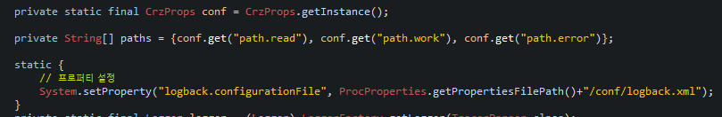
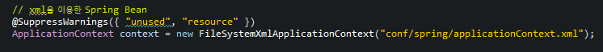
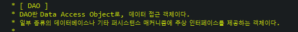

**메인클래스 Parser**

\1. conf에서 properties에서 정보들을 가져옴

\2. xml파일을 이용해서 Spring Bean을 생성한다.

해당 bean은 context라는 객체로 담기게 됨.

\3. 메인 클래스에서는 init()과 execute() 두 메소드가 동작하게된다.

init()에서 읽어온 prop 순회하면서 핸들러 설정해주고

execute()에서 DAO를 받아서 처리를 하게된다.

execute를 자세히 보면 스레드로 프로세싱을 하게되는데

Producer - Consumer 패턴 구조로 이루어져 있다.

(보통, 데이터를 생성하는 스레드를 Producer 데이터를 처리하는 스레드를 Consumer로 구분)

해당 agent에서 Producer는 생성중인 로그, 생성된 로그, 에러로 빠진 로그 구분해서 정리해줌

ConsumerMgr이라는 단일클래스에서 여러개의 Consuemer 스레드들을 관리하는 형태로 구조화해서

Consumer는 멀티스레드 구조로 여러개의 파일을 담당할 수 있도록 한다.

실질적 파싱을 담당하는 곳이 consumer라고 생각하면 된다.

**ConsumerMgr**

consumer를 멀티스레드로 돌려서 로그를 파싱해와서 결과들을 이곳에 통합한다.

레코드의 각 필드들에 데이터들을 map으로 담는 방식으로 테이블을 구성한다.

**Consumer**

파싱해온 값들을 Bean에다가 담는다. 각 bean들은(하나의 레코드) DAO를 통해 DB에 입력한다.