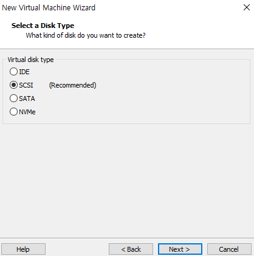
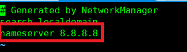

**# INTRO**

CentOS 설치 (CentOS Linux release 7.4.1708)

(API에 맞는 운영체제 버전을 설치해야 한다.)


보통 물리서버장치에 바로 설치하지만, 매뉴얼 작성을 위해 가상환경에서 진행

VMware Workstation 이용


가상 환경만 구성하고, iso파일을 이용하여 직접 설치한다.





여기까지 가상환경 조성 완료


암호까지 설정하고 대기,

설치 완료되면 usb제거


기본적인 설치가 끝나고 부팅이 되면 OS가 잘 설치되었는지,

하드웨어 스펙은 일치하는지 확인해준다.


cat /etc/redhat-release 입력하면 os버전 확인 가능


**# 전체적인 순서**

 자바설치 -> DB설치 -> 톰캣 설치 -> 인증서설치 -> 설정 -> 테스트


**0. 외부 터미널에서 접근하기 위한 interface 정의**

\# cd /etc/sysconfig/network-scripts/

\# ll 로 인터페이스명 확인 (ifcfg~~ 파일)


서버에 여러개의 인터페이스가 존재할 수 있는데, 현재 처음 시작한 서버라 ens33만 존재한다.


ethtool ens33 명령어


인터넷 선이 연결되어져 있는 인터페이스를 확인하고,

이 인터페이스를 수정하면 된다.

vi ifcfg-ens33


\# service network restart로 네트워크 재기동 진행 

이후, 외부 쉘 터미널 프로그램을 이용해서 진행하면 된다.


설치 전, df-h 명령어로 서버의 디스크 공간이 어디에 할당되어 있는지 확인한다.

확인 후, 해당 디렉토리로 이동


보통 root로 디스크가 할당되어져 있는데, 서버마다 환경이 다를 수 있으므로 확인해야 한다.

나의 경우에도 root로 용량이 많이 할당되어져 있다.


참고로, 리눅스 터미널 상에서 복사,붙여넣기는 일반적인 ctrl+shift+c , ctrl+shift+v 다.


1. RPM 설치

RPM은 Redhat Package Manager의 약자로서, 레드햇 계열의 리눅스 배포판에서 사용하는 프로그램(패키지) 설치 관리 도구다.

rpm을 설치하기 전에 시스템에 이미 설치되어져 있는 부분이 있을 수 있어서 충돌이 날 수 있기에

이러한 사항들을 체크하며 설치되지 않은 부분들을 설치하면 된다.

-Uvh 옵션은 패키지를 업그레이드 한다는 뜻인데, 기존에 설치된 것이 없을 경우 설치를 진행한다.


간혹 미리 설치되어져 있는 rpm이 있는 경우, 해당지점에서 작업을 끝내고

쉘 스크립트에 있는 해당 지점 이후의 작업들을 진행하지 않는다.

따라서 중간에 끊기는 지점이 없도록 해야한다.

rpm을 설치하는 경우, 이미 존재한다면 제거를 해줘도 다시 설치할것이기 때문에

결론적으로 해당 패키지를 제거후, rpm 설치를 진행하면 된다.


그냥 지우게 되면 의존성 문제가 발생하게 되므로 의존성을 무시한채로 삭제를 진행하면 된다.

보통 의존성 문제는 해결하고 삭제해야 하지만, 본 경우에는 삭제 후 다시 해당패키지를 설치할 것이기 때문에

문제되지 않으므로 의존성을 무시하고 진행한다.

의존성 무시는 --nodeps 옵션을 추가하면 됨


2. 자바설치

jdk가 압축파일로 되어져 있으므로 tar명령어 이용해서 설치해준다.

<tar 압축,해제 관련 명령어>

\- c : 파일 압축

\- x : 압축 해제

\- v : 압축과정 출력

\- f : 지정한 파일명으로 압축

\- z : tar 압축 후 gzip 압축

\- p : 소유권 등, 퍼미션 그대로 유지


3. MariaDB 설치


설치를 진행할 때, ~ needed by ~ 문구가 뜬다면 해당 패키지가 설치되어 있지 않아서 진행되지 않는 것이다.

위의 경우 perl을 설치해주면 된다.
```shell
yum install perl
```


해당 오류가 뜨는 경우는 보통, nameserver가 지정되어 있지 않아서 그런다.

```shell
vi /etc/resolv.conf
```


다음과 같이 nameserver를 추가해준다.


정책파일 읽기 실패가 뜨는 경우 아래의 명령어 입력
```shell
yum install selinux-policy-targeted
```
semanage 명령어

semanage는 SELinux 의 보안 정책을 조회하고 추가/변경/삭제할 수 있는 명령행 기반의 유틸리티
```shell
semanage port -a -t mysqld_port_t -p tcp 14417
```
14417 포트에 mysqld_port_t의 포트를 개방 해주는 명령어


4. DB 설치

sql 스크립트들을 실행시켜줘서 초기 테이블 구성을 해준다.


5. 톰캣설치

톰캣은 두개가 설치가 되는데

일반 톰캣은 관리자용이고 tomcat_api 가 붙은 것은 일반서버용 was다.

또한 tomcat에 인증서를 담아주는 용으로 ssl 디렉토리를 생성해두어야 한다.

/usr/local/ 에 톰캣이 설치되므로 해당 디렉토리로 이동,

우선 관리자용 톰캣을 셋팅하고 테스트한 다음에 정상적으로 작동하면

해당 인증서와 server.xml 셋팅값을 톰캣api에도 적용시켜준다.


[ **Tomcat 설정 가이드**](https://ejjoo.github.io/server/2019/12/22/tomcat.html)


server.xml 관련 정보 : https://2dubbing.tistory.com/11

[tomcat Tomcat7.0의 server.xml 설정](https://2dubbing.tistory.com/11)


server.xml에서 <value> 부분은 access log를 남기지 않기 위해(리소스 오버헤드 방지) 지운다. (optional)


bin의 catalina.sh도 마찬가지로 수정해준다.

JAVA_OPTS=에 -Xms,-Xmx값 적용시켜줌


\6. 이후 순서대로 설치 완료 후 ulimit설정 및 테스트페이지 설치


참고사항


**슈퍼유저로 전환**

su명령어를 입력해준다.

$에서 # 으로 바뀐 것을 확인가능


**윈도우<->리눅스 파일전송**

WinSCP

https://winscp.net/eng/download.php


**vi 관련 명령어**

esc로 빠져나온 후,

:wq! (저장후 강제종료)

/ (탐색) , n으로 다음항목 이동


**인증서 설치 관련**

톰캣에 ssl폴더 생성해주고, 해당 위치에 인증서를 넣어주는 방식으로 관리

(결론적으로 인증서의 위치는 어디에 두어도 상관없기는 하다. server.xml에서 인증서가 있는 디렉토리를 지정해주면 되기 때문)

인증서는 톰캣이 실행될 때, 카탈리나를 통해서 올라가게 되므로

인증서를 교체하더라도 서버가 기동중이면 교체가 되지 않는다.

서버를 재기동해야 인증서가 교체된다.

인증서가 잘 교체되었는지는 간단히 브라우저를 통해 해당 서버에 접속해서 인증서를 확인하면 된다.

인증서 생성 방법> .key와 .crt 파일을 합쳐서 pfx 혹은 jks 파일로 만들어주고 올린다.

여러개의 crt파일을 합쳐서 인증서로 만드는 경우, pem으로 합쳐주면 된다.

pem 파일로 인증서를 만들 때, PEM_read_bio:bad end line 와 같은 에러가 뜨는 경우는

인증서의 구분선이 한줄로 되어서 에러가 발생하는  것이다.
```
-----BEGIN CERTIFICATE-----
        (Base64) 
-----END CERTIFICATE----------BEGIN CERTIFICATE----- 
        (Base64) 
-----END CERTIFICATE-----
```
vi로 해당 pem을 확인하면 위와 같이  end와 begin부분이 한줄로 되어있을 수 있다.

```
-----BEGIN CERTIFICATE-----
        (Base64)
-----END CERTIFICATE-----
-----BEGIN CERTIFICATE-----
        (Base64)
-----END CERTIFICATE-----
```

이렇게 선을 구분해주면 정상적으로 인식가능.


**xshell 세션 키보드 동시 입력**

