[https://jqueryui.com/tabs/#manipulation](https://jqueryui.com/tabs/#manipulation)


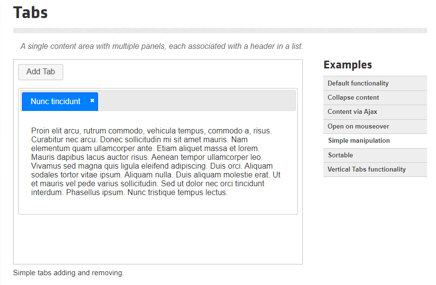

jQuery UI에서 탭 추가/삭제 데모버전 코드를 기준으로 작성하였다.

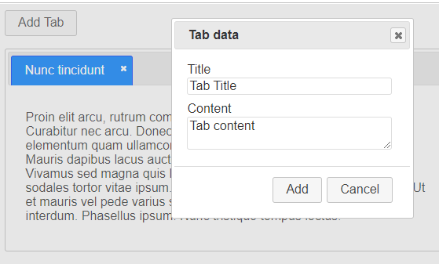

여기서는, 탭의 이름과 탭에 들어갈 내용을 적어주면 해당 결과로 탭을 추가해주는 구조다.

그러나 실질적으로 내가 사용할 때에는 다이얼로그는 필요없고,

탭을 추가할때 div를 추가해주는지, 그 시점에 jsp를 동적으로 해당 div에 include 해주는지 가 관건이었다.


현재 테스트를 위해, include 할 jsp의 url은 정해놨지만 변수로 빼놓은 상황이다.

추후 상황에 맞게 응용 가능한 구조.

Add tab을 누르면

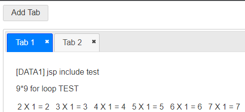

탭이 추가가 된다.

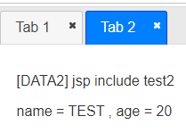

탭을 클릭시 해당 탭으로 이동되는 형태이며, X버튼을 클릭시 해당 탭은 삭제가 된다.

즉, 동적으로 탭을 추가/삭제 할 수 있는 구조


단순히 <div> 태그만 추가하는 형태가 아니라, 해당 탭에 id를 부여하고 jsp를 include하여주는 형태다.

이러한 작업들이 동적으로 작동되도록 구현한 점이 핵심
```html
<!doctype html>
<html lang="en">
<head>
  <meta charset="utf-8">
  <meta name="viewport" content="width=device-width, initial-scale=1">
  <title>tab manipulation demo page</title>
  <link rel="stylesheet" href="//code.jquery.com/ui/1.13.0/themes/base/jquery-ui.css">
  <link rel="stylesheet" href="/resources/demos/style.css">
  <style>
  #dialog label, #dialog input { display:block; }
  #dialog label { margin-top: 0.5em; }
  #dialog input, #dialog textarea { width: 95%; }
  #tabs { margin-top: 1em; }
  #tabs li .ui-icon-close { float: left; margin: 0.4em 0.2em 0 0; cursor: pointer; }
  #add_tab { cursor: pointer; }
  </style>
  <script src="https://code.jquery.com/jquery-3.6.0.js"></script>
  <script src="https://code.jquery.com/ui/1.13.0/jquery-ui.js"></script>
  <script>
  $( function() {

    // 1번 탭 내용 div 영역에 include될 jsp
    $("#tabs-1").load("jsp/data1.jsp");
    
    var tabTitle = $( "#tab_title" ),
      tabContent = $( "#tab_content" ),
      tabTemplate = "<li><a href='#{href}'>#{label}</a> 
         <span class='ui-icon ui-icon-close' role='presentation'>Remove Tab</span></li>",
      tabCounter = 2;
 
    var tabs = $( "#tabs" ).tabs();
 
    // 탭 추가 
    function addTab() {
  
      var label = tabTitle.val() || "Tab " + tabCounter,
        id = "tabs-" + tabCounter,
        li = $( tabTemplate.replace( /#\{href\}/g, "#" + id ).replace( /#\{label\}/g, label ) ),
        tabContentHtml = tabContent.val() || "Tab " + tabCounter + " content.";
 
      tabs.find( ".ui-tabs-nav" ).append( li );
      tabs.append( "<div id='" + id + "'></div>" );
      
      var tab_Target = "#" + id; // jsp를 include할 탭의 id
      var jsp_URL = "jsp/data2.jsp"; // include될 jsp의 url

      // 탭을 만들어줌 과 동시에 jsp를 include 해준다.
      // url, 넘겨줄 파라미터 값
      $(tab_Target).load(jsp_URL,{name: 'TEST', age: 20, jop: 'IT'});

      tabs.tabs( "refresh" );
      tabCounter++;
    }
 
    // 탭 추가 버튼에 탭추가 동작 이벤트 추가을 눌렀을 때
    
    $( "#add_tab" )
      .button()
      .on( "click", function() {
        addTab();
      });
      
 
    // 닫기 버튼
    tabs.on( "click", "span.ui-icon-close", function() {
      var panelId = $( this ).closest( "li" ).remove().attr( "aria-controls" );
      $( "#" + panelId ).remove();
      tabs.tabs( "refresh" );
    });
 
    tabs.on( "keyup", function( event ) {
      if ( event.altKey && event.keyCode === $.ui.keyCode.BACKSPACE ) {
        var panelId = tabs.find( ".ui-tabs-active" ).remove().attr( "aria-controls" );
        $( "#" + panelId ).remove();
        tabs.tabs( "refresh" );
      }
    });
  } );
  </script>
</head>
<body>

 
<button id="add_tab">Add Tab</button>
 
<div id="tabs">
  <ul>
    <li>
     <a href="#tabs-1">Tab 1</a> 
     <span class="ui-icon ui-icon-close" role="presentation">Remove Tab</span>
    </li>
  </ul>
  <div id="tabs-1">
  </div>
</div>
 
 
</body>
</html>
```

메인 HTML


```html
<!DOCTYPE html>
<html lang="en">
<head>
    <meta charset="UTF-8">
    <meta http-equiv="X-UA-Compatible" content="IE=edge">
    <meta name="viewport" content="width=device-width, initial-scale=1.0">
    <title>Document</title>
</head>
<body>
    <p>[DATA1] jsp include test</p>
    <p>9*9 for loop TEST</p>

    <table>
		<%
		for(int i = 1; i < 10; i++) {
		%>
			<tr>
			<%
			for(int j = 2; j < 10; j++) {
			%>
				<td>
					<%=Integer.toString(j) 
					    + " X " + Integer.toString(i) 
					    + " = " + Integer.toString(j * i) 
					%>
				</td>
			<%
			}
			%>
			</tr>
		<%
		}
		%>
	</table>

</body>
</html>
<!DOCTYPE html>
```

```html
<html lang="en">
<head>
    <meta charset="UTF-8">
    <meta http-equiv="X-UA-Compatible" content="IE=edge">
    <meta name="viewport" content="width=device-width, initial-scale=1.0">
    <title>Document</title>

</head>

<body>
    <p>[DATA2] jsp include test2</p>
    <p>name = <%=request.getParameter("name") %> , age = <%=request.getParameter("age") %></p>

</body>
</html>
```

DIV내에 삽입될 jsp 파일들이다.

실질적으로 jsp내부의 코드들은 의미가 없고, jsp파일이 제대로 작동하는 지 검토하기 위한 값들이다.

data1은 jsp가 잘 작동하는지 확인하기 위하여 for문을 돌려놓은 코드이고,

data2는 load할 때 파라미터값을 넘겨주는 경우, 해당 파라미터값을 잘 받아오는지 확인하기 위한 코드이다.


[톰캣관련 lil tip]

톰캣서버 기동시, 외부에서 접속 가능하게 포트 개방해주는 방법

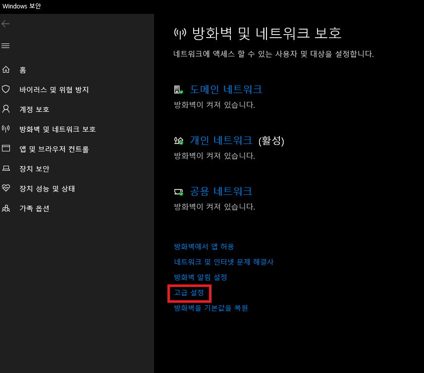

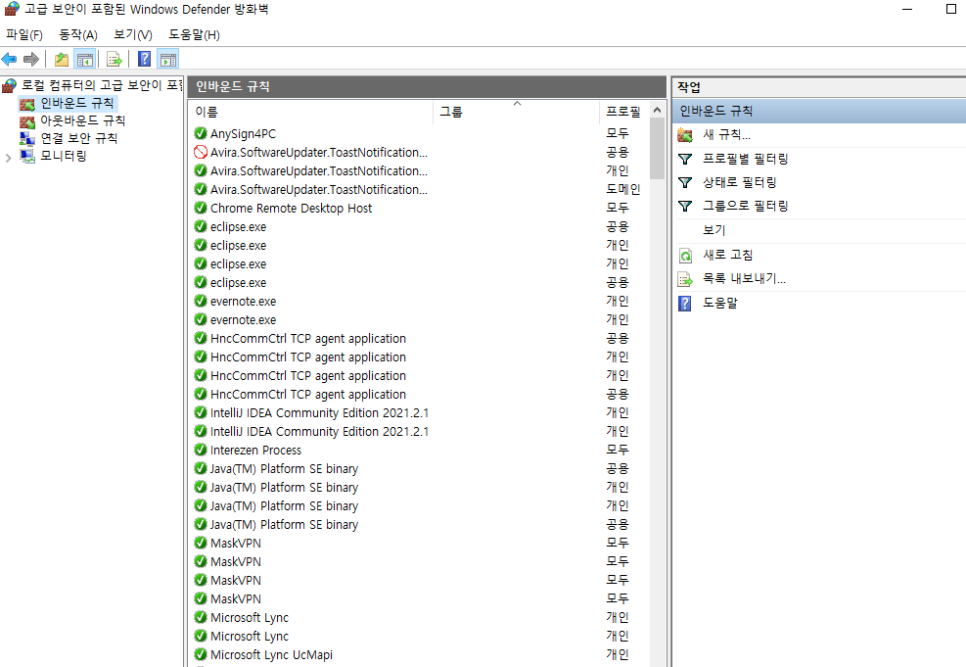

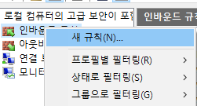


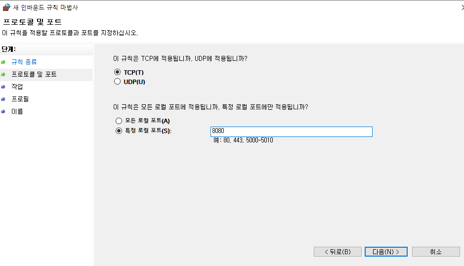

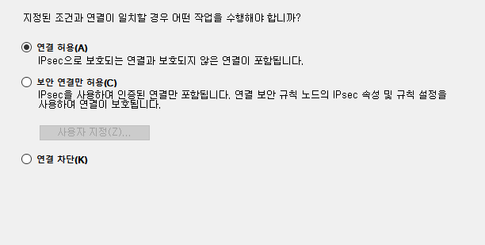

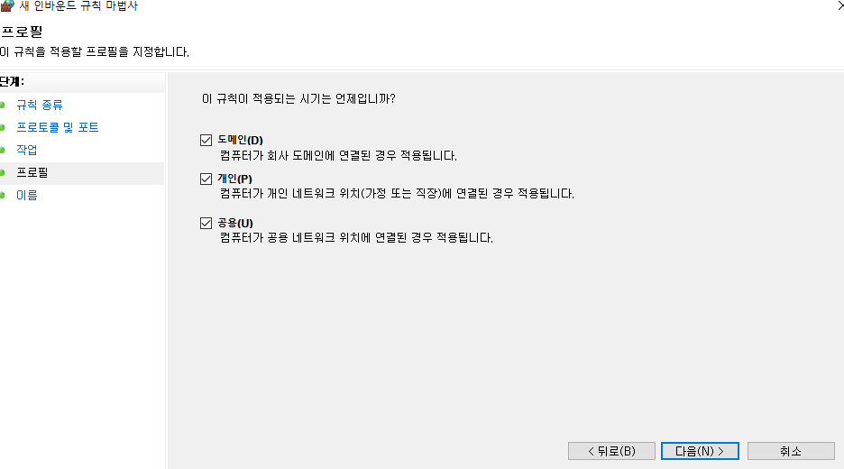

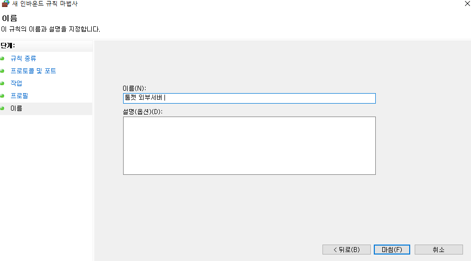

이름은 상관 없지만, 톰캣 포트 개방한 룰 이므로 식별가능한 이름으로 지어주는 것이 좋다.

방화벽에 톰캣포트를 개방시켜주면 (톰캣 설정에서 포트를 변경하지 않았다면 기본값은 8080포트)

외부에서 나의 톰캣서버로 접근가능하다.


접근경로는 이러하다.

http://[내 아이피]:[포트]/[webapp 폴더명]/[접근할 페이지]

나의 경우는 이러하다. http://192.168.0.2:8080/tabs_TEST/test.html

사설 ip 이기 때문에 외부망에서 접근이 불가능 하기는 하지만,

공유기 포트포워딩 설정을 통하여 외부 접근이 가능한 형태로도 할 수 있다는 점은 참고