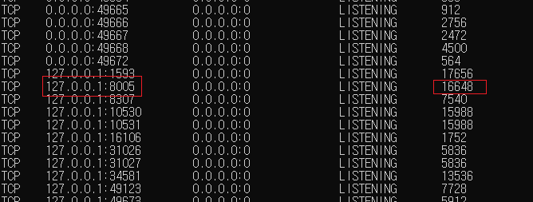

1. 프론트엔드 자동화 테스트 : Cypress.io 

2 .쉬프트 + 윈도우 + 방향키 : 창 모니터 이동 

3 .다중모니터 마우스커서이동 : https://blog.naver.com/PostView.naver?isHttpsRedirect=true&blogId=windowexe&logNo=221501498360 

4. 윈도우 + (1~0) : 작업표시줄 아이콘 실행 

5. 이클립스 탭이동 : 컨트롤 + pgUP,pgDn 

6. 이클립스 탭분할 : 컨트롤 + 쉬프트 + { or _ 

7. 크롬 내부 검색창 바로가기 : / 

8. 크롬 뒤로가기 앞으로 가기 : 알트 + 방향키 


=========================================================================


Tomcat 서버 이미 가동중일 때, 이클립스 서버와 비동기화 되있는 경우

프로세스를 강제로 종료해줘야 한다.

이 때 pid확인하는 법 (윈도우 기준)


명령 프롬프트에 다음 명령어 입력
```
netstat -a -n -o -p tcp
혹은
netstat -anop tcp
```



톰캣에서 기 사용하고있는 포트 (8005 v 8080)의 pid를 체크한다.

해당 포트의 pid는 16648인 것을 확인

```
taskkill /f /pid 16648
```

프로세스 종료 명령어이다.

pid(프로세스 아이디)를 체크후, 종료할 맨 마지막 부분에 pid를 입력해준다.

(16648부분에 pid를 입력해준다.)