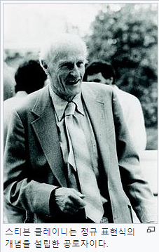
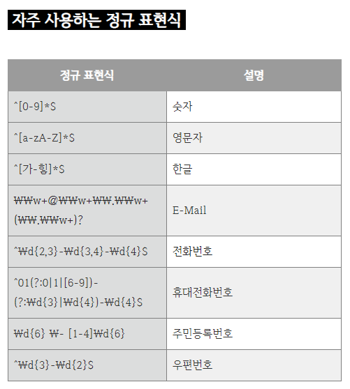
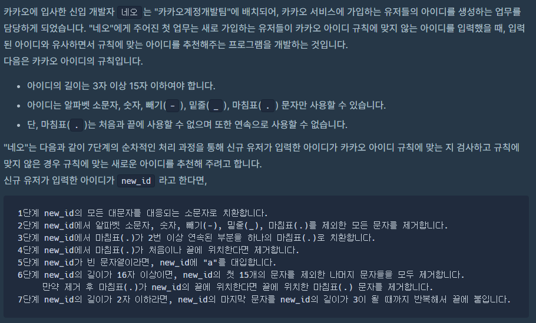

정규 표현식(正規表現式, 영어: regular expression, 간단히 regexp 또는 regex, rational expression) 또는 정규식(正規式)은 특정한 규칙을 가진 문자열의 집합을 표현하는 데 사용하는 형식 언어이다. 정규 표현식은 많은 텍스트 편집기와 프로그래밍 언어에서 문자열의 검색과 치환을 위해 지원하고 있으며, 특히 펄과 Tcl은 언어 자체에 강력한 정규 표현식을 구현하고 있다.


컴퓨터 과학의 정규 언어로부터 유래하였으나 구현체에 따라서 정규 언어보다 더 넓은 언어를 표현할 수 있는 경우도 있으며, 심지어 정규 표현식 자체의 문법도 여러 가지 존재하고 있다. 현재 많은 프로그래밍 언어, 텍스트 처리 프로그램, 고급 텍스트 편집기 등이 정규 표현식 기능을 제공한다. 일부는 펄, 자바스크립트, 루비, Tcl처럼 문법에 내장되어 있는 반면 닷넷 언어, 자바, 파이썬, POSIX C, C++ (C++11 이후)에서는 표준 라이브러리를 통해 제공한다. 그 밖의 대부분의 언어들은 별도의 라이브러리를 통해 정규 표현식을 제공한다.


정규 표현식은 검색 엔진, 워드 프로세서와 문서 편집기의 찾아 바꾸기 대화상자, 그리고 sed, AWK와 같은 문자 처리 유틸리티, 어휘 분석에 사용된다.




[출처 : 위키백과](https://ko.wikipedia.org/wiki/정규_표현식)

요약하자면,

주민번호,전화번호,이메일과 같은 정해진 형식이 있는 데이터를

사용자가 이 형식에 맞게 입력했는지 검증을 할 때 정규표현식을 사용하면 쉽게 사용가능하다.


정규표현식은 Pattern클래스와 Matcher클래스로 나뉜다.

Pattern은 정규표현식을 패턴화 해서 생성하는기능을 제공하고,

Matcher는 대상 문자열의 패턴을 해석하고 주어진 패턴과 일치하는지 판별할 때 주로 사용한다.





**Pattern 클래스**

```java
import java.util.regex.Pattern;

public class RegexExample {
	public static void main(String[] args)  {
    
            String pattern = "^[0-9]*$"; //숫자만
            String val = "123456789"; //대상문자열
        
            boolean regex = Pattern.matches(pattern, val);
            System.out.println(regex);
    }
}

```


matches()메소드에 첫번째 매개값은 정규표현식을 넣어주고, 두번째 매개값은 검증 대상 문자열이다.

이 메소드를 통해 boolean으로 검증해준다.


**Pattern 클래스 주요 메서드**

compile(String regex) : 주어진 정규표현식으로부터 패턴을 만듭니다.

matcher(CharSequence input) : 대상 문자열이 패턴과 일치할 경우 true를 반환합니다.

asPredicate() : 문자열을 일치시키는 데 사용할 수있는 술어를 작성합니다.

pattern() : 컴파일된 정규표현식을 String 형태로 반환합니다.

split(CharSequence input) : 문자열을 주어진 인자값 CharSequence 패턴에 따라 분리합니다.


**Parttern 플래그 값 사용(상수)**

Pattern.CANON_EQ : None표준화된 매칭 모드를 활성화합니다.

Pattern.CASE_INSENSITIVE : 대소문자를 구분하지 않습니다. 

Pattern.COMMENTS : 공백과 [#으로](https://blog.naver.com/PostListByTagName.naver?blogId=kdi3939&encodedTagName=으로) 시작하는 주석이 무시됩니다. (라인의 끝까지).

Pattern.MULTILINE : 수식 ‘^’ 는 라인의 시작과, ‘$’ 는 라인의 끝과 match 됩니다.

Pattern.DOTALL : 수식 ‘.’과 모든 문자와 match 되고 ‘\n’ 도 match 에 포함됩니다.

Pattern.UNICODE_CASE : 유니코드를 기준으로 대소문자 구분 없이 match 시킵니다.

Pattert.UNIX_LINES : 수식 ‘.’ 과 ‘^’ 및 ‘$’의 match시에 한 라인의 끝을 의미하는 ‘\n’만 인식됩니다.


**Matcher 클래스**

```java
import java.util.regex.Matcher;
import java.util.regex.Pattern;

public class RegexExample {
	public static void main(String[] args)  {
            Pattern pattern = Pattern.compile("^[a-zA-Z]*$"); //영문자만
            String val = "abcdef"; //대상문자열
	
            Matcher matcher = pattern.matcher(val);
            System.out.println(matcher.find());
	}
}

```


Matcher객체는 Pattern객체의 matcher() 메소드를 호출하여 받아올 수 있다. 

위 예제는 Matcher 클래스의 find() 메서드를 활용하여 대상문자열이 영문자인지 검증하는 예제

대상문자열이 영문자가 맞다면 ture 그렇지 않다면 false가 출력된다.


Matcher 클래스 주요 메서드

matches() : 대상 문자열과 패턴이 일치할 경우 true 반환합니다.

find() : 대상 문자열과 패턴이 일치하는 경우 true를 반환하고, 그 위치로 이동합니다.

find(int start) : start위치 이후부터 매칭검색을 수행합니다.

start() : 매칭되는 문자열 시작위치 반환합니다.

start(int group) : 지정된 그룹이 매칭되는 시작위치 반환합니다.

end() : 매칭되는 문자열 끝 다음 문자위치 반환합니다.

end(int group) : 지정되 그룹이 매칭되는 끝 다음 문자위치 반환합니다.

group() : 매칭된 부분을 반환합니다.

group(int group) : 매칭된 부분중 group번 그룹핑 매칭부분 반환합니다. 

groupCount() : 패턴내 그룹핑한(괄호지정) 전체 갯수를 반환합니다.


출처 : [https://coding-factory.tistory.com/529](https://coding-factory.tistory.com/529)


정규 표현식을 활용하면 다음과 같은 알고리즘도 매우 쉽게 해결 할 수 있다.



```java
package level1;

class Solution {
    public String solution(String new_id) {

        // 1단계 new_id의 모든 대문자를 대응되는 소문자로 치환합니다.
        String answer = new_id.toLowerCase();

        // 2단계 new_id에서 알파벳 소문자, 숫자, 빼기(-), 밑줄(_), 마침표(.)를 제외한 모든 문자를 제거합니다.
        answer = answer.replaceAll("[^-_.a-z0-9]", "");

        // 3단계 new_id에서 마침표(.)가 2번 이상 연속된 부분을 하나의 마침표(.)로 치환합니다.
        answer = answer.replaceAll("[.]{2,}", ".");

        // 4단계 new_id에서 마침표(.)가 처음이나 끝에 위치한다면 제거합니다.
        answer = answer.replaceAll("^[.]|[.]$", "");

        // 5단계 new_id가 빈 문자열이라면, new_id에 "a"를 대입합니다.
        if (answer.equals("")) answer += "a";

        // 6단계 new_id의 길이가 16자 이상이면, new_id의 첫 15개의 문자를 제외한 나머지 문자들을 모두 제거합니다.
        // 만약 제거 후 마침표(.)가 new_id의 끝에 위치한다면 끝에 위치한 마침표(.) 문자를 제거합니다.
        if (answer.length() >= 16) {
            answer = answer.substring(0, 15);
            answer = answer.replaceAll("[.]$","");
        }

        // 7단계 new_id의 길이가 2자 이하라면, new_id의 마지막 문자를 new_id의 길이가 3이 될 때까지 반복해서 끝에 붙입니다.
        if (answer.length() <= 2) {
            while (answer.length() < 3)  answer += answer.charAt(answer.length()-1);
        }

        return answer;
    }
}

```


정규식과 replaceAll()함수를 활용하지 않는다면, 꽤 코드가 복잡해진다.

 ```java
 public static String solution(String new_id) {
        String answer = "";

        // 아이디의 길이는 3자 이상 15자 이하여야 한다.
        // 아이디는 알파벳 소문자, 숫자, 빼기(-), 밑줄(_), 마침표(.) 문자만 사용할 수 있습니다.
        // 단, 마침표(.)는 처음과 끝에 사용할 수 없으며 또한 연속으로 사용할 수 없습니다.


        // 1단계 new_id의 모든 대문자를 대응되는 소문자로 치환합니다.
        answer = new_id.toLowerCase(Locale.ROOT);

        System.out.println("1단계 후 : " + answer);
        // 2단계 new_id에서 알파벳 소문자, 숫자, 빼기(-), 밑줄(_), 마침표(.)를 제외한 모든 문자를 제거합니다.
        // => 소문자,숫자,빼기,밑줄,마침표의 경우만 문자열로 받아줌

        String tmp = "";
        for(int i=0;i<answer.length();i++){
            char chk = answer.charAt(i);
            if((chk>=97 && chk<=122) || (chk>='0' && chk<='9') || chk == '-' || chk == '_' || chk == '.')
                tmp+=chk;
        }
        System.out.println("2단계 후 : " + tmp);


        // 3단계 new_id에서 마침표(.)가 2번 이상 연속된 부분을 하나의 마침표(.)로 치환합니다.


        while(tmp.contains(".."))
            tmp = tmp.replace("..",".");


        System.out.println("3단계 후 : " + tmp);

        // 4단계 new_id에서 마침표(.)가 처음이나 끝에 위치한다면 제거합니다.

        int first_index = tmp.indexOf(".");
        int last_index = tmp.lastIndexOf(".");

        if(first_index == 0) tmp = tmp.substring(1);
        if(last_index == tmp.length()-1) tmp = tmp.substring(0,last_index);


        System.out.println("4단계 후 : " + tmp);

        // 5단계 new_id가 빈 문자열이라면, new_id에 "a"를 대입합니다.
        if(tmp.isEmpty()) tmp += "a";

        System.out.println("5단계 후 : " + tmp);


        // 6단계 new_id의 길이가 16자 이상이면, new_id의 첫 15개의 문자를 제외한 나머지 문자들을 모두 제거합니다.
        //     만약 제거 후 마침표(.)가 new_id의 끝에 위치한다면 끝에 위치한 마침표(.) 문자를 제거합니다.
        if(tmp.length()>=16){
            tmp = tmp.substring(0,15);
            if(tmp.charAt(tmp.length() - 1) == '.') tmp = tmp.substring(0 , tmp.length()-1);
        }
        System.out.println("6단계 후 : " + tmp);


        // 7단계 new_id의 길이가 2자 이하라면, new_id의 마지막 문자를 new_id의 길이가 3이 될 때까지 반복해서 끝에 붙입니다.
        if(tmp.length() <= 2){
            while(tmp.length() < 3 )  tmp += tmp.charAt(tmp.length()-1);
        }

        System.out.println("7단계 후 : " + tmp);

        return answer = tmp;
    }

```

