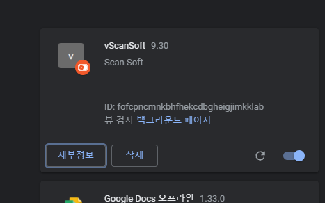

요즘들어 계속 나를 괴롭히고 있는 이상한 맬웨어다.

브라우저를 하이재킹해서 키워드를 가로채서 새로운 탭으로 m.nearbyme.io에 쿼리를 날려서 호출하는 방식이다.

검색엔진은 광고주의 부탁에 따라 상위노출 시켜줄 시 더 많은 돈을 받을 수 있는 것으로 알고있다.

확실한 것은 아니지만, 이 맬웨어는 자체적으로 검색키워드를 하이재킹해서 상위노출시키는 방식으로 광고주에게 돈을 받는 모양이다.

브라우저 하이재킹을 한다면, 단순히 브라우저 내의 키워드만 가져가지는 않을 것 같았다.

1차적으로 구글링을 통해 해당이슈를 해결할 수 있는 방법을 찾아보았다.

국내페이지에서는 이 이슈를 다루는 곳이 별로 없는 듯 하였다.

해외페이지에서는 이 문제를 상당히 다루기는 했는데,

다 똑같은 이야기였다.

요약하자면

1) 프로그램 추가/제거 에서 이상한 프로그램을 삭제하라

2) 안되면 우리 애드웨어 제거 프로그램을 사용하라(유료)

이런식의 백신 홍보글이었다.

우선은 수상한 프로그램을 발견해서 해당 프로그램을 삭제하였다.

구글 확장프로그램 (chrome://extensions/ ) 로 이동하여 이상한 확장프로그램을 확인해보았다.

vScanSoft라고, 검색해봐도 정체를 알 수 없는 이상한 소프트웨어가 깔려있다.

해당 확장프로그램을 삭제하더라도, 계속 좀비처럼 자동으로 설치되는 상황..

이 프로그램을 삭제하면 m.nearbyme.io 탭이 뜨지 않는데, 다시 설치되면서 해당 탭이 뜨는 것으로 보아

이 확장프로그램이 브라우저 하이재킹을 수행하는 것으로 보인다.

세부정보를 확인하여 해당 확장프로그램이 어디에 설치되어 있는지 확인해보았다.

아무파일도 없는데, 신기한 일이다.

그러나 당연하게도 쉽게 발견되지 않도록 숨김설정이 되어있었다.

숨긴항목을 확인해보니 여러 파일들이 있었다.

.json 파일을 확인해보니

메인 동작은 background.js가 작동을 하는 방식이었다.

마치 암호화 되어있는 듯한 자바스크립트 코드

스크립트를 확인할 수 있다면 동작구조를 분석할 수 있었을 텐데 도저히 알아볼 수 없는 형태였다.

svcworker.js도 마찬가지

확장프로그램 섹션에서 해당 프로그램을 삭제하더라도 어차피 다시 살아난다.

왜냐하면 진짜 프로그램은 여기에 계속 상주하고 있기 때문이다.

그럼 이 파일들을 삭제하면 문제가 해결될까?

삭제하더라도, 다시 파일들이 설치되는 엄청난 생명력을 가진 프로그램이었다.

ServiceWorker에서 확인해 보니( chrome://serviceworker-internals/ )

해당 확장프로그램(vScanSoft)를 계속 설치하도록 서비스 등록되어져 있었다.

아까의 vScanSoft와 appid 다른 이유는, 확장프로그램에서 해당 앱을 삭제했기 때문이다.

그래서 서비스가 새로운 appid를 발행하고 해당 프로그램을 설치하는 형태로 보인다.

우선 Unregister 버튼을 눌러서 해당 서비스를 종료시켜준다.

그리고 아까 ProgramData폴더에 계속 상주해 있던 파일들을 또 삭제해준다.

프로그램 추가/제거로 이동하여 아까 발견한 의심스로운 프로그램을 삭제하면 되는데,

제어판에들어가 프로그램 추가/제거를 실행시켜도 되지만,

실행창에서 appwiz.cpl을 입력하면 바로 이동할 수 있다.

의심스러웠던 이녀석까지 완전히 삭제를 해준다.

그리고 재부팅을 해봤을 때 어떻게 되는지 확인을 해보면 된다.

재부팅을 했더니 또 살아있는 대단한 녀석...

우선 무력화시키는 방법은 위의 파일들을 삭제하는 것인데

다시 이 파일들을 자동 설치하는 프로그램을 찾아야 이번 이슈를 해결할 수 있을 것으로 보인다.

어떤 프로그램이 악성파일들을 다시 설치하는 지 아직 알 수 없기 때문에

우선 인터넷 사용 기록과 캐시들을 삭제하여 초기화 해주는 방식으로 해결해본다.

그럼에도 계속 해당 확장프로그램이 생성되는 상황이다.

그래서 단순 파일삭제가 아니라 해당 확장프로그램의 파일이 저장되는 위치에 가서

데이터를 모두 공백으로 바꾼 후, 모든 파일의 쓰기 권한을 없애버렸다.

어떤 악성 프로세스에서 해당 파일을 생성해내는지 아직 알아내지 못했지만

임시조치로서 악성코드를 작성하지 못하도록 막아두었다.

해당 파일을 생성해내는 프로세스를 발견하게 된다면 추후 또 기록할 것...