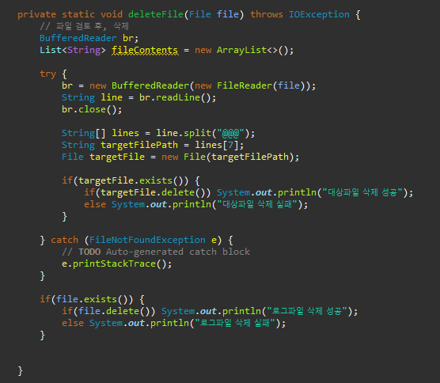

가장 먼저 context정보를 불러온다.


DB에 접근하는 영역 DAO (Data Access Object)


여기에 정의된 내용들은

agent가 동작할 데이터 영역의 구조들이라 생각하면 된다.

이 데이터들을 이용하여 유의미하게 서비스를 제공 혹은 인사이트를 생성해내는 로직을 개발하는 것이

앞으로의 agent 개발 건들에 대해서 기본적으로 생각해야할 전제가 될 것으로 보인다.

따라서 어떤 기능을 동작할 것인지 명세하고 탑-다운 형태로 구현해나가는 것을 목표로 할 것이다.


DB단과 통신하는 경우는 DAO를 이용하고,


질의문은 sql을 정의해놓은 xml에서 id값을 찾아서 데이터를 넘겨준다.

결과값은 보통 HashMap을 이용하여 불러오는 형태로 만든다.


해쉬는 <key,Value> 형태인데 키 값을 통하여 찾고자 하는 레코드에 접근하는 형태다.

레코드는 여러개의 필드의 값을 담고있는 객체인데, 보통 이러한 객체를 Bean객체라 부른다.


통상적으로 agent가 작동할 때는, 파일을 입력받거나 파일을 쓰는 경우가 매우 많기에

파일 입출력과 간단하여 자주 사용하던 코드형태를 정리해둔다.


1) 파일입력

```java
String read_dir_info_path = props.get("read_dir_info_path");
while(true) {
				File dir = new File(read_dir_info_path);
				File files[] = dir.listFiles();

				for (File file : files) {
					doSomthingFile(file); 
					deleteFile(file);
				}
				System.out.println("작업할 파일이 존재하지 않습니다.");

				Thread.sleep(1000);
}
```


스레드를 이용할하여 agent를 동작하는 경우, Consumer,Producer 클래스를 각각 두는 구조로 구성하면 좋다.

본 자료에서는 기본적으로 

특정 대상에 있는 파일리스트에 대하여 각각의 파일들에 대한 특정작업을 진행한다고 간단히 구조화 하여 코드를 작성한 것이다.

doSomthingFile에서 해당 파일을 이용하여 어떠한 작업을 하고, 작업이 끝나면 deleteFile()메소드를 통하여 해당 파일을 삭제해주는 구조


나의 경우 BufferedReader 클래스를 이용하여 파일을 읽는다.

해당 파일에 여러줄의 데이터가 들어있는 경우도 생각하여

List로 라인별로 불러들여준다.

이렇게 하면 각 라인별로 원하는 작업을 수행할 수 있다.


deleteFile()메소드는 다음처럼 구성하면 삭제가 가능하다.




2) 파일쓰기


파일을 쓰려고 하는 곳에, 경로가 존재하는지, 파일이 존재하는지 등 각각의 경우들을 다 따져주고

존재하지 않으면 mkdir() 혹은 createNewFile() 메소드를 이용한다.

그리고 나서 BufferedWriter클래스를 이용하여 파일을 작성한다.