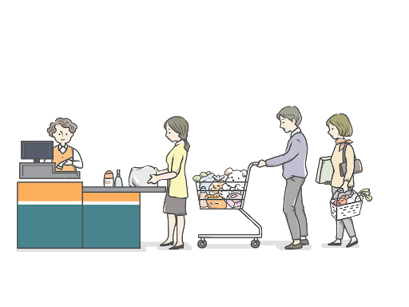

자바스크립트 비동기 처리와 콜백 함수
프로미스?
async & await
함수 표현

## INTRO

프론트단에서 간단히 작동할 동작들을 스크립트로 작성할 필요가 많아졌다.
문법적으로 생소한 부분들을 공부 겸, 정리해두려고 한다.


## 비동기 처리
비동기 처리가 무엇이며, 왜 비동기 처리가 필요할까?
기본적으로 프로그램은 절차적으로 동작을 수행한다.

이 말은 다음과 같다.

```
int a = function1();
int b = function2();
int c = 1 + 2;
```

c의 값을 알기 위해서는 a가 수행되고, b가 수행되고 난 후에야만 가능하다.
function1()이 종료되고, function2()가 종료되어야만 c의 값이 결정되는 것이다.
이것이 절차적으로 수행되는 것이며 이러한 방식을
요청을 보낸 후 응답을 받아야만 다음 태스크가 수행되는,**동기식 처리**라고 한다.
이러한 처리가 왜 문제가 될까?



가끔 마트에서 급하게 물건 **하나**를 살 일이 있어서 들렀을 때가 생각난다.
나는 진짜 딱 한개의 물건만 계산하면 되지만, 
앞줄의 사람들이 다 계산될 때 까지 기다려야 한다.

동기식 처리는 이 때와 비슷한 양상을 보인다.
간단한 일처리를 해야하는데 앞서 수행되는 로직들이 오래걸리는 경우,
앞의 처리들이 끝날 때까지 기다릴 수 밖에 없는 상황이 발생한다.

해당 로직들이 나와 연관이 없다면 굉장히 비효율적인 상황이 된다.
이러한 비효율적인 처리를 방지하기 위해 비동기식 처리를 하는 것이다.

(작성중)