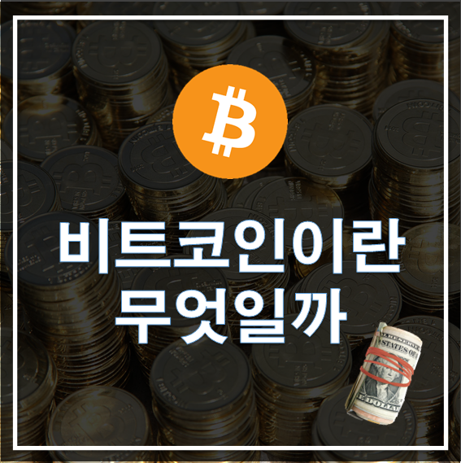
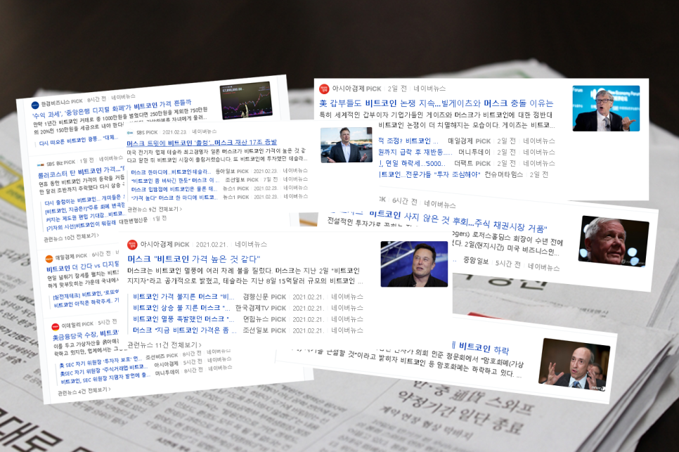
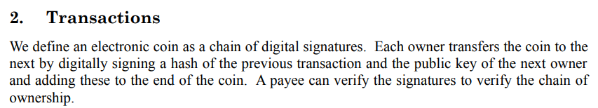

주식열풍을 넘어 비트코인이 다시금 들썩이고 있습니다.

머스크의 한마디에 비트코인의 가격이 오르락 내리락 난리도 아니죠

한 때, JTBC에서 『가상통화, 신세계 인가 신기루인가』 라는 주제로

첨예한 토론을 나누기도 했었죠.

과연 이 비트코인은 무엇일까요?

엄밀히 정의하자면 비트코인이 아니라 가상화폐, 암호화폐가 정확한 표현이고

이 분야의 대표가 바로 비트코인입니다.

암호화폐도 종류가 다양합니다.

저는 경제 전문가도 아니고 전문 투자자도 아닙니다.

그래서 "가상화폐는 ㅇㅇ이다." 라고 결론을 내리려는 것이 아닙니다.

다만, 이 광풍에 공감이 간다기보다는 어떠한 저항감이 발생하여

감정적으로 접근하기보다는 차분하게 살펴볼 필요가 있겠다는 생각이 들었습니다.

그러한 고로, 빌라도의 마음으로

이 광풍에서 한 발자국 뒤로 물러나 조심스럽게 살펴보고자 합니다.

2021년 3월 3일 오후 4:43분 기준 비트코인 가격입니다.

그래프를 보시면 2018년 기준으로 가격이 급격하게 올랐습니다.

이 시기에 실제로 비트코인으로 이득을 본 사람들도 많았고, 돈을 잃은 사람은 더 많았죠

돈 버는 사람이 있으니까 어쨌든 수익이 날 수 있는 투자종목 아니냐? 라고 생각하실 수도 있겠는데

그 뜻이 비트코인에 가치가 있다는 뜻으로 연결되는 것은 아닙니다.

"가치를 알아보고 저렴한 가격에 미리 구매하면 수익이 난다."  라고 동의할 수 있는 명제를 떠올려봅니다.

그러나 그의 역 명제인 "수익이 나는 것은 투자이다."라고 일반화 하기는 어렵다고 생각합니다.

카지노에 가서 대부분 돈을 잃겠지만 혹여 잭팟이 터지는 사람도 있기 마련이죠

"카지노에 가서 잭팟이 터졌다(수익이 났다) -> 수익이 나는 것은 투자이다."

삼단논법에 의해 "카지노에 가는 것은 투자이다." 라는 말은 이상하잖아요

그러므로 이 현상 너머, 그 실체를 좀 면밀히 살펴보고 판단할 필요가 있다고 봅니다.

단순히 감정적으로 "비트코인은 튤립버블마냥 거품이다, 투기나 도박이다" 라고 주장하려는 것이 아니고요

TV에서 토론회까지 벌일정도로 어마어마했던 그 때의 광풍을 기억합니다.

폭풍이 지나간 후, 그렇게 관심도 줄어들고 실제로 가격폭락도 있었죠

그러다가 다시금 갑자기 떡하니 등장하여 엄청난 가격상승과 함께 주목을 받게 되었습니다.

가상화폐란 과연 무엇일까요? 또, 암호화폐란 무엇일까요?

사전에 정의된 바에 따르면 이렇게 나옵니다.

위에서 보다시피 (가상화폐=암호화폐)는 아닙니다.

중요한 것은 우선 실물 화폐가 아니라는 점이죠

다음으로 비트코인의 개발자인 Satoshi Nakamoto가 2008년 10월에 발표한 논문을 통해 비트코인에 대해서 자세히 알아봅시다.

**Bitcoin: A Peer-to-Peer Electronic Cash System** 이라는 제목의 논문입니다.

https://bitcoin.org/bitcoin.pdf

\- 우리는 전자 동전을 **디지털 서명 체인**으로 정의합니다. 각 소유자는 이전 거래의 해시 및 다음 소유자의 공개 키를 디지털 서명하고 이를 동전의 끝에 추가함으로써 동전을 다음 소유자에게 이전한다. 수취인은 서명을 확인하여 소유권 체인을 확인할 수 있습니다.

이 방식이 바로 블록체인 방식입니다.

블록체인은 분산 컴퓨팅 기술 기반의 **데이터 위변조 방지** 기술입니다.

쉽게 생각하여 

데이터들을 중앙에 저장하는 방식이 아닌, 

쪼개서 저장하고, 체인처럼 하나하나 연결한 형태입니다.

(그래서 이를 **탈중앙**이라고 하죠)

이 모든 블록들이 연결되어 있고, 어느 부분만 위변조 하는 것이 불가능 하도록 되어져 있는 구조입니다.

수학적으로 중간에 위변조가 발생했을 경우, 문제가 있다는 것을 알 수 있는 구조이죠

블록체인은 암호학에서 중요하게 다루는 [비잔틴 장군 문제](https://ko.wikipedia.org/wiki/비잔티움_장애_허용#비잔티움_장군_문제)의 솔루션으로 볼 수도 있습니다.

비잔틴 장군 문제는 링크해두었으니 관심있으신 분은 찾아보시면 좋으실 것 같습니다.

비트코인은 이 블록체인 시스템을 유지하기 위해 계산을 해야하는 데

그 계산(컴퓨팅)의 대가로 코인을 지급하는 것입니다.

이 행위가 흔히 채굴, 마이닝 이라고 부르는 일입니다.

쉽게 비유하여 설명하겠습니다.

처음 블록 1개였을 때는 데이터의 위변조를 검토할 때, 게산도 간단하겠지만

블록의 갯수가 늘어나면 늘어날 수록 전체의 무결성을 검토하려면

그 계산하는 양이 더 많이 늘어나게 되겠죠?

이렇게 일일이 계산하다보니 위변조는 막겠지만

이를 유지하기 위한 컴퓨팅의 양은 매우 증가하게 되겠습니다.

즉, 이름 감당하기 위한 연산을 수행하는 컴퓨터의 수가 갈수록 증가할 수 밖에 없습니다.

이 늘어난 연산을 무료로 해결할 수는 없겠죠.

엄연히 컴퓨터 자원을 쓰는 일이기 때문에

그 컴퓨팅의 댓가로 비트코인을 지급해주는 것입니다.

그래픽카드로도 채굴이 가능하기 때문에 그 여파로 그래픽카드 시세도 함께 미친듯이 뛰었죠..

블록체인 기술은 널리 활용될 수 있고,

실제로 4차 산업혁명에서 중요시 되는 기술중 하나입니다.

디지털 데이터의 양은 더욱더 방대해지는데

이러한 빅데이터를 다룰 수 있는 기술이 블록체인이 될 수 있겠죠

이 블록체인의 기반이 되는 데이터들이 무엇이냐에 따라서

이 가상화폐들이 중요하게 다뤄질 수 있겠다고 생각이 듭니다.

예를들어,

한 지방에서 모든 교통 데이터들을 활용할 목적으로 

블록체인 기술을 이용한다고 가정해봅시다.

출처 : https://mblogthumb-phinf.pstatic.net/MjAxOTEyMjRfMTMy/MDAxNTc3MTY3NDAyNTM5.klVIggppz9pgxKskQaLGGVhUQm3o5o5omTg99-o8i9Ug.F1tji2LCmAcwFCuTbzJ0yUZznnOZ_aJO4ms6h0n1qOMg.JPEG.koti10/GettyImages-1140691126.jpg?type=w800

자율주행이나 실시간 교통량을 고려한 네비게이션 서비스를 제공하는데 활용할 데이터라고 칩시다.

이 데이터들을 처리하기 위해서는 방대한 컴퓨팅 자원을 필요로 하는데

한 기관에서 담당하기에는 너무 방대한 영역입니다.

그래서 이를 해결하기 위해 그 지역의 많은 사람들에게 분산하여 컴퓨팅 자원을 이용하고

그 댓가로 돈을 지불하는 대신에 마일리지(가상화폐)를 발행한다고 생각해보세요

이 마일리지가 의미가 있으려면, 이 마일리지로 실제 상품 거래가 가능해야 합니다.

이 때의 블록체인의 기반이 되는 데이터들은 실제로 중요하기 때문에

그 컴퓨팅의 댓가로 지불한 마일리지들이 실제 가치를 가져야 합니다.

그렇지 않다면 채굴하는 사람들이 컴퓨팅 자원을 제공해주지 않을 것입니다.

그렇기에 이 마일리지로 거래가 가능하다는 **사회적인 협약**이 있어야 합니다.

이 마일리지는 이 정도의 가치에 해당한다는 모든 구성원간의 약속이 필요하다는 뜻입니다.

화폐도 실제로 존재하는 존재가 아니라 가치 교환을 위한 수단에 불과하고

그 척도로서 사회 구성원들이 암묵적으로 협의를 맺은 단위잖아요

그런데 재미있는 점은, 블록체인에서 감당해야 할 연산문제를 해결하기 위해 비트코인이 나온것이 아니라

비트코인의 문제를 해결하기 위해 블록체인을 고안했다는 점입니다.

비트코인 자체의 무결성,안정성을 확보하기 위해 코인의 거래내역 등은 블록체인의 기반 데이터들이 됩니다.

한마디로 여기서의 블록체인은 비트코인의, 비트코인에 의한, 비트코인을 위한 존재입니다.

이 자체의 가치를 긍정적으로든 부정적으로든, 저는 감히 평가할 수 없겠습니다.

다만 이러한 방식으로 이루어져있다고 말씀드리고 싶은겁니다.

비트코인은 분산컴퓨팅을 이용하여 탈중앙화를 이루었습니다.

이는 긍정적으로 보면 중앙규제로부터 자유로울 수 있으나,

반대로 그 어떤 보호도 받을 수 없다는 의미이기도 합니다.

물가안정을 위하여 중앙은행에서도 돈을 함부로 발행하지 않습니다.

표준대국어사전 기준으로 화폐의 의미는 **상품 교환 가치의 척도** 입니다.

화폐란 교환 매개체로서 상품의 **가격**을 뜻하는 것이지, 그 자체로 가치가 아닙니다.

이 화폐의 개념을 새로이 정립하지 않는 이상, 이러한 패러다임을 뒤집지 않는 이상

암호화폐가 미래의 통화수단으로 활용되고 그 가치는 더 높아질 것이라는 주장이 아이러니하게 느껴지긴 하네요

이미 주류화폐로 쓰이고 있는 돈의 경우도 물론 완전무결로 안정적이지는 않습니다.

은행에 돈을 넣어놓으면 누군가가 가져갈 염려가 줄어드는 거지 이로부터 완전히 자유로울 수 없지 않습니까

따라서 이러한 문제점을 해결한 안정성있는 비트코인이 새로운 화폐로서 쓰일 수도 있을 것 같기는 합니다만,

모두간의 공통적인 합의가 이루어진다면 모를까 현재 비트코인은 아직 일종의 서드파티 개념의 화폐입니다.

어쩌면 과도기 단계에 있어서 요즈음의 현상이 발생하는 건 아닐까 싶기도 하네요

또한 비트코인이 공용화폐로서 인정되어지려면 현재의 변동성이 잡혀야 한다고 생각할 것입니다.

변동성이 크다면 화폐로서의 효용가치가 떨어집니다.

극단적인 예로 이러한 유머도 있었습니다. 말하는 순간에도 그 가격이 변하고 있다고 풍자한 것이죠

(지금은 5500만원인게 또 아이러니한 세상아니겠습니까)

투자와 베팅의 차이가 무엇일까요?

저는 궁극적으로는 잘 모르겠습니다.

일생 일대의 베팅(betting)이 어쩌면 만루역전홈런을 때리는 배팅(batting)일 수도 있지 않을까 하는

일말의 희망만을 바라보기에는 세상이 그렇게 호락호락하진 않은 것 같습니다.

앞서 말했듯이 저는 경제 전문가가 아니기에 

이 부분에 심도있는 이해는 없습니다.

따라서 더 논하기에는 제 자신이 너무 부족하므로 논외로 하도록 하겠습니다.

나의 인생은 누군가가 책임져주지 않습니다.

전문가들의 의견에만 의지하지 마시고, 조금더 면밀히 살펴보고

이 곳에서 어떠한 가치를 발견하신다면

그 때 투자를 해보셨으면 좋겠습니다.

저는 제가 옳다고 주장하고 싶지 않습니다.

다만 제가 틀렸는지 물어보고 싶을 뿐입니다.

그렇기에 여러분들의 생각도 궁금합니다.

이상으로 가상화폐에 대해 조금 알아보았습니다.

여러분들의 생각은 어떠신가요?

