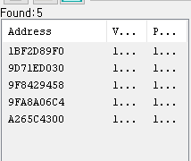

전국의 겜돌이 겜순이 여러분 안녕하세요

저는 가끔 게임을 하다가

이런 생각이 들곤 합니다.

일명 노가다(?)가 필요한 구간들에서 말이죠.

게임은 재밌을려고 하는건데

왜 나는 이 짓을 하고 있는거지???

이 과정 자체가 재밌으신 분들에게는 

해당이 없는 이야기 일수도 있겠습니다.

하지만 저는 게임 자체의 Narrative, 서사를

즐기는 라이트유저 게이머이기 때문에

종종 이런 노가다에 막힐때마다

숨이 턱 막히곤 한답니다.

그래서 제가 종종 쓰고 있는 방법인데

다른 분들에게도 도움이 될 수 있을 내용인 것 같아서

정리해 보았습니다.!!

> \1. 왜 가능한가?

치트키 쓰는 방법만 궁금하신 분들은 이 파트는 생략하시고 넘어가셔도 됩니다.

궁금하신 분들을 위해 개념적인 설명만 간단히 해보겠습니다.

게임,프로그램이 어떻게 돌아갈가요?

메모리상에 데이터를 올려 놓고

cpu가 그 값들을 이용하는 것입니다.

이렇게 생긴 녀석을 본적이 있으신가요?

RAM카드라고 불리우는 녀석입니다.

메인메모리라고도 하며, 이 곳에 데이터의 값들이 올라가게 됩니다.

메모리 상에

데이터들을 올려놓고 그 값들을 프로그램은 참고하는 것입니다.

예를 들어 볼게요

제 캐릭터가 상대의 캐릭터를 공격한다고 가정해보겠습니다.

공격 메커니즘을 이렇게 구현해볼까요?

공격력 값을 가져와서 상대방의 방어력과 비교해서 실제 데미지를 계산

[실제 데미지 = 나의 공격력 - 상대 방어력 (음수값 제외)]

공격함수 실행  => 실제 데미지를 고려하여 HP를 감소시킨다.

아주 간략하게 표현해 보았습니다.

(물론 실제 게임들은 다 각각 다른 함수를 가지고 있겠죠.)

우리가 주목해야 할 점은

프로그래머는 함수를 구현해놓기만 하고

실제 데이터는 메모리상에서 가져온다는 점입니다.

게임내의 자원,데이터들이

어디 다른 세상에 존재하는 것이 아니라

메.모.리. 안에 존재한다는 것이죠

프로그램 자체적으로 각각의 값들을 아는 것이 아니라는 이야기 입니다.

얘네는 이 데이터를 몰라요. 그냥 보고 읽을 뿐이죠

그렇다면, 이 메모리를 조작할 수 있다면

게임 내의 결과도 조작할 수 있다는 이야기가 되겠죠???

우리들은 메모리상에 이 데이터들이

어디에 저장되어져 있는지만 찾을 수 있다면

데이터 조작이 가능합니다.

"난 돈을 늘려주고 싶어"

그렇다면 돈의 메모리 위치를 찾아가서 수치를 조작해주면 됩니다.

저는 메모리를 찾는 방법을 소개할 것이고,

왜 메모리를 찾는지 설명할 필요가 있어서 이렇게

미리 간단한 개념설명을 하였습니다.

> 2.어떻게 하는가?

[ **Cheat Engine**Cheat Engine Download Cheat Engine Download Cheat Engine 7.2 for Mac Read before download: Cheat engine is for private and educational purposes only. Before you attach Cheat Engine to a process, please make sure that you are not violating the EULA/TOS of the specific game/application. cheatengine.or...www.cheatengine.org](https://www.cheatengine.org/)

데이터의 수치를 검색하여

메모리상에서 

그 데이터의 위치를 찾아주고 수치 변경이 가능한 프로그램이 있습니다.

대표적으로 "치트엔진"이라는 프로그램 입니다.

위 사이트에 들어가서 다운받으실 수 있습니다.

사이트에 들어오면 상단에

Download Cheat Engine이라 크게 적혀있네요

이 버튼을 클릭하시면 바로 설치파일이 다운로드가 됩니다.

다운로드가 완료되면 실행해서 설치 해주시면 됩니다.

-설치과정

"I accept the agreement" - 동의

해주시고요 Next > 눌러주세요

일반적인 프로그램 설치과정과 같습니다.

계속 Next를 눌러주시면 체크사항이 나오는데요

첫번째 체크사항은 바탕화면에 바로가기 만들것인지 물어보는 겁니다.

두번째 체크사항은 치트엔진 프로그램을 실행시켰을 때 새 버전이 나왔는지 체크할지 여부입니다.

저는 둘다 체크하지 않았는데

원하시는 항목들 선택하시고 넥스트 눌러주시면 됩니다.

설치가 진행되고 Finish를 눌러주시면 설치 끝.

치트엔진의 첫 화면입니다.

제가 빨간 동그라미 표시해놓은 부분은

내가 메모리스캔할 프로그램을 찾는 아이콘이고,

오른쪽 보라색 창은 검색할 값을 입력하는 곳 입니다.

왼쪽 보라색 창은 검색된 메모리들이 뜨는 곳 입니다.

하단의 빨간 네모 창은

조작할 메모리들을 올려놓는 곳 입니다.

그 외의 부분들은 고급편에서 다뤄보도록 할게요 

하나하나 기능별로 설명하니 복잡하게 느껴지네요

따라하면서 기능들을 이해하게 된다면

어떤 게임에도 응용하실 수 있습니다.

-어쌔신 크리드:오디세이

라는 게임으로

메모리 수치 변경하는

메커니즘을 설명해드리겠습니다.

우리의 주인공 친구...

갑자기 부자가 되고 싶네요

치트엔진을 이용해서

부자가 되어봅시다.

\1) 처음 값을 입력한다.

돈이 현재 17075원 있습니다.

이를 검색하여서 메모리 상에 어디에 있는지 찾아볼 거에요.

17075라는 값으로 검색을 했더니

92개의 데이터가 검색이 되는군요

메모리상에 17075를 의미하는 데이터가 92개 있다는 뜻 입니다.

이 중에서 데이터의 변동값을 추적하면서

돈이 저장되어 있는 위치를 찾도록 하죠

\2) 변화된 값을 입력한다.

무기 하나를 팔아서 돈을 변화시켜볼게요

17075원에서 17422원으로 변했습니다.

이제 치트엔진에서 17422로 값이 변한 아이들을 추적하면 됩니다.

여기서 주의할 점은

"New Scan"이 아니라 "Next Scan"을 해주어야 합니다.

"New Scan"은 아예 새로 검색을 시작하겠다는 뜻이고

"Next Scan"은 현재 검색된 아이들 중에서 다음 검색하겠다는 뜻입니다.

이제 5개의 값이 나왔네요

이 중에 돈이 저장된 데이터가 있습니다.

확실히 하기 위해

한번더 값의 변화를 주고 검색해보도록 할게요

물건 하나를 더 팔아서 17638원으로 만들었습니다.

다시 검색하였는데도 5개의 메모리가 나오네요

원래 하나의 값은 하나의 메모리에 기록하는데

요즘 나오는 게임들은 메모리 변조를 쉽지 않게 하기 위해서

여러개로 나눠서 기록하네요

마치 엑조디아처럼요..

이 중 하나만 고친다고 해서

실제 값이 바뀌진 않을 겁니다.

(하나만 바뀌면 무결성이 깨지게 되거든요)

다섯개의 값을 한번에 고쳐주는 방법을 써볼게요

다섯개의 값을 한번에 선택해주시고

마우스 오른쪽 버튼 눌러주시면 위와 같이 메뉴가 뜨는데

거기서 

 Change value of selected addresses를 눌러주세요

선택된 주소들의 값들을 변경시킨다는 뜻이죠

(Ctrl + E)를 눌러주셔도 됩니다.

여기에 변경할 값을 입력하시면 되는데

원하는 값으로 적절히 조절하시면 됩니다.

저같은 경우는 999999999 이렇게

수정해버리면 재미가 없더라구요

필요한 만큼만 적당히 쓰시면 됩니다.

저는 소박(?)하게 딱 10배의 값만 입력해보았습니다.

다시 게임으로 돌아와볼게요

과연 값이 바뀌었는지

다시 게임으로 돌아왔는데 값의 변동이 없네요

메모리상에서는 값이 변하였으나 아직 동기화가 되지 않아서 그럽니다.

물건 하나를 사거나 팔아서 값의 변동이 생기면

실제 메모리 값이 나타나게 됩니다.

물건하나 팔았더니 돈이 늘어났죠?

176380원에다가 방금 물건 판 값이 더해져서 176586원이 되었네요

여기까지 하시고

게임을 저장해주시면 됩니다.

치트키 치는법 참 쉽죠???

어떤 게임이든 이런 방식으로 데이터 수치 변경이 가능합니다.

이를 에딧이라고도 부르죠

제가 마법의 주문을 알려드린 것 같다고 생각하시는 분들도 있을겁니다.

그러나 그렇지 않아요

이 방법은 온라인 게임에는 통하지 않습니다.

왜냐하면

실제 중요한 데이터들은 

게임사의 서버에 저장되어 있기 때문이죠

우리가 그 서버로 진입할 수 있다면

데이터 수정이 가능하겠지만, 그건 쉽지 않은 일이니까요

우리 컴퓨터의 메모리상에

데이터가 올라가게 되는 게임들은

이렇게 메모리 추적해서 수정이 가능합니다.

가끔 게임하다가 답답하다 막힌다 하시면

이러한 방법도 활용해보시면 좋겠네요 ^^

너무 과도하게 사용하면 재미를 급격히 반감시키니 적당히 이용해봅시다!

과도한 노가다는 피로와 스트레스 이지만,

적당히 노력하는 재미도 분명 있거든요

오늘의 탐구생활~

이상입니다 ^^

