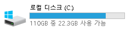
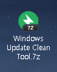
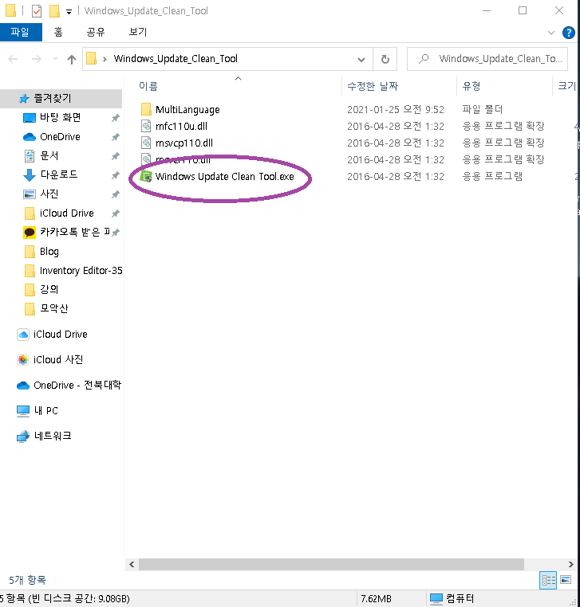
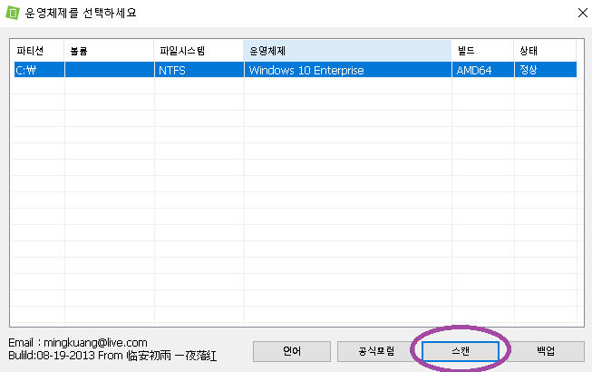
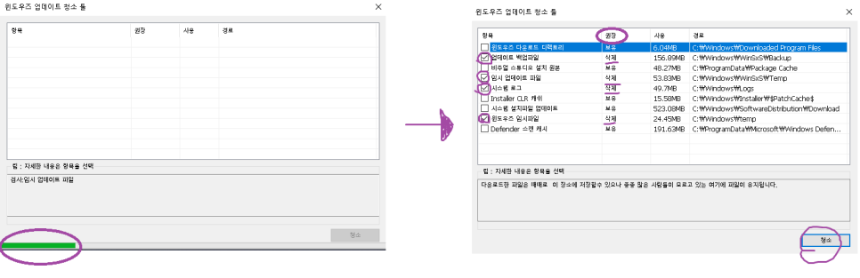
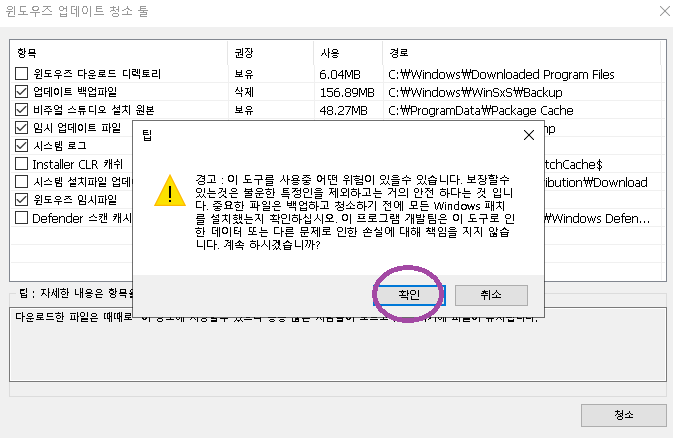
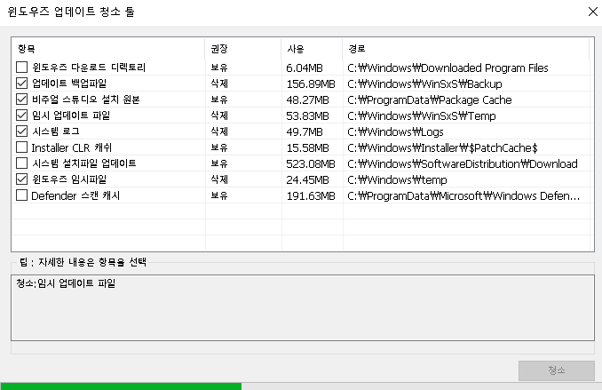
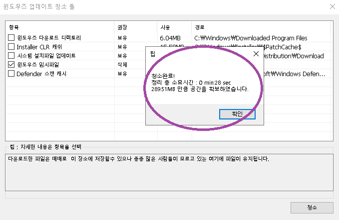
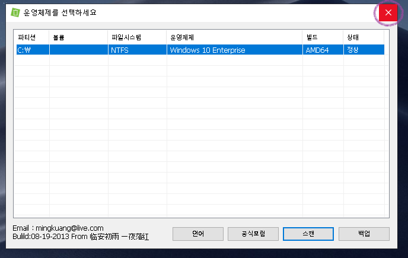
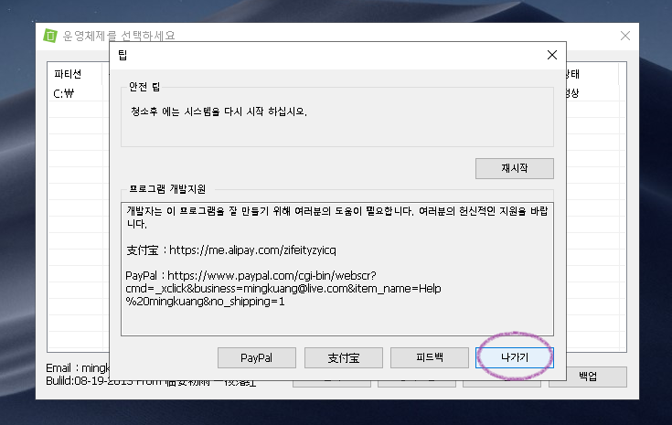

컴퓨터를 오래 사용하다 보면

필요 없는 파일들이 많이 쌓여서

용량도 많이 차지하고 느려지는 경우들이 많습니다.

이런 파일들로 대표적으로 윈도우 업데이트 파일들이 있습니다.

업데이트 하기 위해 설치파일을 다운받고

업데이트를 하고 나서도 그 설치파일 껍데기들이 남아있죠...

이런 파일들이 은근히 용량차지를 많이합니다.

저의 SSD 용량은 110GB입니다.

용량이 매우 적죠..

그래서 쓸데없는 파일들은 웬만하면 정리를 해줘야 합니다.

앞서 언급했던 윈도우 업데이트 파일들을 정리해주면 좋습니다.

제가 주로 쓰는 방법인데

여러분들에게도 소개드릴까 합니다.

**첨부파일**

Windows Update Clean Tool.7z

 [파일 다운로드](https://blogattach.naver.com/79ec65d5c49b9d416d88ecdbe7027e03a7f00fec94/20210125_46_blogfile/kdi3939_1611539329222_hARxvi_7z/Windows+Update+Clean+Tool.7z)

우선 파일 하나 올려드릴게요

제가 올려드린 파일을 다운받으면 위와 같은 압축파일이 하나 있습니다.

압축을 풀어주세요

**"Windows Update Clean Tool.exe"** 파일을 실행시켜주세요

윈도우가 설치되어져 있는 파티션이 뜹니다.

**"스캔"**을 눌러주세요

처음 스캔을 진행하고 오른쪽 화면과 같이 정리할 목록이 뜹니다.

어떤파일을 지워야 할지 잘 모르겠으면

권장에 "**삭제**"라고 나와있는 파일들만 지워주시면 됩니다.

지울 항목들을 선택한 후, 청소 버튼 눌러주세요

청소버튼을 누르면 경고창이 뜨게됩니다.

아니 컴퓨터 청소하는데 갑자기 이렇게 협박을 하는거 같죠?? 무서워요 ㅠㅠ

그러나 여러분 무서워하지마시고

확인 눌러주시면 되요

업데이트 파일을 지우는 거기 때문에 윈도우 입장에서는 시스템 파일을 건드는 일이라서

위험할 수 있다고 미리 알려주는 것입니다.

그러나 우리가 삭제하는 파일은 업데이트 찌꺼기 파일이기 때문에 쫄지마세요!

다만, 권장에서 "**보유**"라고 적혀있는 것을 체크해서 삭제할 때 문제가 발생할 수 있으니

그때는 잘 알지 못하면 체크하지 않는 것을 추천드립니다.

확인 눌러주시면 아래에 진행바가 가면서 청소가 진행되고

완료되면 총 얼마만큼의 용량을 확보했는지 알려줍니다.

저는 이 글을 작성하기 전에 한번 정리를 했었어서

289MB밖에 확보되지 않았네요..

그래도 쓸모없는 파일들을 다 지운거니 참 개운하네요 ㅎㅎ

간혹 프로그램 종료를 어려워 하시는 분들이 계셔서

추가 설명 드릴게요!

우측 상단에 "x"표를 클릭합니다.

그럼 바로 종료되는 것이 아니라

이러한 창이 한번 뜨게 됩니다.

그냥 "나가기" 버튼눌러주시면 되요

이 프로그램이 너무 고마우면 후원이나 피드백을 남겨줄 수도 있습니다.

중국어는 제가 뭔말인지 몰라서... 그냥 넘어갈게요.. ^^;;;

오늘의 탐구생활

여기까지 입니다~!

