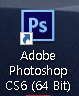

포토샵 CS6가 영문으로만 뜨는 경우가 있습니다.

많은 책들이 영문기준으로 작성된 경우가 많아서 영어로 쓰시는 분들이 있을텐데

요즘에는 한글기준으로도 많이 강의가 나와있는 것 같습니다.

제가 첨부한 아래의 한글 언어팩을 다운받아 포토샵 언어 폴더에 넣어주시면 한글로 실행 가능합니다.

바이러스 검사한 파일이니 안심하고 받아주셔도 됩니다. 불안하신 분들은 압축풀기전에 바이러스 검사 한번 더 해주시면 좋을 것 같습니다.

주의) 제가 첨부한 파일은 **포토샵 CS6 버전**용 입니다. 다른 버전은 호환이 안됩니다. 참고해주세요

**첨부파일**

 [ko_KR.zip ](https://blogattach.naver.com/44d158e8fda3a07c50b5d1e6da3f423c9ac830d1c7/20210219_109_blogfile/kdi3939_1613710129520_qe32PR_zip/ko_KR.zip)

 [en_US.zip](https://blogattach.naver.com/9a0f8630221110a58b6e093907e69be44410ed2f/20210219_190_blogfile/kdi3939_1613710135779_t8bUWP_zip/en_US.zip)

이제 포토샵이 설치되어있는 폴더로 이동하셔야 하는데 

쉽게 이동하는 방법을 알려드리겠습니다.

바탕화면에 포토샵 아이콘이 있으면 마우스 오른쪽 클릭해주세요

꼭 바탕화면 아니더라도 상관없습니다. 시작메뉴 안에 있어도 괜찮습니다.

아이콘을 찾아서 마우스 오른쪽 클릭만 해주시면 됩니다.

그 다음 파일 위치 열기 눌러주시면 포토샵이 설치되어져 있는 폴더가 뜨게 됩니다.

위쪽으로 스크롤해서 이동하면 "Locales" 폴더가 존재합니다.

저는 en_US폴더만 존재하네요

영어 언어팩만 설치되어져 있는 상황이라 포토샵이 영어로 뜨게 됩니다.

Locales폴더안의 파일들을 다 삭제해줍니다.

이렇게 폴더를 비워주세요

그다음 제가 첨부한 파일들의 압축을 풀어주세요

설치하고자 하는 언어를 Locales폴더에 넣어주시면 됩니다.

en_US는 영어버전이고, ko_KR은 한글버전 입니다.

원하는 언어버전을 집어넣어주시면 됩니다.

모두 넣으시면 한글판이 적용이 안될 수 있습니다.

한개의 언어만 넣어주세요

폴더에 넣을 때 이런 창이 뜨게 되는데 관리자 권한으로만 넣을 수 있어서 이러한 창이 뜨는 겁니다.

"계속" 버튼을 눌러지면 정상적으로 폴더가 옮겨지게 됩니다.

혹시 포토샵이 실행중이었다면 종료후 재실행 하게되면

한글이 정상적으로 적용되어져 있는 것을 확인할 수 있습니다.

이상으로 

포토샵CS6 한글로 바꾸는 방법을

알아보았습니다.

