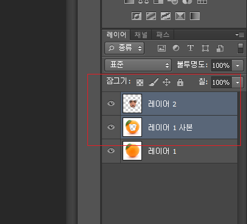
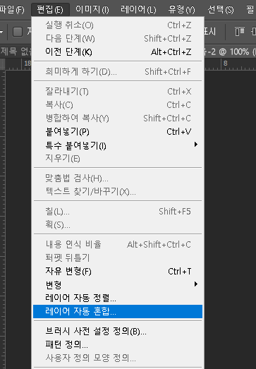
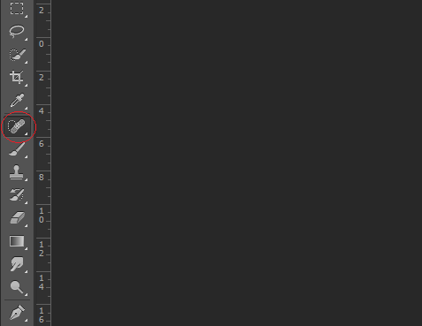

저는 디자이너 전공을 한 사람이 아닙니다만,

간단한 그림작업을 하기 위해서 알아보다 보니

그림판으로는 한계가 있더라구요

그러다가... 포토샾도 만지게 되더라구요

블로그에 올릴 짤들을 만들면서

제일 많이 쓰이는게 합성 아닐까요?

뭐 페이스북에서 대신 포토샾해주시는 그런 고수분들에 미치지는 못하지만

간단하게 합성할 수 있는 방법을 대방출 하도록 하겠습니다.

어노잉 오렌지라고 들어보셨나요?

오렌지에 사람 눈과 입을 합성해서 괴기스럽네요 ㅋㅋㅋㅋ

이런 간단한 합성을 하고 싶다면 어떻게 해야할까요?

> 스텝 1. 오렌지 인간 만들기

오렌지 사진을 포토샾으로 불러옵니다.

그리고 눈코입을 붙여넣어야하는데

누구의 얼굴이 좋을까요..?

요즘 펜트하우스 굉장히 핫하죠?

여기서 열연중이신 유병재씨의 도움으로 합성을 진행해보도록 하겠습니다.

(유병재씨 죄송합니다.ㅠㅠ)

어노잉 오렌지처럼 만들자니 죄책감이 드는군요

유병재씨의 상큼한 매력을 오렌지로 표현하는 쪽으로 방향을 잡고

합성을 진행해보도록 하겠습니다.

좌측에 이런 모양이 있을겁니다. 올가미 도구라고 불리는데

이 툴을 선택하시고 붙어녛을 영역을 그려주세요

그리고 오렌지에 붙여넣으면 이런식으로 들어갑니다

단순 사진 복붙을 합성이라 할 수는 없겠죠?

중요한 건, 단순 복붙이 아니라

레이어로 나누어서 이루어져야 한다는 점입니다.

레이어에 개념은 추후 포토샾 기본기능에 설명할 기회가 있다면 자세히 다뤄보겠습니다.

이제 밑의 배경이 되는 레이어를 선택하고 복제해주세요

단축키는 [컨트롤 + J] 입니다.

그 다음 다시 얼굴을 선택하고 적당한 위치를 잡아주세요

크기가 맘에 안든다면 [컨트롤 + T]를 눌러서 크기도 조절해주세요

원하는 위치에 적절히 배치하고 나면 이제 톤을 맞춰줘야 합니다.

컨트롤을 누른상태로 빨간색으로 표시한 부분을 클릭하면

얼굴영역이 선택되어집니다. 그 다음  이 영역만큼 레이어 1 사본을 지워야 합니다.

똑같은 크기로 지우는 것 보다는 이 선택영역보다 조금 작게 선택하고 지우는 것이 좋습니다.

선택영역을 줄이려면 [선택->수정->축소]로 이동합니다.

그럼 몇 픽셀만큼 줄일지 설정 할 수 있는데 5픽셀 정도면 적당한 것 같습니다. 

사진에 따라 다르니 적절하게 해주시면 될 것 같습니다.

선택영역보다 조금 축소된 영역만큼을 그대로 잡고 뒷그림을 지워주는 것이 핵심입니다.

원래 얼굴에서 조금 안쪽으로(5픽셀) 선택영역이 축소된 것이 보입니다.

그럼 이제 이 상태에서 아래 레이어를 선택해줍니다.

다른 거 선택하지 말고

선택영역만 축소하고 바로 아래 레이어를 클릭해주시면 됩니다.

그다음 [del]키를 누르시면 그 영역만큼 지워지게 됩니다.

그다음 [컨트롤 + d] 누르시면 선택영역이 해제가 됩니다.

아무 변화가 없는 것 같지만 실제론 이렇습니다.

이런 세장의 레이어가 겹쳐져서 보이는 거 뿐입니다.

이제 레이어 합성을 하게 되면

자동으로 톤 보정이 이루어집니다.

레이어 2와 레이어 1 사본을 같이 선택합니다.

컨트롤 누르고 고르셔도 되고, 쉬프트 누르고 고르셔도 됩니다.

두개가 선택되게만 해주세요

그 다음,

상단 메뉴에서 [편집>레이어 자동혼합] 을 선택해줍니다.

이런 창이 뜨게 되는데 저처럼 셋팅하시고 확인을 눌러주세요

그럼 이렇게 오렌지 색에 톤이 맞춰지면서 합성이 됩니다.

원하는 이미지에 맞게 후보정 해주시면 됩니다만,

우선 이번 포스팅에서의 목적은 합성하고 톤을 맞춰줘서 조금 더 자연스럽게 만드는 "방법"에 초점이 있습니다.

후보정 하는 방법은 또 추후 다른 포스팅에서 다루도록 하겠습니다.

> 스텝 2. 만화에 합성하기

외모지상주의 바스코 + 김두한 입니다.

이런식으로 만화에도 합성이 가능합니다.

저는 스파이더맨을 참 좋아하는데요

영화 아이언맨의 주연배우 로버트 다우니 주니어도 참 좋아합니다.

아이언맨이던 스파이더맨이던, 같은 마블 세계관인데

저만의 IF스토리로 사실 스파이더맨의 정체가 피터파커가 아니라 토니 스타크라면?????

라고 가정하고 합성을 해보겠습니다.

만화캐릭터에 실제 사람 얼굴을 합성해볼게요

합성하는 방법은 위와 동일합니다만, 사진을 조금이라도 그림처럼 느껴지게 조정을 해주시는게 좋습니다.

이 사진속 얼굴을 만화캐릭터와 합성해보겠습니다.

[ 필터 > 필터 갤러리 ] 이쪽으로 이동합니다.

여러가지 효과들이 있습니다.

이중에서 가장 합성할 곳과 그림체가 비슷하다 생각되는 것을 골라주시면 되요

저는 [포스터 가장자리]를 선택했습니다.

막대들을 조정해서 적절히 원하는 이미지로 만들어주세요

필터를 적용하여 사진을 그림처럼 변환시켰습니다.

[이미지 > 조정] 으로 이동하시면 사진을 조정하실 수 있는데 여러가지 만져보면서

최대한 그림처럼 만들어보려고 시도해보세요~

위 그림은 저의 한계네요 ㅠ

저는 이정도 선택했습니다.

선택하는 방법은 스텝1과 동일합니다.

그리고 붙여넣는 것도 똑같습니다

이제 로다주의 얼굴을 스파이더맨 얼굴 위로 위치시킵니다.

[컨트롤 + T]를 누르면 자유 변형이 되니 적절히 크기조절과 회전을 해주세요

참고로 얼굴에 레이어 불투명도를 설정하면 아래의 그림이 비치게 되서 위치시키는게 조금 더 편리할 것입니다.

불투명도를 주고 크기와 위치를 적절히 위치시키고 나면 다시 불투명도를 100으로 바꿔주세요

이번에는,그냥 맨 얼굴로 만든다음 합성하겠습니다.

단순하게 선택영역 지우고 합성하는게 더 쉽긴 한데, 

이번에는 [스팟 복구 브러쉬 툴] 사용법을 간단히 설명해드리고자 얼굴을 맨 얼굴로 만들어 보겠습니다.

이렇게 맨얼굴로 맞추고 합성영역을 지워주면 눈코입 위치가 어색하게 안맞는 부분이 줄어듭니다.

우측 레이어메뉴에서

레이어 바로 왼쪽칸을 보면 눈동자 모양이 있습니다.

이는 화면에 보여질 레이어를 뜻하는데

지금은 레이어 2만 작업할 것이기 때문에

레이어 2만 표시해놨습니다.

이런 반창고 모양의 툴이 있습니다. 이것이 바로 [스팟 복구 브러쉬 툴] 입니다.

사진에서 점 같은 것을 제거할 때 주로 사용하죠

이 녀석으로 만져주면 주변의 색을 가져와서 덮어버리게 됩니다.

으.. 달걀커신마냥 징그럽긴 하지만

이렇게 맨 얼굴로 만들어 주세요

합성을 하기 전 마지막으로 얼굴위치,크기 확인 해주시고

레이어3 컨트롤로 클릭해서 영역 선택해준 후, 

선택영역 축소하고 그 만큼 레이어 2를 지워줍니다.

그리고 마지막으로 레이어 2, 레이어 3을 선택해주고 레이어 자동혼합을 해주세요

어떤가요? 어색하긴 하지만

어쨋든 합성은 성공했네요...ㅎㅎ

더 자연스럽게 만들기 위해서는 후보정을 할 필요가 있는데

이는 추후에 다시 포스팅에서 후보정 하는 방법으로 찾아오도록 하겠습니다.

오늘의 탐구생활

여기까지입니다 ^^

