코로나로 집콕생활이 시작된 요즘

저에게 가장 힘든건 아무래도

코인노래방에 가지 못하는게 크지 않을까 싶네요

음악만이 나라에서 허락한 유일한 마약이잖아요..

밖으로 돌아다닐 수 없는 아쉬운 마음을 다잡고

언제 어디서든

아이폰과 이어폰만 있으면

나만의 노래방을 만들 수 있는 방법을

소개할까 합니다.

**[주.의] 이 방법으로 발생한 소음공해는 제가 책임질 수 없습니다.**

> 준비물: 아이폰, 이어폰(마이크 달린)

\1. 아이폰

GarageBand라는 아이폰 전용 어플을 이용할 것이기 때문에

아이폰이 반드시 필요합니다. 구형 아이폰도 가능합니다.

2.이어폰(마이크 달려있는)

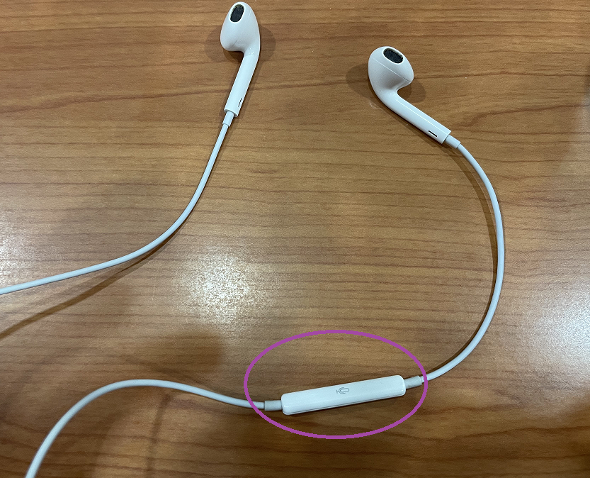

통화가 가능한 이어폰이 필요합니다.

마이크 입력이 필요하기 때문이죠

이 두가지의 준비물이 마련되어진다면

언제 어디서든 노래방을 이용할 수 있습니다.

노래방 기능을 수행하는 방법을

제 핸드폰으로 따라하면서

차근차근 알려드릴게요

\- GarageBand 어플을 설치합니다.

\1. App Store에 들어간다.

\2. "GarageBand"를 검색하여 설치한다.

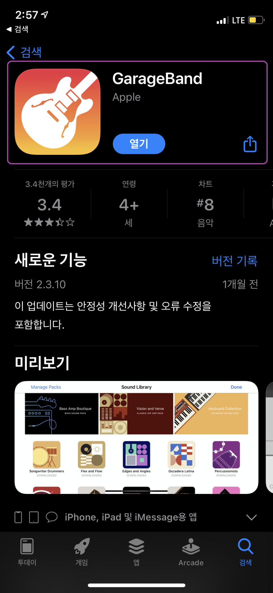

저처럼 이미 설치되어져 있으신 분은 "열기"라고 뜹니다.

\- GarageBand 어플 실행

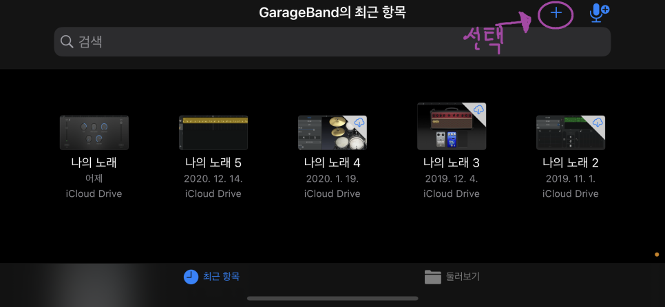

GarageBand를 실행시키면 다음과 같은 화면이 뜹니다.

"+" 버튼을 눌러 프로젝트를 하나 만들겁니다.

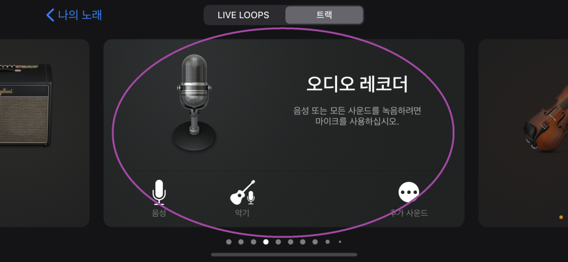

여러 악기들이 나오게 되는데

"오디오 레코더"라는 항목을 찾아주세요

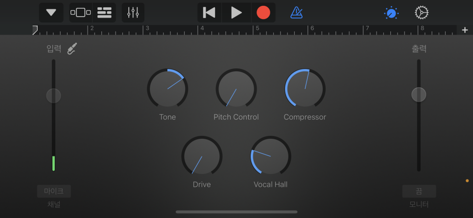

그러면 이와 같은 화면이 나오게 됩니다.

참고로 셋팅을 위해서 이어폰이 연결되어져 있어야 합니다.

GarageBand 어플을 통하여

우리는 이어폰으로 우리의 목소리를 들을 수 있도록 셋팅할 것입니다.

노래방처럼 에코와 증폭을 넣어줄 수 있습니다.

그러기 위해서는 우선 "모니터"를 켜야합니다.

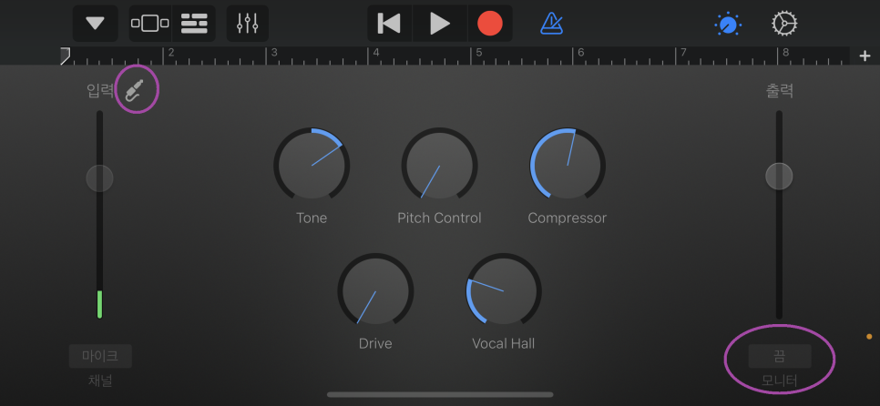

오른쪽에 "모니터"라고 적혀있는 부분을 누르셔서 "켬"으로 바꿔주세요

아니면,

이렇게 생긴 아이콘을 누르셔서

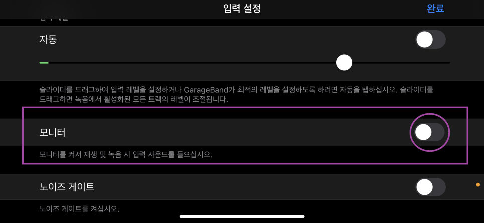

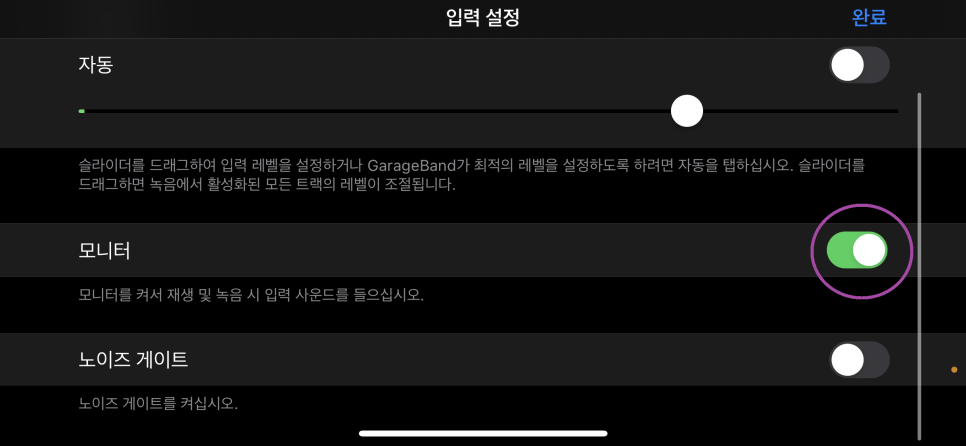

"모니터" 부분을 저처럼 초록색으로 활성화 시켜주시면 됩니다.

이제 이어폰에서 우리들의 목소리가 들립니다.

이것만으론 부족하죠

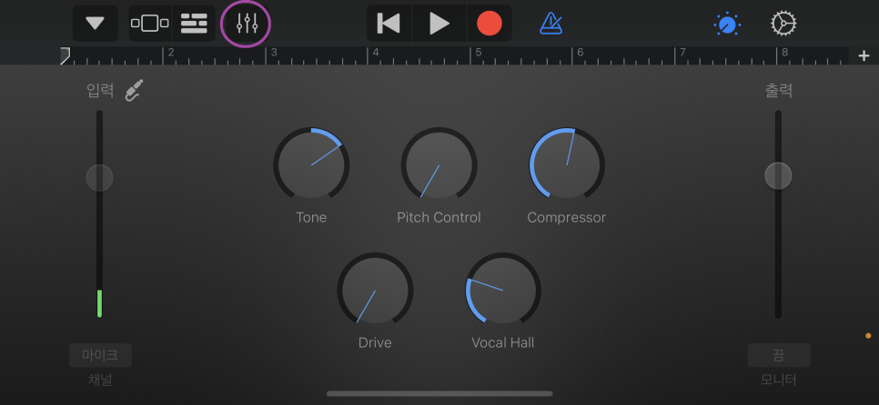

조절막대기같이 생긴 아이콘을 눌러주세요

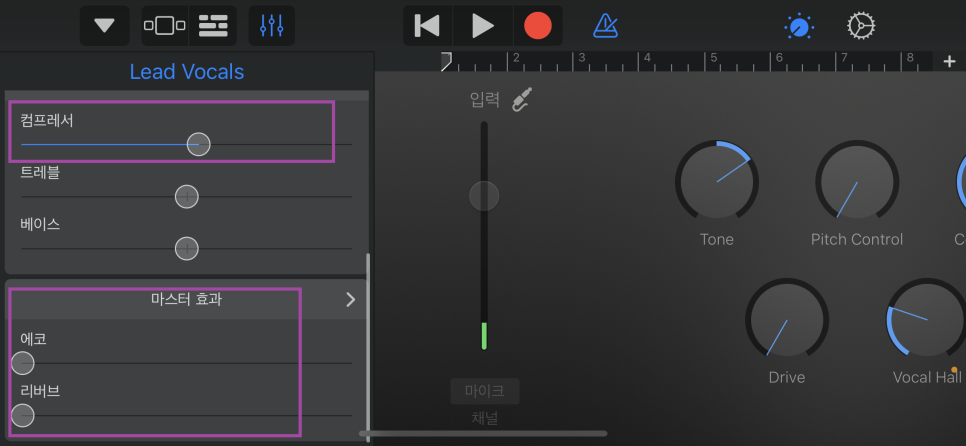

그러면 다음과 같은 창이 왼쪽에 활성화가 되어집니다.

컴프레서를 조절하여 음량의 크기를 조절할 수 있습니다.

노래방처럼 에코를 넣으려면

마스터 효과에서 "리버브"를 조절해주세요

노래방에서 에코라 부르는 그 효과가 여기서는 "리버브"와 유사하더라구요

에코를 조절하면 메아리 효과라고 보시면 됩니다.

우리의 목소리가 약간의 딜레이 후 다시 그대로 들리는 효과가 "에코"더라구요

모니터가 켜져있으므로 이어폰에서 노래방처럼

증폭되어져서 우리들의 목소리가 들립니다.

간단하게 귀로 들으시면서 맘에 드는 소리로 조절해주세요

그리고 이제 GarageBand를 백그라운드에서도 활성화 시켜주는 셋팅을 해야합니다.

그렇지 않으면 바탕화면으로 나가면 노래방 에코가 사라집니다.

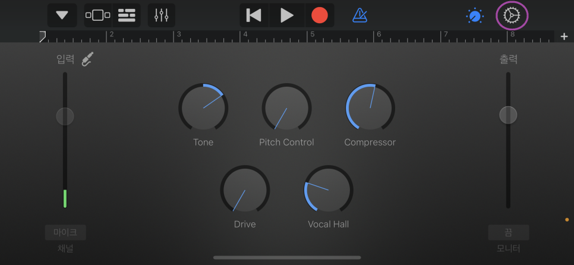

톱니바퀴 모양을 눌러주시고요

설정창이 나오게 됩니다.

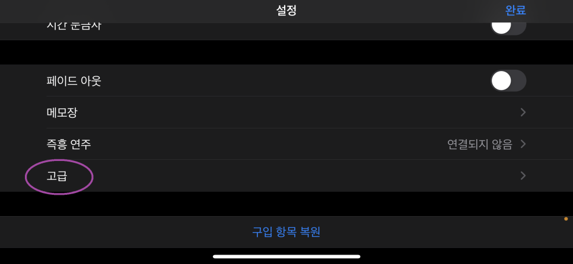

하단으로 메뉴를 내려보시면 "고급"이라고 나오게 됩니다.

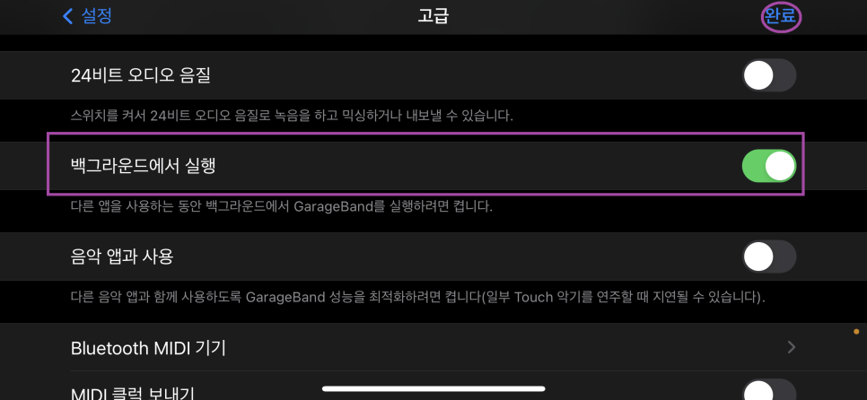

여기에서 "백그라운드에서 실행" 메뉴를 찾아주셔서 활성화 해주시면 됩니다.

그 다음 완료까지 눌러주시면 GarageBand에서 해야하는 설정은 끝납니다.

이제 홈화면으로 이동해보세요

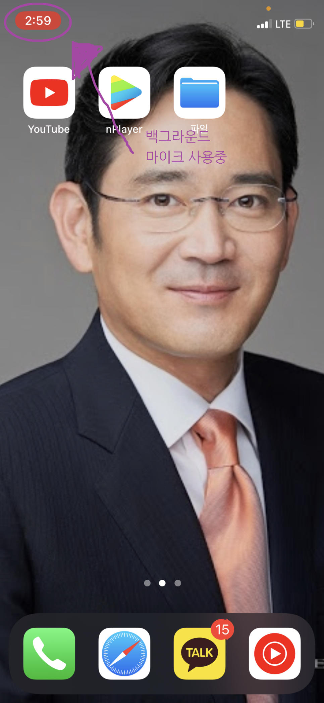

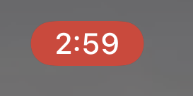

왼쪽 상단 시계표시 부분이 평소와 다르게

빨간색으로 활성화 되어져 있습니다.

이는 백그라운드에서 마이크를 사용하고 있다는 뜻이죠

통화중에도 저렇게 변합니다.

여기까지 해서 마이크는 준비되었으니

이제 음악이 필요합니다.

youtube에 들어갑니다.

요즘 유튜브가 잘 되어져 있어서

TJ노래방 KY노래방 등 채널들에

노래방 mr들이 가사와 함께 잘 올라와 있습니다.

유튜브에서 노래를 검색합니다. 

키워드는

원하는 노래 제목을 입력하고 끝에 노래방

이라고 붙이시면 됩니다.

그러면 다양한 mr들이 나오게 되죠

외국노래의 경우 노래방대신 inst, 혹은 kara(외국에선 노래방을 가라오케로 부르더라구요)라고 붙이시면 됩니다.

원하는 노래를 검색하시면서

이제 노래방을 즐기시면 되세요

쉽죠?

코로나로

노래방 자주 다니지 못하지만..

이렇게라도 노래방 기분을 느껴보아요 ㅠ

