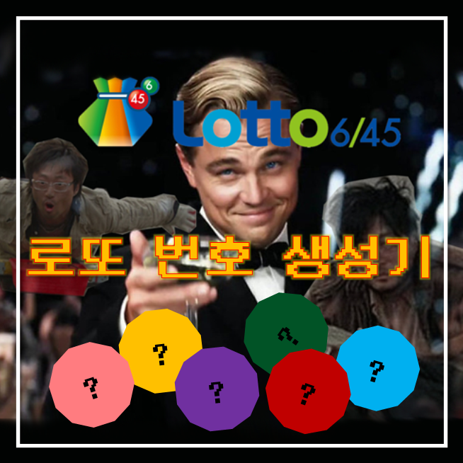
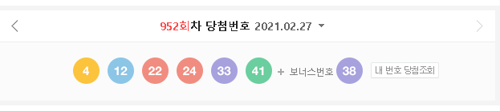
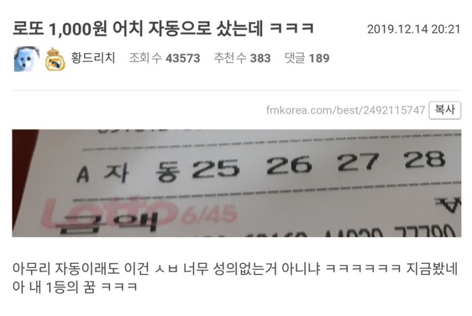
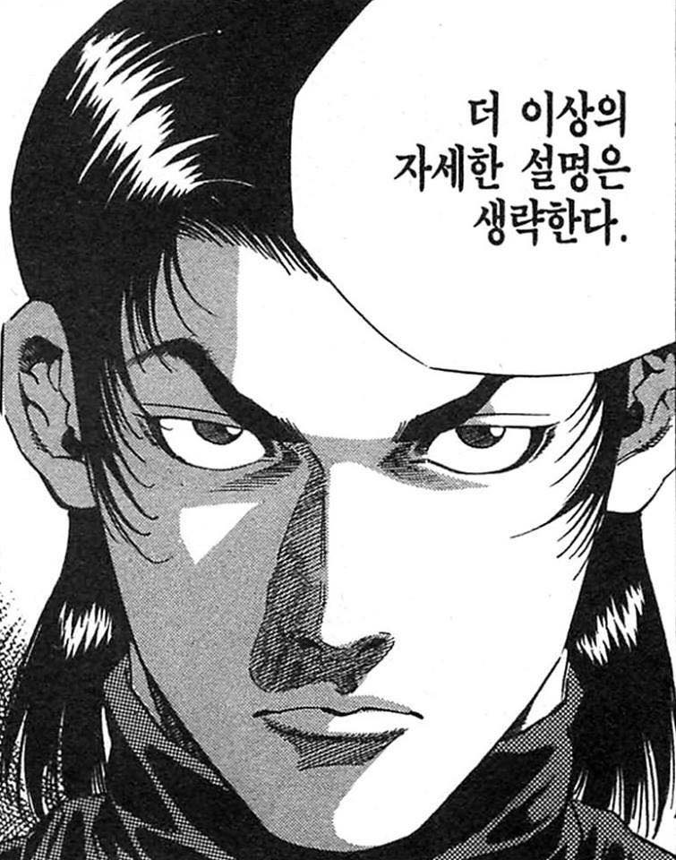
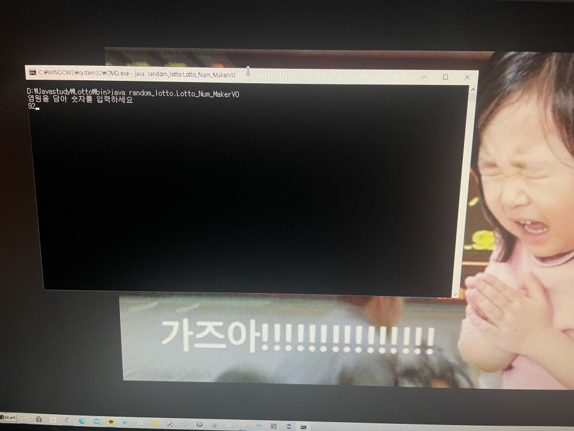
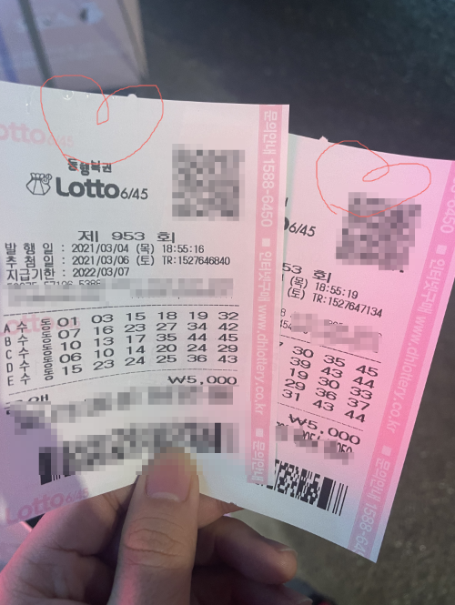

952회차 로또 당첨 번호는

4, 12, 22, 24, 33, 41 +[38] 이었습니다.

이번 일등은 2,713,699,834원 되겠습니다

일확천금의 꿈... 인생역전의 꿈...

제발 한 번만 

저만 이렇게 외치고 있는 것은 아니겠죠..?

이런 짤을 보았습니다. 자동으로 로또번호를 생성하는데 이렇게 성의 없으면 어떻게합니깧ㅎㅎㅎㅎ

로또 번호를 자동으로 돌린다면

컴퓨터가 랜덤으로 수를 추출해서 번호를 골라주는 것인데

이 랜덤이라는 것이 사실상 완전구현이 안됩니다.

엄청나게 많은 숫자들을 섞어 놓은 데이터 덩어리에서 임의로 뽑아내는 거에 불과합니다.

자연에서 탄생한 완전한 랜덤한 수 들이 아닌,

인간의 손을 한번 거친 랜덤처럼 보이는 데이터 덩어리란 말입니다.

각설하고, 

성의 있게 번호를 한번 뽑아볼까요?

그래서 저는 랜덤함수로 1차적으로 로또번호를 생성하고

최대한 숫자들이 분산되도록 이 번호들에 저만의 해쉬함수를 적용하여

엔트로피를 증가시키는 방식으로 1000개의 로또번호를 생성할 예정입니다.

그리고 각각의 번호들은 지난 로또 100회차의 당첨번호와 비교하여 점수를 매길 겁니다.

새로이 뽑아낸 숫자를

1등에 당첨되었다면 3000점 2등에 당첨되면 600점 3등은 30점 4등은 10점 5점 1점 이런식으로 합산해서 기록할 것입니다.

그럼 각각의 번호들은 점수들이 매겨지겠죠?

점수가 가장 높은 상위 5개의 번호가 로또 당첨 패턴과 유사한 난수일 것이고

점수가 가장 낮은 하위 5개의 번호가 지금 껏 나왔던 당첨 번호들을 최대한 비껴맞았다는 뜻이 되겠네요

로또 당첨되는 그 이면에 혹시 어떠한 패턴이 숨어있을까요?

그렇다면 이 패턴과 유사한 난수들이 상위점수 번호들이 당첨확률에 가까울 것입니다.

 

또는 당첨 번호가 중복되지 않을 거라는 기대를 이용하여 (한 숫자가 아닌, 6개단위의 복권 번호를 의미합니다.)

가장 점수가 낮은 번호들이 다음 회차에서의 1등은 자기 차례일 수 있으리라 소망해볼 법 합니다.

이 따위 설명들이 궁금하시진 않으시겠죠 ㅎㅎ

바로 본론으로 들어가봅시다.

이제 모든 준비는 끝났습니다.

숫자를 입력하면 이 숫자에 따른 자체 제작 난수 생성 알고리즘이 작동하여

10개의 최종 로또번호가 탄생합니다.

여러분들은 운명을 믿으세요?

운명이란게 과연 존재할까요?

있다면 저는 우리 뽀미에게 맡기도록 하겠습니다.

실제로 모바일 게임에서 뽑기할 때 뽀미 발을 자주 빌렸는데

뽀미가 으르렁 거리면 거릴수록 더 좋은 템이 나오더라고요

염원을 담아서~☆

이렇게 나온 10개의 당첨번호...

고생해서 작성한 알고리즘이라 그런지

숫자가 더 예뻐보이네요

 

KTX 끊어놓겠습니다.

이 글을 보신 모든 분들,

다음주 월요일 농협앞에서 함께 뵐게요 ^^

**마치며,**

****

확률적으로 봤을 때

1,2,3,4,5,6 처럼 절대 안 될 것 같아 보이는 녀석이나

8,17,19,37,40,44 처럼 좀 섞여있어서 그럴듯한 녀석이나

1등이 될 확률은

놀랍게도 둘 다 똑같습니다.

로또 번호로 나올 수 있는 모든 가짓수는 45C6 이고 당첨번호는 이 중에 단 하나이기 때문이죠

당첨되기 전 까진 그 어떤 숫자 배열이라도 특별한 의미가 있는 것은 아닙니다ㅎㅎㅎ

또한, 전번에 시행한 게임과 이번에 시행하는 게임과의 인과관계가 존재하지 않죠

독립시행입니다!

따라서 제가 이렇게 열~~심히 번호를 뽑아냈다고 하더라도 큰 의미가 있는 숫자는 아닙니다..ㅋ

당연한 이야기지만 재미로만 봐주세요 ~

오늘의 탐구생활

여기까지입니다~

