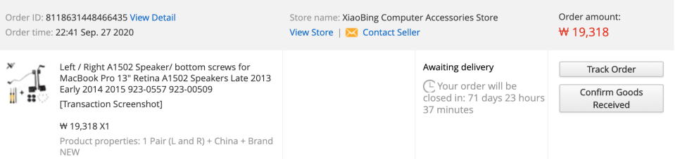

어느 날, 맥북 스피커에 이상이 생겼다.

소리가 굉장히 찢겨져서 나오는 증상이었다.

나의 모델은 2013년형.. 무려 7년이나 지났기 때문에

고장이 날 법도 하다.

인터넷에 맥북 스피커 수리비용을 검색해보니

사설 수리센터 방문시, 수리비는 대략 7,8만원 정도 나오는 것 같았다.

애플 공식 수리센터에 방문하면 그 이상으로 비쌀 것이다.

사설업체에 맡기는 것도 꽤나 만만치 않은 비용이 든다.

검색해보니까 스피커 수리 난이도가 어려운 편도 아니고

부품도 크게 비싸지는 않았다.

왼쪽 오른쪽 스피커 부품 다 합쳐서 15.99$

공식수리가 아니라 사제수리를 하는 순간 애플의 보증이 끝난다고 알고있는데,

앞으로도 나는 자가수리를 할 것 같아서

자가수리를 하기로 결정했다.

망치면 끝장이다. 

서론이 길어져서 각설,

왼쪽 오른쪽 스피커 부품을 주문하였다.

9월 27일에 주문하였는데 10월 15일날 도착하였다.

배송은 대략 2~3주 걸리는 것 같다. 

수리를 위해 먼저 맥북의 아랫판을 분해해야 한다.

맥북은 전용 드라이버가 있기 때문에

스피커 부품 주문시 같이 구해야한다.

나는 포함되어져 있는 상품을 구매했다.

맥의 나사들은 일반적인 규격의 +,- 나사와는 다르게

별모양의 나사였다.

두개의 전용 드라이버가 있는데

빨간색 드라이버 1.2x40 mm가

외관 판의 나사용이었다.

분해하면서 깨달았는데 총 10개의 나사가 다 같은 것이 아니라

빨간색 표시해놓은 부분만 길이가 조금 달랐다.

원래 그런것인지는 알 수 없지만

혹시 모르기 때문에 다른 나사와 나중에 섞이지 않도록 분류해서 놓았다.

판을 분해할 때, 상단부분을 들어올려서 뜯으면 된다.

판의 중간부분에는 하부 프레임과 외관판을 고정하는 틈이 있어서 고정되어져 있는데

끼워져 있는거라 적당한 힘으로 들어올리면 제거 된다.

하판을 분해 하고 난 후의 사진

처음 분해 했을 때 많은 먼지에 당황하였고 정교하게, 적절하게 자리잡은 부품들이 경이로왔다.

주황색 으로 표시해놓은 부분을 보면 틈이 있다.

이 부분이 하판과 고정되는 부분이었다.

처음 판을 떼어낼 때, 뭔가 걸리는 느낌이 드는데 바로 여기에 고정되어져 있었기 때문이다.

이제 스피커를 교체하도록 한다.

수리가 거창하게 어렵게만 느껴졌는데

단순하게 부품만 교체하는 작업이었다.

그래서 사람들이 쉽다고 말했던 것이다.

부품들은 모듈화 되어져 있고

메인 보드에 각각의 슬롯에 연결되어져 있는 거고,

고장 시 해당 부분만 교체하면 되는 방식이다.

데스크탑과 크게 다른 개념은 아니었다.

스피커의 좌우 모양이 다르기 때문에

각각의 위치를 쉽게 파악할 수 있다.

사진 기준으로 오른쪽의 스피커를 교체하였다.

사진에는 짤렸는데

윗 부분에 한개, 아랫부분에 두개 해서

총 세개의 나사로 스피커가 고정되어져 있다.

이 나사들을 해제한 후, 보드와 연결되어져 있는 케이블을 제거해야한다.

어두운 빨간색으로 표시한 부분이 보드와 스피커를 연결하는 부분이다.

주의 할 점이 있다.

위에서 아래로 넣는 방식이지

가로로 찔러넣는 방식이 아니다.

처음에 이를 몰라서 헤맸었다.

기존의 스피커를 떼어낸 후, 새로운 스피커를 끼우면 된다.

반대편도 마찬가지로 진행하면 된다.

그런데 약간 달랐다.

보드와 스피커를 연결하는 케이블 위에 어떤 덮개 하나가 있다.

바로 파란색으로 표시된 부분이다.

이 부분을 제거해야 스피커 케이블을 빼낼 수 있다.

덮개를 제거하면

스피커를 분리해낼 수 있다.

왼쪽과 오른쪽 스피커 모두 교체를 완료했다.

조립은 분해의 역순!

이제 들뜬 마음으로 내부청소도 마치고 조립을 완료하였다.

조립을 완료하고 셜록으로 소리가 잘 나오는지 테스트 해보았다.

사운드가 제대로 잘 작동하였다.

그런데 문제가 발생하였다.

와이파이가 잡히지 않는 것이었다.

멘붕에 빠졌다.

스피커 말고 다른 부분은 건드린 부분이 없었고, 더러워진 내부를 청소한 후 조립한 것이 전부인데 이런 새로운 문제에 봉착하게 되었다.

검색해보니 와이파이를 담당하는 부분은 airport라는 카드였다.

혹시 먼지들을 청소하다가 이 부분이 고장이 났으려나?

스피커가 깨지는 소리를 내는 것은 작은 문제이지만,

와이파이가 안되는 것은 심각한 문제다.

이것이 소탐대실인가...

여하간 청소하다가 어디 케이블 하나 빠진 것이 아닐까 하고

airport를 완전 분해후 안쪽 먼지까지 제거하고 다시 끼웠다.

분해 방법은 간단했다.

위의 세개의 케이블을 해제한 후,

상단부의 나사를 제거하고

하단부의 슬롯에서 빼내면 된다.

이 녀석은 스피커와 다르게 슬롯에 밀어넣는 방식으로 끼워져 있었다.

이런 조치를 취했는데도 제대로 작동하지 않았다.

결국 나의 램처럼 사망한 것일까...?

외국 사례들을 검색해보니

나와 비슷한 사례들이 조금 있었다.

거기의 지시에 따라 SMC 초기화, PRAM 초기화, 네트워크 초기화 등등 다 해보았다.

아무런 소득없이 시간만 속절없이 흘렀다.

부품을 교체해야 하는 것인가..?

모델명을 보니 bcm94360cs라고 씌어 있었다.

알리에 가격을 검색해보니

32.28$

이만원짜리 고치니까 삼만원짜리가 고장난 꼴... 눈물이 났었다.

또한 해외배송 기다리려면 얼마나 기다려야 하나..

그런데 가만히 생각해보니 이상했다.

블루투스는 제대로 작동하는데 와이파이만 작동하지 않는 점이었다.

airport는 블루투스와 와이파이를 담당하는 부분인데

고장났다면 둘다 안되야하는데 왜 와이파이만 안될까?

혹시 내가 스피커 말고 다른 부분을 건드린 것이 있었을까?

충격!

단순히 덮개라고 생각했던 부분이

사실은 와이파이 수신기였던 모양이다.

그냥 덮개라고 생각하고 대충 조립했었는데

제대로 슬롯에 맞춰 끼워주니

와이파이가 정상적으로 작동하였다.

9시간의 삽질 후 깨달았다.

기술문서로 남길 목적이 아니라 순수히 조립 참고용으로

사진도 대충 찍으며 수리를 진행하였기 때문에

자료가 빈약하고 글들이 투박하다.

다음부터는 차근히 정리하며 진행하도록 하겠다.