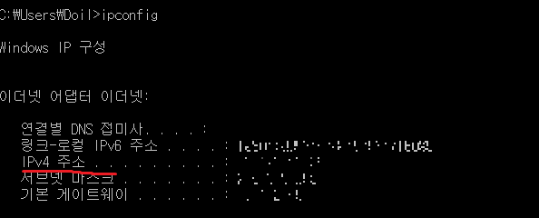

살다 보면 대단한 것은 아니지만

대단해 보이는 무언가들이 있습니다.

그중에 하나로 

저는 오늘 

컴퓨터 잘하는 '척'

할 수 있게 해주는 

저만의 두 가지 방법들을 소개할까 합니다.

사실 결론적으로 말하자면

컴퓨터를 잘 활용하는 방법을 익히는 것입니다.

어렵지 않지만 작은 습관으로 활용도를 대폭 높이고

더불어 컴퓨터 잘하는 '척' 까지도 할 수 있으니 많이 활용해주세요

그럼 시작하겠습니다.

**1. 단축키를 활용하자**

단축키는 어떤 작업을 수행하려 할 때,

명령 과정을 보다 빨리, 쉽게 하기 위해 만든

키보드의 조합으로 만든 명령어 또는 버튼입니다.

아마 많이들 알고 계시겠죠

대표적으로 Ctrl + C(복사) , V(붙여넣기) 라던지

Alt + F4(종료), Alt + Tab, (창 전환) 등등...

여러분들이 많이 쓰시는 단축키들이 있습니다.

우선, 단축키를 활용하는 것 자체만으로

여러 명령 단계를 생략하기 때문에

컴퓨터를 잘 활용하고 있는 것이 맞습니다.

\~~~~ 

그런데, 여기에 더해서

남들이 잘 사용하지 않는 단축키를 익히고 활용한다면

잘 모르는 사람들이 보기에 정말 컴퓨터를 잘해 보입니다.

왜냐하면 마우스의 사용 빈도가 적기 때문입니다.

영화에서 보면 해커들이 키보드로 뭐라 뭐라 쓰는 것이 멋있어 보이지 않습니까?

해커가 마우스로 뭐 활용하는 장면을 보신 적 있으십니까?

~~(있다면 죄송)~~

아무튼, 그러한 것들 중에 제가 자주 활용하는 몇 가지를 소개하겠습니다.

(아시는 분들이 분명 존재할 수 있습니다. 아무도 모르는 단축키가 아니라

많은 사람들이 잘 쓰지 않지만 유용한 단축키 모음이라고 보시면 됩니다.)

① 실행 창 켜기 : ÿ (윈도우키) + R

키보드상에서 윈도우 키와 R키를 동시에 누르면 실행창이 뜨게 됩니다.

한번 눌러보세요 바로 뜹니다~

실행창을 켜서 뭘 할 것이냐?

이 녀석을 이용해서 컴퓨터 잘하는 '척' 할 수 가 있습니다.

몇 가지 실행시킬 프로그램의 이름을 안다면 바로 실행시킬 수 있기 때문입니다.

컴퓨터를 쓰다 보면 메모장, 그림판 혹은 계산기를 쓸 일이 있습니다.

메모장 - notepad

그림판 - mspaint (마이크로소프트 페인트 대략 이런 식으로 전 기억했습니다. 아마 맞을겁니다^^;;;ㅎㅎㅎ)

계산기 - calc (calculate에서 앞의 4자만 딴 것입니다.)

특히 저의경우에는 그림판을 가장 많이 활용하는데

스크린샷을 print screen 키로 찍은 후,

그림판에서 바로 원하는 부분만 잘라쓰기에 편하기 때문이죠

Print Screen, Ctrl + C, Ctrl + V, Ctrl + N

저는 이 네개의 단축키 만으로 편하게 원하는 부분을 캡쳐합니다.

다른 프로그램이 필요없을 정도입니다.

학교나 회사 등 여러 명과 함께 있는 상황에 이 방법을 쓴다면

아마 모르는 사람들이 보면 컴퓨터를 매우 잘한다고 생각할 것입니다.

.

*** 심화) ip 주소 확인하기

자신의 컴퓨터의 ip주소를 확인하는 방법은 여러가지가 됩니다.

저는 그중에서 조금 멋있어보이고 간단한 방법을 소개하고자 합니다.

실행창에 cmd를 입력합니다.

그럼 명령 프롬프트 창이 뜨게 됩니다.

도스창이라고도 많이 알려져 있는데요,

많이들 보셨을 겁니다.

이곳에 이렇게 입력합니다.

ipconfig

그럼 ip를 바로 확인하실 수 있습니다.

IPv4 주소 라고 나와있는 부분 보이시죠? 그것이 ip주소 되시겠습니다. (제 주소는 가렸습니당)

컴퓨터 잘하는 척 하실 때 필수로 활용하시면 좋으시겠습니다.ㅎㅎㅎ

사람들 많을 때, 괜히 한번 ip 이 방법으로 확인해보세요

더불어서 굉장히 활용도가 높은('컴잘알처럼 보이는 것은 덤)

놀라운 윈도우키 활용 단축키를 하나 더 소개할까 합니다

ÿ + ← : 화면을 왼쪽 사이드로 최대화

ÿ + → : 화면을 오른쪽 사이드로 최대화

ÿ + ↑ : 화면을 최대화

ÿ + ↓ : 화면을 최소화

ÿ + D : 바탕화면 보기

② 파워포인트 고수인 척

특히 대학생들은 파워포인트를 쓸 일이 참 많죠.

발표하면서 활용하면 좋은 단축키들을 알려드리겠습니다.

\* F5, Shift + F5 : 슬라이드 쇼 시작하는 단축키입니다. 많이들 아실 겁니다.

그런데 shift를 같이 누른 것과 안 누른 것의 차이를 혹시 모르시고 계시다면 참고하세요

F5는 첫 슬라이드부터 슬라이드 쇼를 시작하는 것이고,

Shift + F5는 현재 창에서 보고 있는 현재 슬라이드부터 슬라이드 쇼를 시작하는 것입니다.

~~~~ 

\* Home,End : 처음과 끝 슬라이드로 이동

방향키 바로 위쪽에 Home 키와 End 키가 있죠

Home 키를 누르면 첫 번째 슬라이드로 가지게 됩니다.

End는 마찬가지로 제일 마지막 슬라이드로 이동하게 됩니다.

\* num + enter : 원하는 슬라이드로 이동

이 numpad 키보드를 알고 계실 겁니다.

파워포인트로 발표를 하다 보면

특정 슬라이드로 가고 싶어, 막 넘기시는 경우가 있으실 수 있습니다.

이때 이 방법을 활용하신다면

원하는 슬라이드로 바로 정갈하게 이동되기 때문에

컴퓨터를 잘하는 '척' 하실 수 있습니다.

13번 슬라이드로 이동하고 싶다 - numpad 키보드에서 13을 입력하고 enter를 친다.

ex ) 발표 중 누군가가 질문을 했다. 아까 말씀하신 내용 중 "블라 블라 블라~~~" 하셨는데 잘 이해가 안 돼요,

할 때 그 슬라이드로 바로 이동!

단, 활용하려면 슬라이드의 번호를 숙지하고 있어야겠죠? (아마 발표자라면 당연히 숙지하실겁니다.ㅎㅎ) 

\* '.'과 ',' - 화면을 끌 수 있다.(검은 화면, 흰색 화면)

슬라이드 쇼 도중 . 키를 누르시면 검은 화면이 되고 , 키를 누르시면 흰색 화면이 됩니다.

저 같은 경우에는 레크레이션 때 단어암기, 틀린그림 맟추기 등등..

순간적으로 화면을 꺼야 할 때 활용하기도 했답니다.

**2. 원격접속을 활용하자**

원격접속은 바로

컴퓨터 활용의 꽃이라 할 수 있겠습니다.

인터넷에만 접속되어 있다면

어디서든 바로 원격으로 접속하는 것,

정말 멋진 일이 아닐 수 없습니다.

우선 윈도우 운영체제에서는 원격 접속 기능을 제공하고 있습니다.

(아마 home edition 버전은 안될 겁니다. 대부분 엔터프라이즈, 프로페셔널 버전을 이용하실 거라 가정해서 죄송합니다.)

위에서 제가 언급한 (윈도우 + R ) 키를 눌러서 실행창을 띄웁니다.

그 뒤 mstsc 를 입력합니다.

그럼 다음과 같이 "원격 데스크톱 연결" 창이 뜨게 됩니다.

여기에 접속하고자 하는 컴퓨터의 ip를 입력하면 원격 접속이 가능하게 됩니다.

물론 원격접속을 위한 몇가지 설정과 고려사항들이 있지만,

윈도우 원격 접속 하는 방법은 조금만 검색해봐도

참고할 방법들이 많이 나와있습니다.

네트워크 지식을 많이 요하는 일이 아닙니다.

여기에 함께 적기에는 양이 길어질 수도 있어서,

~~(스크린샷 찍기 귀찮아서)~~

여러분들의 몫으로 남겨두겠습니다.

아무튼, 제가 말하고자 하는 핵심은

학교나 회사에서 아마 발표 자료를

usb나 이메일에 넣어 오시는 분들이 많으신데요

원격접속을 하면 (인터넷이 된다는 가정하에)

바로 원격 접속하여 발표 자료를 실행시킬 수 있다는 점입니다.

이 방법에는 장점이 있는데,

우선 메일이나 usb로 발표 자료를 따로 저장하지 않아도 된다는 점,

폰트를 따로 저장하지 않아도 된다는 점,

궁극적으로 컴퓨터를 잘 하는 것처럼 보일 수 있다는 점 되시겠습니다.

제가 말한 건 원격접속 활용의 일면에 불과합니다.

활용하기는 활용하는 이용자 나름으로 천차만별이 되실 수 있겠습니다.

그럼 다들 즐컴~~

