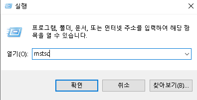
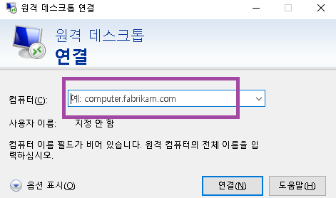
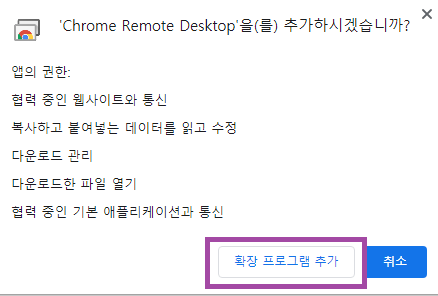
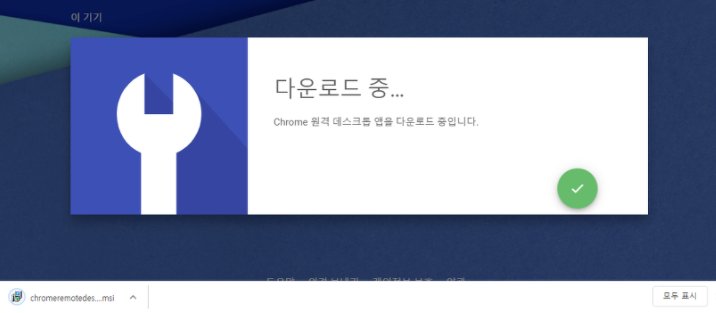
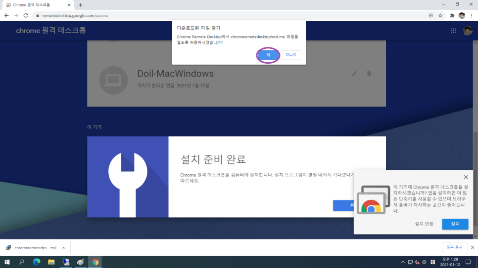
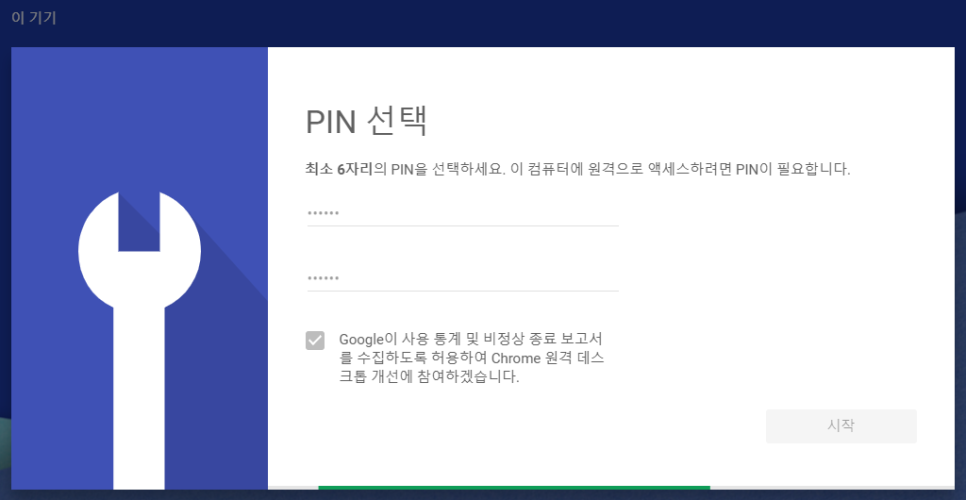
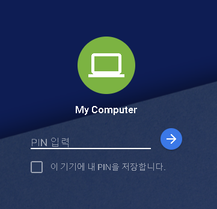
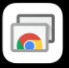

4차 산업혁명이 시작된다고,

빅데이터의 시대가 온다고

범 지구적으로 관심이 모였던 것도

벌써 몇 년 전이죠

그 후로도 시간 참 많이 흘렀습니다.

이제 디지털 세상은 

더없이 일상이 되어버린 스마트 세상입니다.

기술진보의 속도는 정말 빠른 것 같습니다.

그래서 준비했습니다.

컴퓨터 활용의 꽃인 원격접속을 자유롭게 이용하는

스마트 인간이 되어봅시다!

참 쉽고 편리한 기능들인데...

원격접속이 뭘까요?

쉽게 설명하자면 집에 있는 컴퓨터(PC)를 멀리서 다른 기기로 접속하는 것입니다. 인터넷에 연결되어 있기만 하다면 어디서든 접속할 수 있습니다. 요즘 같은 비대면 시대에 참으로 유용한 기술이 아닐 수 없죠?

집이 아닌 다른 곳에서 pc를 이용할 일이 있으면 원격접속을 이용하면 되죠

예를 들어 집에서 컴퓨터로 작업하다가 카페를 나가야 하는 경우, 컴퓨터를 들고나가기는 힘들잖아요.

여담으로, 요즘 제가 젤루 좋아하는 핫한 래퍼

원슈타인님!

출처 : 원슈타인님 인스타그램

노트북이 없어서 

컴퓨터 본체를 들고 다녔다는 일화가 생각나네요

본체를 들고 다니는 일이 불편할 수는 있는데

이렇게 보니 아티스트적인 면모가 돋보이기는 하네요 ㅎㅎ

출처:원슈타인님 인스타그램 

2017년 전역 직후 노트북 없어서 본체들고 버스타며 오가며 작업하던 때

참고로, 홈보이와 함께 작업한 원슈타인님 노래들

시티 팝 느낌의 음악들인데요

너무 좋으니 다들 많이 많이 들어주셔서

귀 호강하세요~

다시 본론으로 돌아올게요!

저는 원격접속을 할 수 있는 세 가지의 방법을 소개할 것입니다.

컴퓨터로만 원격접속을 하는 것이 아니라

다른pc,노트북,스마트폰,태블릿pc까지 원격접속이 가능합니다.

참고로 이 아이들을 단말기기(Terminal)라고 부릅니다.

여기서 소개해드리는 방법들은

외장 그래픽카드를 이용하지 않고 내장 그래픽카드로 구동하기 때문에

고사양 작업들은 수행할 수 없는 단점이 있습니다.

다음 원격접속 심화 편에서 고사양 작업도

원격으로 할 수 있는 방법을 알려드릴 계획입니다.

심화편도 기대해주세요! 

> \1. mstsc
>
> 윈도우 기본 원격 프로그램

따로 원격접속 프로그램을 설치하지 않더라도

윈도우 운영체제를 이용하고 있다면

원격접속이 간단하게 가능합니다.

자체적으로 원격 기능을 제공하기 때문이죠

단, 윈도우 Home버전은 원격 기능이 빠져있습니다.

이외의 버전을 이용하신다면 이 기능을 활용해 주세요

물론 Home 버전이더라도 다른 pc로 원격접속이 가능하기는 하지만

다른 pc에서 Home 버전 pc에 접속할 수가 없습니다.

바탕화면에 "내 PC" 아이콘이 있을 겁니다.

오른쪽 버튼을 누른 뒤, 속성에 들어가줍니다.

속성에 들어오시면 다음과 같이 "시스템"이라는 창이 뜨게 됩니다.

~~부끄러우니 제 컴퓨터의 사양과 제품 ID는 가리겠습니다.~~

왼쪽 메뉴에 보면 "**원격 설정**"이라는 항목이 보입니다.

들어가주세요

이러한 화면이 뜨게 되는데, 두 번째 항목에 "원격 데스크톱"이라는 항목이 있습니다.

(다시 한번 말하지만, Home 버전에는 안 나옵니다. 원격 기능이 빠져있습니다.)

"이 컴퓨터에 대한 원격 연결 허용" 항목을 체크해 주시고 "적용", "확인"

하시면 끝입니다.

여기까지 설정을 마치시면 다른 컴퓨터에서 원격접속이 가능합니다.

이제 다른 컴퓨터에서 어떻게 접속하냐?

Window 키 + R 키를 눌러서 실행창을 띄워줍니다.

"mstsc"라고 입력해 주시면 됩니다.

그러면

원격 데스크톱 연결 이라는 창이 뜨게 됩니다.

여기서 컴퓨터: 라고 되어있는 부분에

접속할 컴퓨터의 주소를 입력하면 연결이 가능합니다.

DNS를 이용하실 경우 "doiloppa.chickenkiller.com"과 같은 도메인 주소를 입력하셔도 되지만

보통 DNS를 이용하지 않으므로 ip 주소를 입력해 줍니다.

*. ip주소 모를 때, 아는 방법

여러 방법이 있겠지만

깔끔하게 네이버로 알아내는 방법 알려드릴게요

네이버에 "내 ip"라고 검색합니다.

그러면 이렇게 ip 주소가 나옵니다.간단하죠?

이제 mstsc에 ip 주소를 입력하면 접속할 수 있습니다.

헷갈리실 수 있으니 개념도로 정리해서 말씀드릴게요

접속할 컴퓨터의 주소를 입력하게 되면

사용자 자격 증명 입력 창이 나옵니다.

로그온 할 계정의 이름과 암호를 입력하시면

원격접속을 할 수 있습니다.

혹시, pc의 암호를 설정해두지 않았다면 보안 문제로

원격 기능이 활성 되지 않으므로

로그온 하는 계정에 암호 설정을 해두세요

원격창 크기는 전체 화면도 가능하고, 조절도 가능합니다.

이렇게 하면 원격 컴퓨터와 네트워크로 연결돼서

파일전송이 컴퓨터 간에 서로 자유롭고 클립보드(복사)도 연동이 되기 때문에

편리합니다.

저 같은 경우는 학교 컴퓨터에서 원격으로

집 컴퓨터를 연결하여 수업을 듣습니다.

위에 제가 설명한 대로 처음 설정만 해두면

별다른 프로그램을 설치하지 않더라도 원격접속을 간편하게 할 수 있다는 점이 가장 큰 장점인 것 같습니다.

우리 집은 Home 버전인데 어떻게 하냐? 라고 물으시는 분들이 있을 수 있습니다.

또한, mstsc는 윈도우 운영체제를 이용하는 PC에서만 원격접속이 가능하죠.

핸드폰,태블릿pc에서는 접속이 불가하다는 단점이 있네요

그래서 아래의 두 방법도 소개해드리겠습니다.

> \2. 구글 크롬 원격 데스크톱
>
> 구글 크롬 브라우저

크롬 브라우저를 이용하고 있다면 원격접속을 할 수 있습니다.

구글 아이디로 연동이 되기 때문에

어디서든 크롬 브라우저를 이용한다면 

원격 기능을 이용할 수 있다는 장점이 있습니다.

단점을 꼽자면 크롬 브라우저를 반드시 사용해야 한다는 점,

크롬이 깔려있지 않다면 설치해야 한다는 점이 있겠네요

참고로 이런 개념을 서드파티 프로그램이라 합니다.

우선 원격접속할 컴퓨터를 설정해 줘야 합니다. (이를 액세스 포인트라고 할게요.)

먼저 크롬(Chrome) 브라우저를 실행시켜주세요

크롬 브라우저가 설치돼 있지 않다면 설치해 주셔야 합니다.

크롬 브라우저를 실행시킨 후,

주소창에 [https://remotedesktop.google.com/access/](https://remotedesktop.google.com/access/) 을 입력합니다.

들어왔을 때, 로그인 되어 있지 않다면

다음과 같은 창이 나오게 됩니다.

크롬 원격 데스크톱을 이용하려면

구글 계정이 있어야 합니다.

계정이 있으시다면 로그인해 주시고, 없다면 새로 만들어주세요

원격을 처음 이용하면 위와 같은 화면이 나옵니다.

원격 액세스 설정에서 다운로드 아이콘을 클릭해 줍니다.

그러면 위와 같은 창이 나옵니다.

Chrome에 추가 버튼을 눌러주세요

이러한 알림이 나오게 되는데 "확장 프로그램 추가" 버튼을 눌러주시면 됩니다.

하단에 msi 파일이 다운로드 됩니다. 다운이 완료되면

다음과 같은 알림 창이 뜨는데

"예" 버튼을 눌러주고

 "동의 및 설치" 버튼을 눌러주시면 돼요

설치가 완료되면

원격 액세스 설정이 가능하게 됩니다.

컴퓨터 이름을 입력할 수 있습니다.

구글 계정에 원격 컴퓨터를 여러 개 저장할 수 있으므로

구별을 위해 이름을 잘 지정해 주세요

그리고 "다음"버튼을 눌러주세요

PIN을 입력하라고 하는데

**암호**라고 생각하시면 됩니다.

다른 기기에서 현재 설정한 PC로 접속할 때

입력하는 번호입니다.

최소 6자리로 정해주시면 됩니다.

그리고 "시작" 눌러주시면

하단에 녹색바가 움직이게 됩니다. 설정 중이라는 뜻이죠

완료되면

이렇게 추가가 됩니다.

이제 원격 접속을 위한 설정이 완료되었습니다.

하나하나 설명을 하려다 보니 복잡한 과정처럼 설명된 것 같습니다.

어렵게 생각하시지 마시고 차근차근 따라와 주시면 굉장히 간단한 일입니다.

이제, 이렇게 설정된 PC는

다른 컴퓨터,스마트폰,태블릿pc에서 접속이 가능하게 됩니다.

\1) 다른 컴퓨터에서 원격접속할 때,

크롬 브라우저를 실행시킨 후

https://remotedesktop.google.com/access/

이 주소로 들어온 후 로그인을 하게 되면

접속 가능한 PC들이 "원격 기기" 항목에 뜨게 되죠

저의 경우에는 여러 컴퓨터를 설정해놔서 항목이 여러 개 있는 것을 볼 수 있습니다.

"My Computer"라고 있는데 클릭해 주시면

아까 설정한 PIN 번호를 입력해 주시면 됩니다.

"이 기기에 내 PIN을 저장합니다." 누르시면

PIN을 기억해서 앞으로는 PIN 번호 입력을 하지 않아도 되겠죠

\2) 스마트폰,태블릿pc

"Chrome 원격 데스크톱"어플을 설치하시면 됩니다.

아이폰 ios 기준으로 설명을 드리자면

앱스토어에 "크롬 원격 데스크톱"이라 검색하고 다운로드합니다.

이 아이콘입니다.

처음 구글 계정에 로그인하고 나면

이와 같은 화면이 나옵니다.

접속하고자 하는 컴퓨터를 누르시고

PIN 번호 입력해 주시면 원격접속이 됩니다.

> \3. 팀뷰어

[TeamViewer](https://www.teamviewer.com/ko/)

세 번째 방법은

TeamViewer라는 프로그램을 이용하여 원격접속하는 것입니다.

팀뷰어 공식 사이트에 들어와서 팀뷰어 프로그램을 다운로드해 주세요

"무료 버전 다운로드" 버튼을 누르시면

다음과 같은 페이지로 이동되며 자동으로 다운로드 됩니다.

다운로드가 완료되면 팀뷰어를 설치해 주시면 됩니다.

실행하시면 설치 화면이 나오게 되는데

크게 어렵진 않습니다.

"설치" 버튼 체크해 주시고 "동의 - 다음" 버튼을 눌러주시면 돼요

설치가 진행되고

마지막 설치 완료 화면이 나오게 됩니다.

따로 유료 버전을 이용하시지 않다면

두 번째 메뉴 체크하시고 종료 눌러주세요

팀뷰어를 설치하시게 되면

ID와 비밀번호가 나오게 됩니다.

다른 pc에도 팀뷰어를 설치하고

위의 ID를 파트너 ID에 입력하시고 암호까지 입력해 주시면 원격제어가 가능합니다.

다만, 아이디랑 암호 너무 복잡하고 매번 입력하기 번거로울 수 있습니다.

그런 경우

팀뷰어 회원가입을 하여 계정에 PC들을 등록해 놓으시면

어디서든 팀뷰어에 접속하여 원격접속이 가능하게 됩니다.

로그인하고 "컴퓨터&연락처" 메뉴에 오면 등록된 컴퓨터들이 나옵니다.

팀뷰어 프로그램은 크롬 원격 데스크톱과 마찬가지로

PC 말고도 스마트폰,태블릿pc 어플로도 있기 때문에

어플을 설치하고 로그인하시면 원격접속이 가능합니다.

프랜시스 베이컨이 이런 말을 했죠

"아는 것이 힘이다."

아는 만큼, 활용할 수 있는 만큼 

여러분의 잠재력은 놀라운 힘을 발휘할 수 있습니다.

원격접속 많이 활용하셔서

여러분의 생산성을 극대화해보세요~

