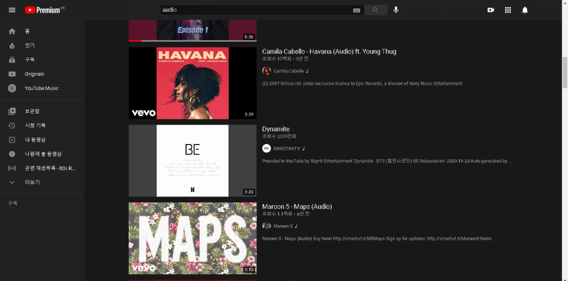
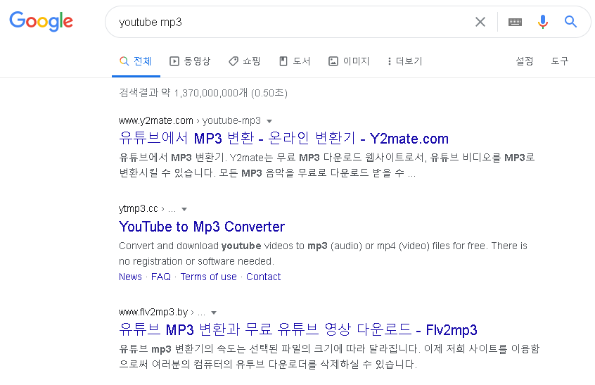
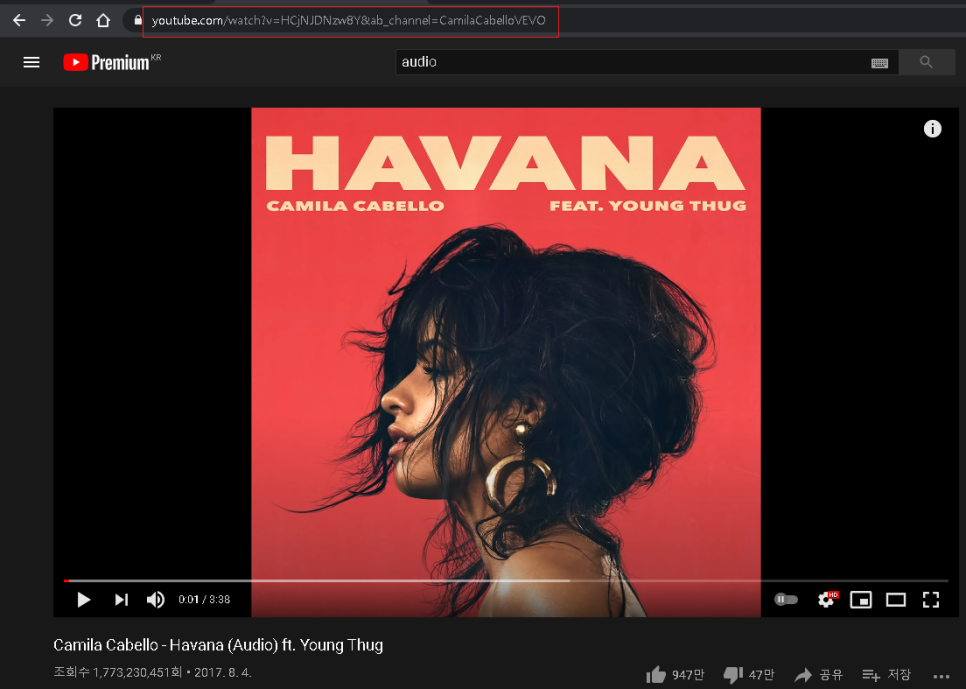
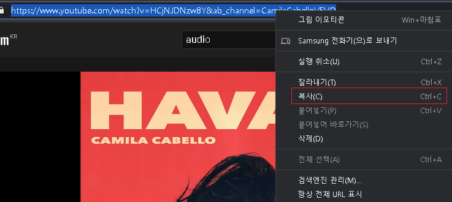
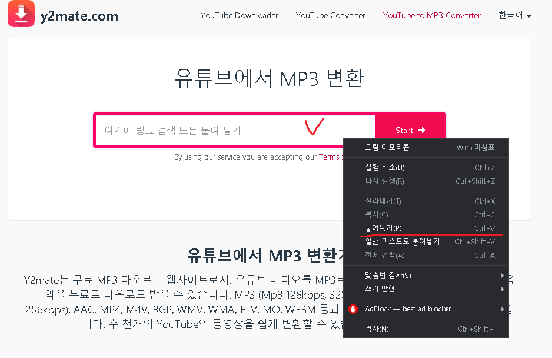
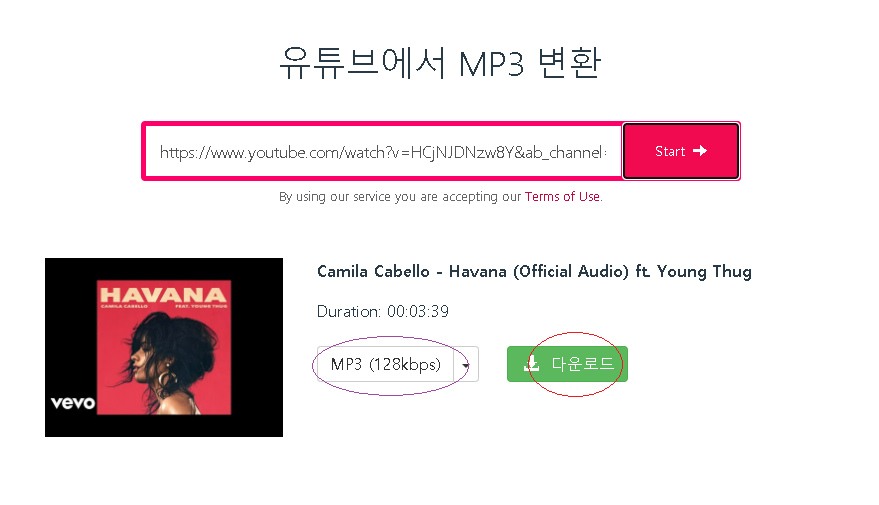
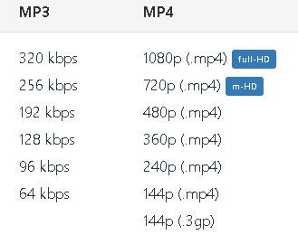
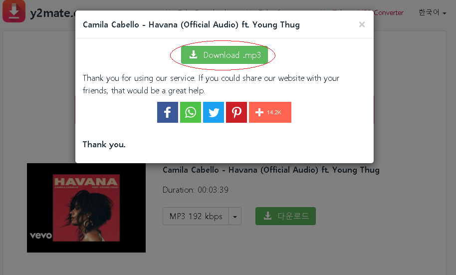
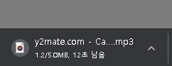
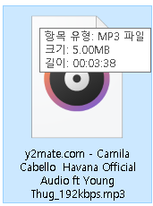

유튜브를 이용하다 보면 음악들이 뮤직비디오 말고 

(audio)라고 음원만 올라와 있는 경우가 많죠

급하게 음원파일이 필요한 경우,

유튜브에 올라온 동영상을 활용해서 구할 수 있습니다.

유튜브 mp3추출 프로그램들도 많이 나와있지만,

설치없이 간편하게 바로 이용할 수 있는

온라인에서 유튜브 음원추출 하는 방법을 알려드리겠습니다.

참고로 이 방법은 mp3파일 자체를 다운받는 것이 아닌, 

동영상에서 소리만 추출해서 mp3파일로 변환한 것을 다운로드 받는 것입니다.

그렇기에 뮤직비디오를 다운받으시게 되면 음원버전이 아닌

동영상의 소리들도 함께 변환된 mp3를 다운받아진다는 점 참고하세요

단, 알려드리기에 앞서 다운받은 음악을 **재배포 및 공유**를 하게되면

저작권법에 위촉될 수도 있으니 주의하세요

구글에 [youtube mp3] 라고 검색합니다.

그러면 온라인 mp3추출 사이트들이 여러곳 나옵니다.

[ **유튜브에서 MP3 변환 - 온라인 변환기**유튜브에서 고품질의 MP3를 다운로드하고 변환하세요. 몇 초 안에 모든 유튜브 동영상을 MP3로 변환시키세요. 온라인으로 빠르고, 간단하고 무료로 다운로드받으세요!www.y2mate.com](https://www.y2mate.com/kr12/youtube-mp3)

[ **유튜브 MP3 변환과 무료 유튜브 영상 다운로드**어떻게 비디오 스트리밍 웹사이트에서 비디오나 mp3 다운을 햘 수 있나요? 이 어플리케이션으로 유튜브를 다운로드 받는 방법은 아주 간단합니다. 지원되는 스트리밍 웹사이트의 링크를 입력한 후, '다음'버튼을 누르세요. 여러분은 다양한 비디오 파열 형식 중에서 선택하실 수 있습니다. 선택된 비디오 파일은 원하시는 어떠한 파일 형식으로든 추출되어 무료로 다운받을 수 있습니다. 유튜브 변환기를 이용하여 WMA lossy, 애플의 AAC, Divx와 mp3 같은 어떠한 파일 형식으로든 사용할 수 있습니다. 유튜브 mp3 변환기의 속도는 선택...www.flv2mp3.by](https://www.flv2mp3.by/kr32/)

아무 사이트나 들어가세요

써보시고 더 편리한 사이트를 이용하시면 됩니다.

사용법들이 비슷비슷하니 저는 y2mate.com 기준으로 설명해드리겠습니다.

이제 음원파일을 다운로드 하는 방법을 알려드리겠습니다.

mp3파일을 추출할 동영상에 들어가시고 상단의 주소를 복사해주세요

주소를 클릭하시면 약식 주소가 아닌 총 주소가 나옵니다.

총 주소를 모두 드래그해서 복사 해주세요

[컨트롤 + c] 누르셔도 되고, 마우스 오른쪽 버튼 클릭하셔서 나온 메뉴에서 복사항목을 선택하셔도 됩니다.

그리고 다시 mp3변환 사이트에 들어갑니다.

"여기에 링크 검색 또는 붙여 넣기..." 라고 써있는 부분을 클릭하시고

주소를 붙여넣기 해주시면 됩니다.

[컨트롤 + V] 누르셔도 되고, 마우스 우클릭 하셔서 나오는 메뉴에서 붙여넣기 고르셔도 됩니다.

그리고 나서 [엔터]를 치시거나 옆의 Start 버튼을 눌러주세요

그러면 하단에 다운로드 할 수 있는 페이지로 바뀌게 됩니다.

보라색 표시를 보시면 여기서 음질을 고르실 수 있는데 mp3는 음성, mp4는 영상 입니다.

동영상 자체를 다운받으실 거면 MP4에서 골라주시면 되고, 음원파일로 받으실 거면 MP3에서 고르시면 됩니다.

원하는 품질을 선택하시고 다운로드 버튼을 누르시면 설정된 품질로 파일이 다운로드 됩니다.

그리고 다운로드를 누르시면 위와 같은 창이 뜨게 됩니다.

여기서 Download .mp3 누르시면 이제 다운로드 되게됩니다.

음악이 다운로드 되어지는데 파일명 앞에 y2mate.com이라고 달리네요

파일명은 알아서 적절히 바꾸시면 됩니다.

이상으로 유튜브 mp3 추출 다운로드 방법을 알아보았습니다.

오늘의 탐구생활

여기까지 입니다 ^^

