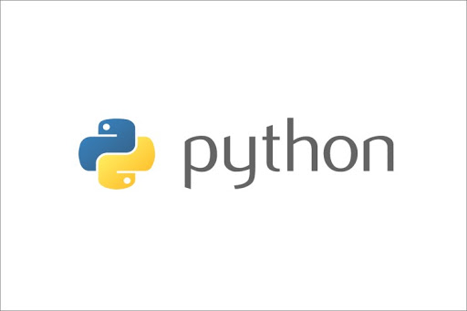
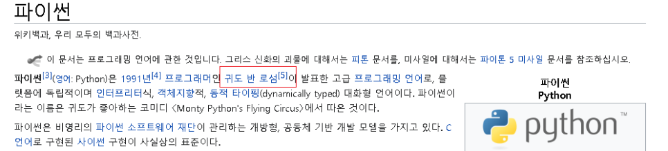
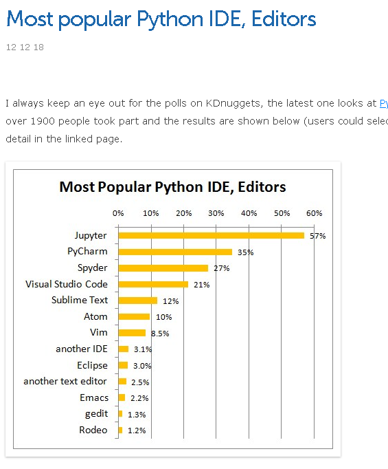
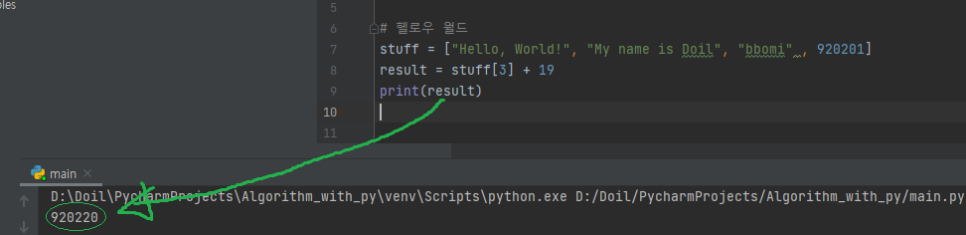
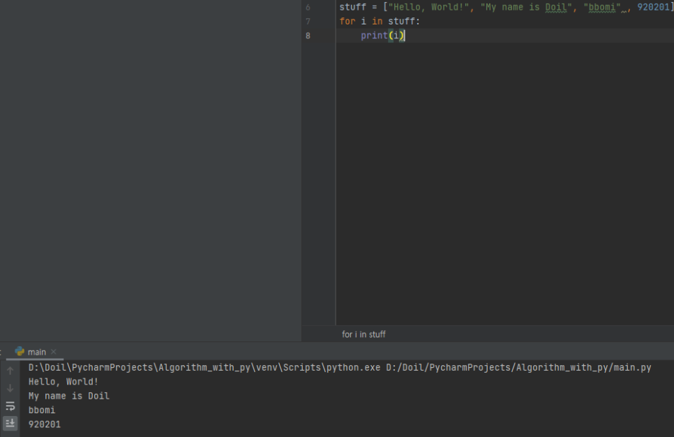
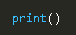
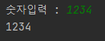
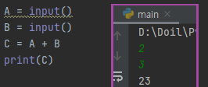
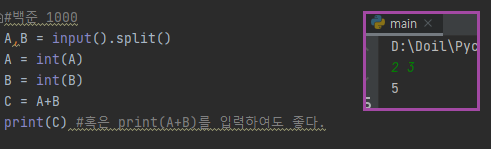
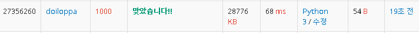

알고리즘 공부를 시작해보려 한다.


이번 공부에서는 프로젝트 단위의 개발을 목표로 하는 것이 아니기 때문에,
알고리즘 그 자체의 논리적 순서를 파악하고 검증하기 위한 가벼운 언어가
프로그래밍 도구로서 필요했다.


나에게 익숙한 C언어와 자바는 이러한 간단한 일들을 하기에는 무거운 편이었다.
반면 파이썬은 한 번도 만져본 적이 없다.
파이썬은 데이터 분석이나 딥러닝 쪽에서 많이 쓰이는 언어이고,
이 분야가 4차 산업혁명의 핵심이 아니던가
파이썬 문법도 공부하면서 동시에 알고리즘도 공부해볼 수 있을 것 같아
파이썬으로 알고리즘을 해결하는 연습을 해볼 것이다.





개발에 적합한 IDE를 찾아야 했는데


주피터가 압도적으로 점유율이 높았다.
그러나 조금 찾아보니 초보자가 시작하기에는 어려울 수 있다고 한다.
또한 웹에서 사용할 때 주로 사용한다고 하니,
초보자에 더 적합한 IDE로 파이참을 선택했다.

찾아보니 많은 이들이 추천해 주기도 했었다.
[파이참 사이트](https://www.jetbrains.com/ko-kr/pycharm/)


파이참을 설치하고 처음 해야 할 일
Hello World 찍기

아, 그전에 파이썬의 특징을 하나 알고 넘어야 한다.
자바나 C언어처럼 컴파일하는 방식이 아니라
인터프리터 형식으로서 대화하듯 한 줄 한 줄 코딩하는 것이다.
그렇기에 쉽고 빠르다는 평가가 있는 것이다.


각설하고, IDE 설치도 완료했고

이제 Hello World를 찍어보자.


Hello World 찍으려고 알아보다 보니
변수 선언, 반복문, 배열, print를 간단하게 익혔다.

```python
stuff = ["Hello, World!", "My name is Doil", "bbomi" , 920201] 
for i in stuff:    
    print(i)
```


변수의 타입을 선언하지 않아도 알아서 담는다.
위의 반복문의 형태는 자바의 for-each 형태(enhanced loop)와 비슷하게 느껴졌다.
또한, 배열이 한 타입의 변수만 담을 수 있는 것이 아니라 String형이던 int형이던 가리지 않고 받는다는 점이 대단했다.

```python
result = stuff[3] + 19
    print(result)
```

stuff[3]은 920201로 숫자다. 만약 수가 아니라 문자열이라면 result는 92020119 라고 찍힐 것이다.

그런데 문장이 끝나고 ;을 찍지 않으니 왠지 모르게 불편해졌다.


다시 돌아와서 반복문을 잠깐 살펴보자.



자바나 C에서 for 문 쓰려면 위와 같은 문장을 표현하려면 꽤 길어진다.
(물론, stuff는 여러 타입을 담을 수 없다는 점도 차이가 있긴 하지만...)

```java
String[] stuff = ["Hello, World!", "My name is Doil", "bbomi"];
for(int i=0;i<stuff.length;i++)
System.out.println(stuff[i]); 
/*  
int stuff_int = 920201;
System.out.println(stuff_int);
*/
System.out.println(920201);
```
이제 Hello World를 했으니


알고리즘의 세상으로 들어가 보자


알고리즘 문제는 [백준 알고리즘](https://www.acmicpc.net/)에서 출제되는 문제들을 풀 것이다.
첫 문제로 적합한 것은

이 문제로 정했다.
A와 B를 입력받고 A+B를 출력해 주는 매우 매우 간단한 알고리즘이지만
변수의 선언, 연산, 입출력을 한 번에 문법적으로 익히기 위함이다.
*) 먼저 입출력


**출력**은 매우 간단했다.

여기 안에 출력할 인자를 넣으면 된다.
큰따옴표로 바로 입력해 주어도 되고, 변수를 넣어줘도 된다.


다음으로 **입력**

입력하기 위해선 담을 수 있는 변수가 필요하고
입력을 담당하는 함수도 필요하다.
변수 선언이 매우 간단하다.

```python
number = input("숫자입력 : ")
print(number)
```


input()이라는 함수만 쓰면 되고,

안에 ""를 입력하면 입력 폼을 만들어준다.

변수 선언, 입출력을 배웠으니 이제 문제로 돌아가서 위 문제를 풀어보자




이렇게 풀면 쉽게 나오겠지? 싶은데 전혀 의도한 바대로 작동하지 않는다.
그 이유는 input() 함수는 무조건 문자열로 인식하기 때문이다.
그래서 덧셈 연산을 하게 되면 산술연산이 아니라 결합 연산을 하게 된다.


문제의 요구대로 첫 번째 줄에는 A와 B를 입력받는다.
다만, 한 줄에 다 입력해야 하므로 split() 함수를 쓴다.
이러면 공백을 기준으로 나눠서 A와 B에 넣어준다.
그리고 받아들인 수는 정수가 아닌 문자열이기 때문에
정수형으로 변환시켜줘야 한다. (문제에서는 실수가 아니라 정수를 요구하므로)
정수형 변환 함수는 int()
그리고 A와 B를 더한 값을 C에 담아주고, print로 출력해 주면 끝


다만, 문제에서는 C라는 변수를 선언하지 않았고,
입력받은 값을 합산해서 바로 출력해 주기 때문에
print(A+B)라고 입력하는 것이 더 문제에 적합하다.


c.f)파이썬에서는 주석이 // 이 아니라 #으로 해야 한다.
결과는 성공적


```python
A,B = input().split()
A = int(A)
B = int(B)
print(A+B)
```

이렇게 간단한 코드를 자바로 이를 표현하려면 꽤 길었을 것 같다.

```java
package test;
import java.util.Scanner;
public class A_Plus_B 
{ 
    public static void main(String[] args) { 	
        int a,b;
        Scanner sc = new Scanner(System.in);
        a = sc.nextInt();
        b = sc.nextInt();
        System.out.println(a+b);		 
    } 
}
```

입력하려면 Scanner 클래스도 임포트 해주어야 하고,
출력하려면 System.out.println(); 이렇게 길게 써주어야 한다.
이 간단한 덧셈을 수행하려는 작업에도
이렇게 꽤나 일이 커진다.
그래서 파이썬을 쉽고 간편한 언어라고 하나보다.
아직 문법이 어색해서 그런지 쉬운지는 모르겠고,
우선 가벼운 작업을 하기에는 적합한 언어라는 생각이 든다.


앞으로 잘 부탁한다

