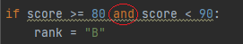
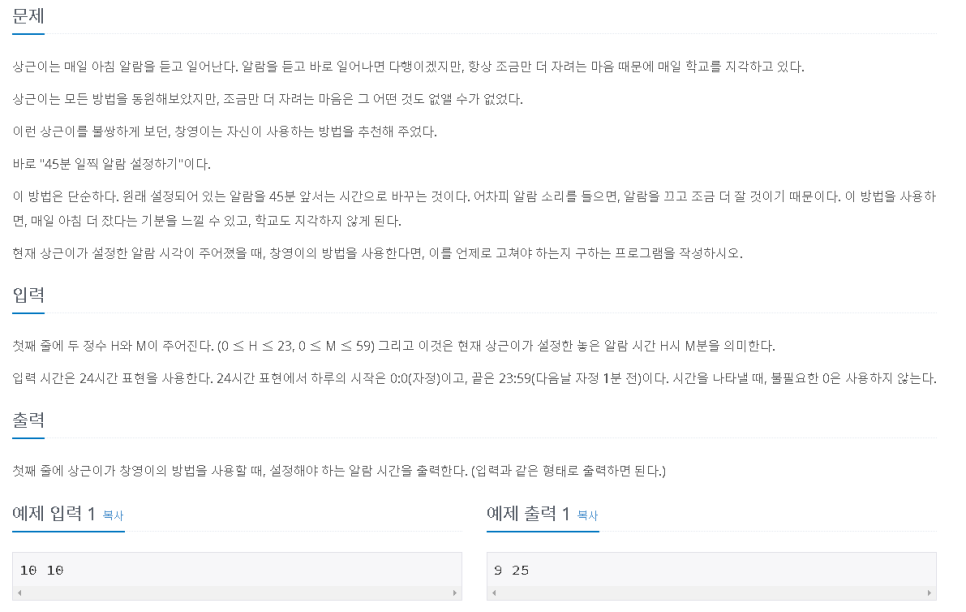
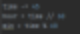

대표적인 조건문으로 if 문이 있다.

전 시간 while 문에서 살짝 살펴보았는데

파이썬에서는 { } 대신에 : 과 들여 쓰기로 표현한다.


자바에서는 if, else, else if 이렇게 세 가지로 크게 나눌 수 있는데

파이썬에서는 if, else, elif로 세 가지로 나뉜다

else if 가 elif로 바뀌었다는 점이 차이


또한, switch 문은 파이썬에 존재하지 않는다.

문법적으로 존재하지는 않지만 딕셔너리를 활용하면 비슷하게 구현은 가능하다.

이번 시간에는 조건문의 학습이 주요 목표이기 때문에

딕셔너리는 추후 활용할 일이 있으면 그때 학습하도록 하자.

> \#1 시험 성적

백준 알고리즘 [9498#](https://www.acmicpc.net/problem/9498)


시험 점수를 입력받고, 값이 해당되는 범위에 따라 등급을 출력해 주는 간단한 프로그램

이런 문제는 switch문을 이용하면 간단하게 해결 가능하지만, 파이썬에는 없기 때문에 if 문으로 해결해보자.


if 문을 5번 돌려서 등급을 지정해 주는 방법도 가능하긴 하지만,

이렇게 되면 내부적으로 5번 체크하게 된다.


else if 문을 이용하면 이 체크들이 한 분기로 설정되기 때문에

조건을 만족할 시 다른 항목들은 체크하지 않는다.

그리고 else의 의미가 상위 조건에 만족하지 않는 값 들이므로 경곗값을 추가해 주지 않아도 된다.


물론 이 모든 것이 찰나에 이루어지기 때문에 체감하는 실행 시간에는 거의 차이가 없다.

그렇지만 if 문을 5번 쓴 것과 else if로 조건 분기를 나눠준 것에서 확인하는 횟수의 차이가 아래와 같이 존재한다.


이때는 문제가 되지 않지만, 만약 검색을 한다고 생각을 해보자.


모든 값들을 if 문으로 점검한다면 n 회의 확인이 이루어지지만

else if 면 원하는 값을 찾으면 멈추게 된다.

n의 크기가 커지면 커지는 만큼의 비효율이 발생하게 된다.

그렇다고 무조건 else if가 좋은 것이라는 뜻은 아니다.

위 문제의 경우에는 이러한 비효율이 발생하기 때문에 else if를 사용하는 것이 효율적이라는 뜻이다.

그러므로 else if를 써야 하는 경우를 잘 생각하고 이용하면 되겠다.

if는 메인 분기, else if는 if의 서브 분기이므로 이를 잘 확인하자.

(else도 if의 서브 분기다. 그 외의 경우인 여집합)


조건문의 설명이 길어졌기 때문에

바로 문제를 풀이해보자.

문제는 매우 간단하다.

" 입력받고 -> 등급 지정 -> 출력 "

등급 지정하는 부분을 작성하여 if 문을 익혀보자.


매우 간단하다.

else if는 상위 조건에 해당되지 않는 값 들이므로

또 다른 경곗값을 정해주지 않아도 상위 조건이 경곗값이 된다.


else if를 사용하지 않고 if 문을 여러 번 썼을 경우, 위처럼 경곗값을 정해줘야 한다.

그렇지 않고 else if랑 똑같이 조건을 주게 되면 

다음 조건도 만족하게 된다면 rank가 변하게 되므로 정상적인 결과가 출력되지 않는다.


이번 파이썬에서의 조건문 문법을 보면서 몇 가지 자바와의 차이점을 보았다.

1) 자바의 논리연산자 &&,||,! 이

파이썬에서는 and, or, not이라는 키워드로 대치되었다는 점이다.



2) 자바에서는 사잇값을 바로 표현하지 못하고 논리연산자로 묶어주어야 하는데

파이썬에서는 직관적으로 표현 가능하다는 점이 큰 차이였다.


> \#2 윤년


백준 알고리즘 [2753#](https://www.acmicpc.net/problem/2753)

연도를 입력받았을 때, 윤년이면 1 아니면 0을 출력한다.

윤년이 맞는지 아닌지 확인하는 조건만 안다면 간단하게 풀 수 있는 문제

문제에서는 연도가 4의 배수이면서 100의 배수는 아닐 때,

혹은 400의 배수일 때 윤년이라 한다고


배수를 확인하는 방법은 나머지 연산자 %를 이용하여 0이 출력되는지 보면 된다.


4의 배수이면서 100의 배수가 아니라는 뜻은,

4의 배수 중에 100의 배수가 있기 때문이다.

=> 4의 배수들로 걸러주고 그 값이 100의 배수인지 한 번 더 확인


그런데 400의 배수일 때는 무조건 윤년이라 한다.

400은 4의 배수이면서 동시의 100의 배수이기 때문에 위의 조건에 따르면 윤년이 아니지만, 

400의 배수는 예외로 윤년이라 했으니 새로운 분기로 나누어서 확인해야 한다.


이상으로 윤년 확인 조건을 파악했으니 코딩을 해보자


조건식에 ( )를 치지 않아도 되지만,

자바에서는 조건식을 () 안에 넣어주기 때문에 그냥 괄호를 쳐야 마음이 편안하기 때문에 썼다.

자바에서는 { }로 블록을 정하지만, 파이썬에서는 들여 쓰기로 블록을 정하기 때문에

들어 쓰기 하는 것을 잘 확인해야 한다.

위에 모두 if를 썼지만 두 번째 if는 첫 번째 if 안에 있는 if이고 세 번째 if는 다른 if이다.


물론, 세 번째 if를 첫 번째 if의 두 번째 하위 조건문으로 넣어도 상관없긴 하다.


또한 세 번째 if를 두 번째 if의 하위 조건으로 넣어도 가능하다.


들여 쓰기에 따른 조건문의 블록 형성을 보여주기 위해 여러 경우를 써봤다.

이 말은 조건문은 항성 어떻게 표현해도 상관없다는 뜻이 아니라,

위 문제의 경우에서만 이러한 방법들이 다 가능한 표현법이기 때문에 허용된다는 점 다시한번 확인하자.

( 벤다이어그램을 그려보면 이 문제에서는 결국 다 같은 표현이라는 것을 확인할 수 있다.)


이처럼 조건을 또 확인해야 하는 경우는 else if를 사용하지 않고 계속 if로 따져볼 수밖에 없다.

그러므로 if와 else if의 차이를 잘 파악할 필요가 있다.


참고로, 위의 문장을 한 줄로 표현하면 다음과 같다.


기본적으로 윤년이 아니지만, 조건문에 해당되는 연도라면 윤년이라는 뜻

> \#3 알람시계



백준 알고리즘 [2884#](https://www.acmicpc.net/problem/2884)


문제 요약 : 시간을 입력하면 그 시간에서 45분 뺀 값 출력 출력


연산을 하려면 한 쪽으로 단위를 맞춰주고 계산 후, 다시 원래 값으로 단위 변환을 해주는 방식으로 하면 간단히 해결할 것 같다.

다만, 알람을 0시 44분으로 지정하는 경우에는 23시 59분으로 설정되어야 하기 때문에

-45 했을 때 음수가 된다는 뜻은 24시 단위를 넘어간다는 뜻이다.

그러므로 이 경우에만 24시 00 분을 기준으로 계산해 줘야 한다.

실제 알람시계로서의 역할을 하려면 날짜까지도 고려해야 하지만(오늘 밤 11시인지, 내일 밤 11시인지)

이 문제에서는 단순 시간만 표현하면 되기 때문에 이는 고려하지 않도록 한다.


한쪽으로 단위 변환을 위해

분을 시간으로 바꾸던지, 시간을 분으로 바꿀 수 있을 것이다.

그러나 빼는 시간 단위가 분이므로 계산의 편리를 위해 (그리고 큰 쪽으로 변환하면 소수점이 발생하기 때문에)

분으로 환산하여 준다. 

여기에서 45분을 빼주고, 다시 원래 단위로 변환시켜주면 된다.



이때, 60으로 나누었을 때의 몫은 시간(時)을 의미하고 나머지는 분(分)을 의미하게 된다.

한 시간을 60분으로 환산하고 분으로 변환하여 더하였기 때문이다.

수학적으로 구조를 표현하자면 Time = (60 * hour) + min   (min<60) 꼴이다.


문제에서 요구하는 출력 범위는 0시 0분부터 23시 59분 까지다.

그런데 앞에서 이미 설명했듯, 0시 44분으로 알람을 설정하면 음수의 값이 나오는 문제가 발생하게 된다.


0시 0분은 24시 00분과 같은 의미다.

만약 계산 결과가 음수가 나오게 된다면 24시 00분을 분으로 환산하고,

여기에서 빼주면 된다.(이미 음수이기 때문에 더한다는 표현이 더 적합하다.)


"만약 ~~한 경우라면" 과 같은 문장이 들어간다면 조건문으로 표현해 준다.


그러므로 이렇게 중간에 조건문을 넣어  표현을 해주어야 문제에서 요구하는 조건을 모두 만족시켜줄 수 있게 된다.
```python
hour,min = input().split()
hour = int(hour)
min = int(min)
time = (hour * 60) + min
time -= 45 if(time<0) : time += (24*60)
hour = time // 60
min = time % 60

print(hour,min)
```


