c와 자바에서의 for문의 구조는 다음과 같다.

```java
for( 초기값 ; 조건식 ; 증감값) {  
    반복문 
}
```


\1) 초깃값을 주고

\2) 조건식을 주어서 이 조건에 만족하는 동안만 반복하게 한다.

\3) 루틴이 한 바퀴 돌고 난 후 값의 변화를 주는 부분


이를 예를 들어 설명하자면

```java
sum = 0;
for(int num = 1 ; num <= 10 ; num++ ){ 
	sum += num;
}
```


1부터 10까지의 합을 구하는 반복문을 만든다고 할 때,

초깃값 num = 1이라고 주었고,

조건으로 num이 10이 될 때까지는 반복하겠다고 조건식을 주었다.

그리고 한 바퀴 돌고 나면 num의 값을 1 증가시키겠다는 의미가 된다.


그런데, 파이썬에서 for 문은 이와 사용하는 방법이 다르다.

기본 구조는 이러하다.

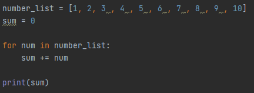

자바의 for-each문과 사용법이 유사하다.

[for-each](https://blog.naver.com/kdi3939/222246519883)


in에 있는 리스트의 1번부터 10번까지, 반복문의 내용을 수행하겠다는 의미가 된다.

각 루틴당, num의 의미는 num[인덱스]가 된다.


기본적으로 for문은 특정 리스트의 첫 번째부터 끝까지 접근하면서 어떠한 작업을 수행할 때 이용하는 듯 보인다.

기존의 자바 for문에 익숙하다 보니 조금 낯설긴 하다.


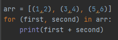

그러나 배열의 값이 이처럼 2차원 배열같이 들어가 있는 경우,

반복문을 쓸 때 쉽고 직관적으로 접근할 수 있다.


그래서 언어적으로 이해할 필요가 있다고 생각되어서

내 식으로 풀어서 설명해보겠다.

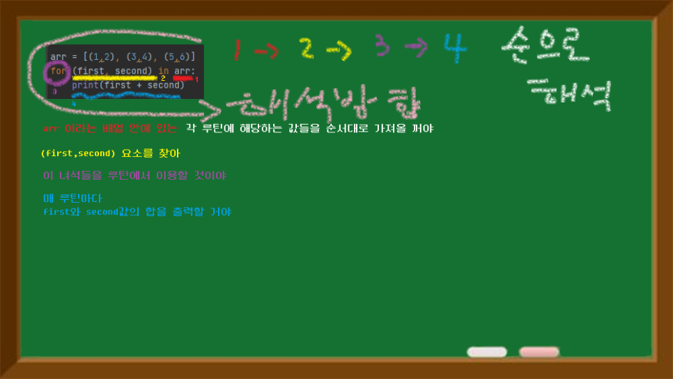

원래 영어는 거꾸로 해석하는 거라고 하던가, ㄷ자형으로 해석하면 대략 의미 파악이 가능하다.


이제 이 방법을 알았으니 구구단을 찍어볼까?

하지만, 문제가 있다. 위 방법으로 하려면, 조건이 아닌  1부터 9까지의 값들이 담긴 배열이 필요하다.


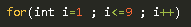

1~9 라고 적어주면 그만인 것을

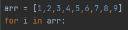

위 방법대로라면 파이썬에서는 1,2,3,4,5,6,7,8,9 이렇게 배열에 담아두고 접근해야 한다.

이렇게 적은 개수의 수라면 그나마 참겠는데

만약 더 큰 수의 범위(ex: 1~98712157) 라면 언제 다 쓰고 있는가??

\* 조건식을 쓸 수 있는 while 문을 써야 하나?

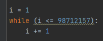

\* 아니면 꼭 악착같이 for문을 써야 한다면, while 문으로 범위에 해당하는 값들을 추가하여 배열을 만들어주고 이 배열에 접근하나?

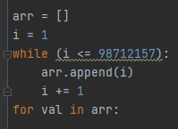


이렇게만 보면 for문 참 안 좋아 보인다.

그런데 이를 해결할 방법이 있다. 바로 range() 함수를 이용하는 것이다.

```python
a = range(10)
b = range(1,98712157)

```

이 함수를 이용하면 끝 값을 제외하고 범위만큼 숫자 리스트를 생성해 준다.

왜 끝값은 제외할까 생각해 보니

자바에서 for문을 돌릴 때, 보통 인덱스를 0부터 시작하기 때문에

조건식에서 부등호를 <=가 아닌 <로 표현하기 때문인 것 같다.

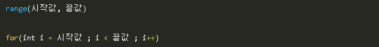

이것이 기본적인 형태이지만, 만약 값을 하나만 넣는다면 시작 값은 0으로 인식한다.

따라서 a는 [0~9], b는 [1~98712156] 의 숫자 리스트가 생성된다.

그렇다면 range로 시작 값과 끝값을 지정할 수 있으므로

자바에서 쓰던 방식으로 for문을 사용할 수 있게 되었다.

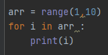


코드를 보면 여기에 시작 값과 끝 값이 들어가 있다.

이러한 관점으로 보니 파이썬 for문도 쉽게 느껴진다.


이제 기본기는 습득했으니, 아래 문제들도 풀어보자.

물론 어떠한 반복문을 써도 상관없이 풀 수 있으나,

for문을 익히기 위함이므로 for문으로만 풀도록 하자


> 1부터 N까지의 합

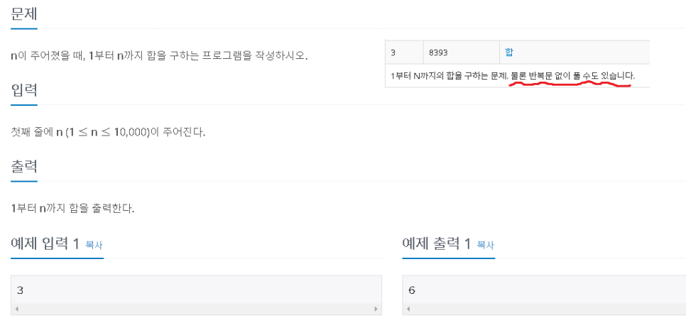

백준 알고리즘 [8393#](https://www.acmicpc.net/problem/8393)


N 값을 입력받고, 1부터 N까지의 합을 출력하는 매우 간단한 프로그램

쉬운 문제이지만 반복문의 기본 원리를 익히기 위해 적합한 문제로 보인다.

또한 문제 번호가 8393인데 우리 엄마 예전 핸드폰 번호 뒷자리와 같기 때문에 정감이 가는 문제다.


구조를 짜자면 다음과 같이 할 수 있겠다.

N 입력받음 -> 1부터 N까지 숫자 리스트 생성 -> 숫자 리스트의 합계를 구함 -> 출력


이 기본 구조를 그대로 코딩하면 된다.

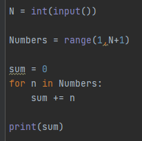

range에서 N+1을 해주는 이유는 끝 값