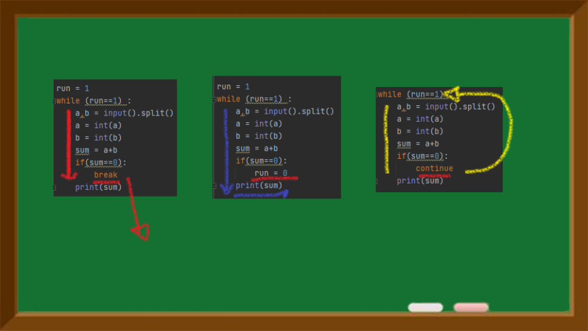

전 시간에 for문을 이해해 보았다.

이번 시간에는 while문을 익혀볼 것

while문은 구조가 더 단순하다.

저번 세로 곱셈 알고리즘에서 사용했던 while문을 보면 이해가 쉽다.

조건을 만족하는 동안, 반복문을 시행하겠다는 의미가 된다.

물론 중간에 조건문을 주어서 break, continue 키워드 이용도 가능

반복문을 쓸 때에는 for문, while문 둘 중

어느 것을 사용해도 상관없이 가능하지만

내가 느끼는 바로는

어떤 리스트의 값들에 접근하는 경우(순차적 반복의 특성을 가지는 경우)에는 for문 ,

특정 조건에 한해서 반복할 때는 while문

이렇게 사용하는 것이 적절하겠다는 생각이 들었다.

간단한 문제 풀이로 바로 while문을 학습해보자

> 두 수의 합 반복출력

백준 알고리즘 [10952#](https://www.acmicpc.net/problem/10952)

두 수를 입력받고 합을 출력하는 반복문을 작성하는 것이다.

무한 반복인데, 0 0 을 입력받으면 반복문을 빠져나가는 구조

조건은 크게 두 가지로 할 수 있겠다.

1) a와 b가 각각 0일 경우

2) 두 수의 합이 0일 경우

0+0 = 0이므로

a와 b를 각각 따지거나, 결론만 보거나 하는 방식으로 조건을 줄 수 있겠다.

이제 while문의 구조를 짜야 하는데

1) 두 수의 합이 0이 아닌 한 반복하는 구조이거나

2) 무한 반복문인데 두 수의 합이 0이 되는 순간 빠져나가는 구조

이렇게 생각할 수 있다.

두 수의 합계를 sum이라 하고, 이 값이 0이 아닌 한 반복하는 구조

print앞에 조건을 준 것은 0 0을 입력받았을 경우 합계를 0이라고 굳이 찍지 않고 바로 종료하기 때문이다.

혹은 무한반복문을 구성하여 0 0 을 입력 받은 경우 바로 반복문을 빠져나가도록 구성해도 된다.

run 값이 변하면 반복문을 빠져나가긴 하지만,

break는 그 시점에서 빠져나가는 거고

중간에 run값이 변화되더라도 그 루틴의 끝가지는 다 수행하고 조건을 확인하므로

반복문을 빠져나가는 시점이 다르니 이 점도 잘 확인해야 한다.

정리하는 김에 continue까지 비교하여 차이들을 살펴보자.

break를 쓰면 그 시점에 바로 반복문을 빠져나간다.

run = 0 처럼 조건의 변동을 주더라도 아래 print(sum)까지는 찍고 반복문을 빠져나간다.

continue는 이번 루틴은 끝내고 바로 조건을 확인하고 다시 반복문을 돌리게 된다.

마치 학창시절 선생님들이 문제풀다 틀렸을 때 혼내는 방식과 비슷하다.

호랑이 선생님 : " 틀렸어! 다시해"

> 더하기 싸이클

백준 알고리즘 [1110#](https://www.acmicpc.net/problem/1110)

모든 수를 두자리 수라고 생각하고 1의 자리의 수를 더한다는 의미같다.

출력은 원래 수로 돌아갈 때 까지의 사이클 횟수

파이썬에는 do-while이 없다.

그래서 do에서 할 부분을 미리 처리해주고 while문으로 돌렸다.

문제에서 요구하는 대로 출력값을 맞춰주려면 이렇게 코드를 작성하면 된다.

다만, 반복문이 제대로 작동하고 있는지 확인하기 위해서

중간중간 print로 정상적으로 진행되는지 확인해보자

result가 제대로 찍히는 것을 확인할 수 있다.

