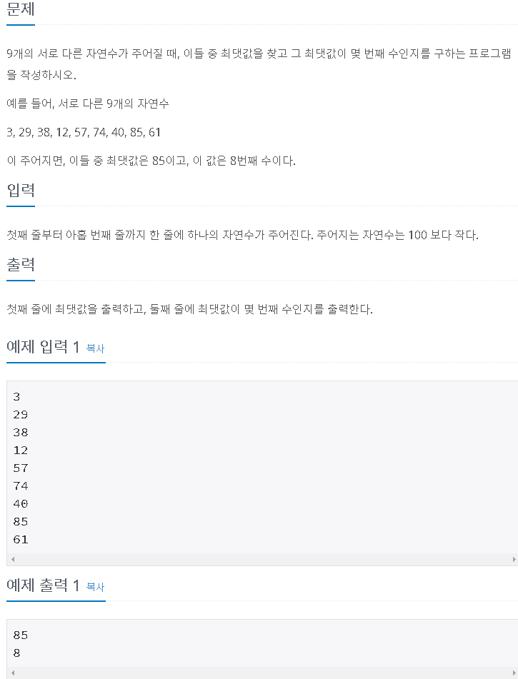

파이썬에서는 배열 선언하는 것이 너무 간단하다.

배열 이름과 []만 쳐주면 끝이다.

이렇게 하면 비어있는 배열 선언이 완료된다.

안에 넣을 수 있는 요소는 String, int, float, 등... 상관없다.

자바나 C언어에서는 같은 데이터 타입만 담을 수 있는 것에 반해 데이터 타입은 신경쓰지 않는다.

또한,

이러한 형태로, ()안에 담긴 구조들을 넣을 수도 있고

배열을 요소로서 가질 수도 있다.

다차원 배열은 다음시간에 자세히 다뤄보도록 하고, 이번시간에는 1차원 배열에 한해서 문제를 해결해보자!

> 최소, 최대

백준 알고리즘 [10818#](https://www.acmicpc.net/problem/10818)

첫째줄에서는 배열의 크기,

둘째 줄에는 각각 들어갈 값들이다.

그러면 최솟값과 최댓값을 출력해주면 끝

최솟값과 최댓값을 얻는 방법은 무엇일까?

처음부터 끝까지 다 확인을 해서 가장 작은 값을 최솟값, 가장 큰 값을 최댓값이라 하면 된다.

먼저 배열을 입력받았을 때, 최댓값, 최솟값을 구하는 함수들을 각각 정의해주고

배열을 채워주는 부분을 짜면 끝

n은 배열의 크기

x는 배열에 들어갈 값들을 입력받는 부분이다.

split()함수는 공백을 기준으로 쪼개서 넣어주는데 따라서 x에는 입력받은 값들을 배열로 받아들인다.

다만, int형으로 받아들이는 것이 아니라 문자형으로 받아들이기 때문에

연산을 위해서 숫자로 변환시켜줘야 한다.

> 최댓값과 그 위치

백준 알고리즘 [2562#](https://www.acmicpc.net/problem/2562)

최댓값을 구하는 알고리즘은 똑같다.

다만, 그 위치를 찾아주는 알고리즘

입력값이 9개로 제한되어 있기 때문에

아무렇게나 코딩하더라도 크게 실행시간에 문제는 없을 것으로 보인다.

다만, n의 갯수가 커지면 커질수록 실행시간이 증가되므로

최대한 효율적인 코드를 작성하도록 해보자

최댓값을 구할 때, 0부터 끝번까지 순차적 접근을 하므로

최댓값을 찾았을 때의 순서가 최댓값이 있는 위치가 된다.

이를 한번더 구하기 위해 굳이 검색을 하는것 보다는

최댓값을 찾으면서 같이 그 위치를 리턴해주는 것이 효율적으로 보인다.

> 숫자의 개수

A,B,C의 의미는 크게 없어 보인다. (100부터999까지)3자리수 정수라고 했으나 정수이기만 하면 된다.

근데 왜 하필 3자리 수 정수일까 궁금해서 고민좀 해봤다.

100만에서 9억사이의 값이 된다.

만약 4자리수를 허용하게 된다면 결과값의 범위가 

10억부터 1조에 조금 못미치는 값(9997억)까지 나온다.

4바이트 int정수의 범위가 (-21억~+21억)이기 때문일까?

4자리수로 하면 오버플로우가 발생할 수 있다.

문자열로 변환한다 치더라도 그 전에 정수값이 오버플로우 발생하기 때문에

이러한 문제때문에 3자리수 정수로 한정한 것이 아닌가 싶다.

long형을 쓴다면 4자리수 정수도 가능할 것 같긴하지만,

결론적으로 결과값에서 0부터 1까지 각 숫자별로 나온 횟수만 잘 출력해주면 된다.

코드를 최대한 줄여쓰려고 노력해봤다.

길이 신경쓰지 않고 그냥 쓴다면

A,B,C의 곱을 계산한 후,

0의 갯수, 1의 갯수, 3의 갯수..... 각각 세주고

마지막에 각각 출력해주면 된다.

조금 더 간략하게 표현하기 위해서 배열의 인덱스를 이용하는 방법을 생각해보았다.

0부터 9까지, 즉 정수는 순차적으로 증가하는 특성을 가지고 있고

이 숫자들은 각각의 인덱스에 대응할 수 있다.

또한 이번 문제에서 요구하는 작업들은 동일한 작업들이다.

그러므로 이러한 특성을 이용해서 반복문으로 작업할 수 있다.

0의 갯수, 1의 갯수, ... 9의 갯수 각각을 변수로 만들기보다는

모두 정수적 특성을 가지고 있으므로( = 인덱스로 접근이 가능)

이를 이용해서 코드를 줄여서 작성했다.

> 나머지 구하기

백준 알고리즘 [3052#](https://www.acmicpc.net/problem/3052)

각각의 값들의 42로 나누었을 때의 나머지들을 구하는 것은 어렵지 않다.

다만 "서로 다른" 나머지의 갯수가 몇 개 인지 출력하는 것이다.

이렇게 들으면 말이 좀 어려워서 문제에서 요구하는 바를 쉬운 방식으로 치환하여 생각해보기로 한다.

각각의 나머지들을 구한 후, 이를 중복을 제외한 집합으로 보면 된다.

예를 들어 1~9까지의 집합이면 (1,2,3...,9) 이렇게 총 9개의 원소가 들어간다.

그런데, (1,2,1,2,3,4,5,6) 이면 이 집합은 (1,2,3,4,5,6)이 된다.

즉, 치역을 정의(42로 나눈 나머지)해주고 치역의 갯수를 뽑아내면 되는 것이다.

이렇게 하면 서로 다른 나머지의 갯수가 몇개인지 묻는 것과 동일한 의미가 된다.

비어있는 배열을 선언해주고 해당 값이 배열에 존재하지 않으면 넣어주고,

이미 존재하는 값이면 넣지 않는 방식으로 배열이 구성되도록 만들것이다.

말로 설명하자니 더 복잡해지는 느낌이다.

코드를 보면 이해가 될 것이다.

아직까지 내가 작성한 배열 알고리즘은 선형접근이기 때문에 항상 시간복잡도 O(n)이다.

이를 더 효율적으로 바꿀 수 있는 방법이 있는지 연구가 필요하다.

> 평균조작

단순히 수치를 조작하는 것이 아니라

최댓값을 기준으로 각 점수들을 환산(100 곱하고 최댓값으로 나누기)해주는 것이다.

그렇게 하면 점수들이 오르게되고 당연히 평균도 올라가게 된다.

문제에서 요구하는 대로 각각의 값들을 환산하고 이들의 평균을 구하는 방법도 가능하지만

애초에 평균을 구하고 여기에 해당 환산치를 곱해주는 것도 결과는 같다.

문제에서는 각각의 점수들이 오르는 것이 아닌 "평균의 향상"을 목표로 하기 때문이다.

> 평균은 넘겠지

백준 알고리즘 [4344#](https://www.acmicpc.net/problem/4344)

누구나 자신이 평균은 넘겠다고 생각하지만 세상은 실제로 그렇게 녹록하지 않다는 것을 보여주는 매우 슬픈 문제다...

동심파괴문제지만 그래도 한번 풀어보겠다 ㅠ

여러 테스트 케이스를 통해 평균을 넘는 학생들의 비율이 얼마나 되는지 보여주는 문제

90퍼센트 정도는 본인이 평균을 넘는다 생각하지만

실제로 평균을 넘는 인원은 그에 훨씬 미치지 못한다  

평균을 넘기란 이처럼 어렵다...

알고리즘의 설명이 따로 필요 없을 것 같지만,

평균을 구하는 함수를 구현했고, 평균을 넘는 학생의 비율을 계산해주는 함수도 구현했다.

결과를 구하는 것은 어렵지 않았지만

문법적으로 소숫점3자리 반올림해서 %로 출력해야 하는 부분이 조금 헷갈렸다.

c언어나 자바에서의 printf처럼 쓰고 %스타일 포맷팅 해줘서 문제에서 요구하는대로 출력값을 맞춰주었다.

