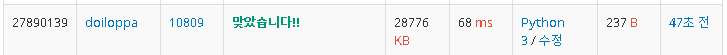
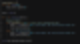

> 숫자의 합


백준 알고리즘 [11720#](https://www.acmicpc.net/problem/11720)


첫째줄에 숫자의 갯수를 적어주고 둘째줄에 입력한 수의 합을 구해주는 단순한 구조

둘째줄의 수는 정수의 의미라기보다는 공백없는 숫자들의 나열, 즉 문자열이라 봐야 해결가능한 문제다.

파이썬에서 기본적으로 입력받은 값은 문자열이다.

이를 int, float등 형 변환 해주지 않으면 수가 입력되더라도 

문자열이므로 각 자릿수들을 분리하는 것이 매우 간단하다.

이후, 각 문자들을 정수로 변환해주고 합산해주면 끝


x가 둘째줄이고, 합을 구하는 과정에서 int형으로 형변환 해주는 것이 핵심


> 알파벳 찾기


백준 알고리즘 [10809#](https://www.acmicpc.net/problem/10809)

소문자로만 이루어진 단어를 입력하면

a~z까지 단어에 각각 처음 등장하는 위치를 출력해주는 프로그램

첫번째 위치는 0부터 시작하며, 존재하지 않을 경우는 -1을 출력


첫번째로 생각할 것이 단어와 알파벳이 주어졌을 때, 단어에 해당 알파벳이 존재하는지 확인하는 함수다.

둘째로는 a~z까지 각각 이 함수들을 써서 각 위치들을 출력해주는 것


알파벳이 존재하는지 확인하는 함수는 단어의 0번 위치부터 끝 위치까지

내가 입력한 알파벳과 같은 알파벳이 있는지 확인해보면 된다.
```python
is_In(word,char)
```


a~z까지 각각 이 함수들을 호출한다고 했을 때, 각각 함수 호출을 할 것인가?

그것은 너무 비효율이다.
```python
is_In(word,'a')
is_In(word,'b')
....
is_In(word,'z')
```

문자를 아스키 코드로 변환하면 정수가 된다.

정수가 된다는 것은 쉽게 반복문을 이용할 수 있다는 뜻이다.

a의 아스키 코드는 97이고, z의 아스키 코드는 122이다.

따라서 97~122까지 반복하는 반복문으로 확인하면 된다.


```python
정수 -> 아스키 : chr()   
    ex) chr(97) = 'a' 

아스키 -> 정수 : ord()   
    ex) ord('a') = 97
```


결과 출력이 한줄에 띄어쓰기로 구분하여 출력하고 마지막 z의 위치를 찍고 바로 개행하므로

if문으로 출력하는 형태에 분기를 주었다.





> 문자열 반복


백준 알고리즘 [2675#](https://www.acmicpc.net/problem/2675)


그냥 문제에서 하라는 대로 코딩을 할 줄만 알면 될 것 같다..

\1) 테스트 케이스만큼 반복하는 반복문을 만들고

\2) 각 케이스에서 숫자와 단어를 입력받아서 단어의 각 자리의 문자를 숫자만큼 반복해서 출력해주기


> \#1157 단어 공부


백준 알고리즘 [1157#](https://www.acmicpc.net/problem/1157)


대소문자를 구별하지 않고 각 단어의 나온 횟수를 체크해서

가장 많이 나온 단어를 대문자로 출력해주는 것이 문제다.

하나가 아닐 경우에만 ?를 출력해주면 됨


직관적으로 쉽게 표현하자면

a~z까지 카운트를 셀 수 있는 배열을 만들고 해당 단어가 나올 때마다 1씩 증가시켜주고

최대값 구하는 알고리즘으로 최대값이 존재하는 곳의 알파벳을 출력해주면 될 것 같다.

단, 최댓값이 한개가 아닐경우에만 ? 출력


a~z까지를 인덱스로 표현하려면 아스키코드를 활용하면 될 것 같다.

알파벳은 총 26개다.




\1) a~z까지 각각 나온 횟수를 기록하는 alpah_Count라는 배열을 생성하고 0으로 채워준다.

단어를 입력받고, 각 단어들을 아스키 코드로 변환하면 인덱스 번호로 만들 수 있다.

다만 대소문자 구별하지 않으므로 대문자인 경우와 소문자인 경우로 나눠서 카운트를 증가시켜준다.


\2) 최댓값을 출력해주면 되는데, 만약 최댓값이 한 개가 아닌 경우 ?를 출력해주는 함수를 만든다.


s4개 i4개 이므로 ? 출력


z가 제일 많이 나왔으므로 z 출력


무려 정답률 38%의 꽤 난이도 있는 문제였다.

> \#1152 단어의 개수


백준 알고리즘 [1152#](https://www.acmicpc.net/problem/1152)


이 문제에서 요구하는 단어의 갯수는 (공백의 갯수 + 1) 이라고 생각하면 될 것 같다.

즉, 공백을 기준으로 단어여부를 처리해주는 것이다.

공백을 기준으로 문자열을 쪼개주는 함수인 split()을 활용할 수 있다.

그러면 각 단어들이 나눠져서 배열에 담긴다.

이 배열의 크기가 단어의 갯수라고 보면 된다.


이렇게 쓰면 코드가 직관적이지 않아서 예쁘지는 않지만

한줄로 표현할 수 있어서 효율적이긴 하다.


굉장히 간단한 문제지만 의외로 정답률이 28%다.

split()함수를 모르더라도 공백의 갯수를 체크하고 + 1 해주면 되는 문제였는데

의외로 어려웠나보다.
