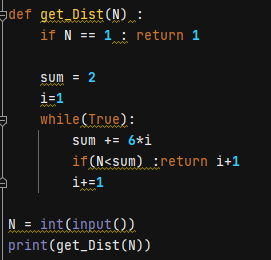
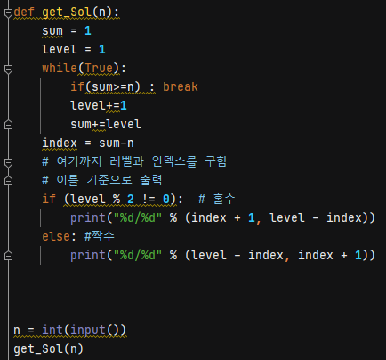
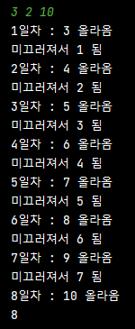

> \#1712 손익분기점

백준 알고리즘 [1712#](https://www.acmicpc.net/problem/1712)

코드를 작성하기 전에 관계식을 세울 필요가 있다.

A는 고정적으로 들어가는 비용이고 B는 노트북 한대를 생산하는데 들어가는 비용이기 때문에, 제작비용은 A + Bx 가된다.

노트북의 가격은 C원이고, x대를 팔았을 때의 돈이 수입이 된다.

제작한 노트북은 모두 팔린다는 가정하에 제작비용보다 수입이 많아지는 지점이 바로 손익분기점이 된다.

A+Bx < Cx 로 식을 세울 수 있으며, x의 최소값이 손익분기점이다.

식을 x에 관하여 정리해보면

$A\ <\left(\ C\ -\ B\right)\ x$

$\frac{A}{\left(C-B\right)}\ <\ x$

이를 만족하는 x의 최소값을 구하면 된다.

이러한 수식이 만족하려면 ( C != B )이여야 한다. 또한 C가 B보다 작은 값이면 음수가 되어 절대로 손익분기가 발생하지 않는다.

A / ( C-B) < x 를 만족하는 x의 최소값 (단, x는 정수)이 손익분기점이며, ( C<=B ) 이면 손익분기점이 발생하지 않으므로 -1이다.

c.f) 틈새정보 : 손익분기점은 Break-even point이라 부른다.

손익분기가 발생하지 않는 경우를 알았으므로 그 때는 -1(손익분기 없음) 을 리턴해주고,

그 외의 경우에 x의 최소값을 구해서 리턴해주면 된다.

+1을 해주는 이유는 x는 정수의 값이기 때문이다.

ex) 10.3 < x 를 만족하는 정수 x의 최소값은 11이다. 10.3에서 소수점 뗀다음 +1을 해준다는 것을 볼 수 있다.

> \#2292 벌집

백준 알고리즘 [2292#](https://www.acmicpc.net/problem/2292)

자세히 규칙을 살펴보니

해당 방에 도달할 때 까지의 최소 거리는 몇번째 외곽에 있는지와 똑같은 의미였다.

a1 = 1 이고, a2 = 6, a3 = 12 , a4 = 18 ...

규칙성으로 보았을 때, n번째 층은 6(n-1)개의 방이 있다.

임의의 방인 N을 넣었을 때 이 수가 존재하는 영역의 층을 리턴해주는 함수를 만들면 된다.

n이 3이면 8보다 작으므로 2층

n이 18이면 20보다 작으므로 3층... 이런식으로 정해진다.

각 층의 기준값은 1,2,8,20 ...... 증감값이 (n-1)6이다.

N이 1이면 1이고, 그 외의 경우들만 따져주면 된다.

1, 2, 8, 20 ... 각각의 경계값들을 확인한다.

입력받은 N을 아래의 경계값부터 차례대로 확인하고, 

다음 경계값보다 작아지는 순간이 바로 N이 속한 층이 된다.

방의 갯수가 (n-1)*6 의 규칙으로 증가하므로, 몇번째 층인지 알기 위해서는 +1을 해준다.

> \#1193 분수찾기

백준 알고리즘 [1193#](https://www.acmicpc.net/problem/1193)

분수라고 하지만, 자세히보면 행렬이다.

트리로 그려보니 홀수층과 짝수층의 특징이 보이기 시작했다.

우선, 각 트리의 층에 대한 노드의 갯수는  자신의 층과 같다.

1층은 1개, 2층은 2개 3층은 3개, ... n층은 n개 이런식으로

지그재그로 움직이다 보니 홀수층과 짝수층의 순서가 달라진다.

홀수층에서 분모는 순차로 오고, 분자는 역순이다. (짝수층은 홀수층과 반대)

문제에 나오는 조건대로 따라가면서 결과를 출력하는 방법과 관계식을 세워서 바로 구하는 방법 이렇게 두가지 정도가 생각난다.

순서대로 결과값을 배열에 저장해주고 해당 값의 인자값을 출력해주면 문제에서 요구하는 대로 출력할 수 있다.

배열이 잘 들어가는지 확인

그런데 문제가 있다.

이런식으로 프로그램이 작동하면 결과는 나오지만 시간이 많이 걸린다.

즉, 효과적이지만 효율적이지는 못하다는 이야기

그렇다면 효율적으로 결과를 얻기 위해서는 관계식을 세워서 바로 구하는 것이다.

1) 몇번째 층의 몇번 째 노드인지를 구한다면

2) 해당 층의 규칙에 따라 노드의 값을 알 수 있다.

즉, 반복문으로 배열을 만드는 것이 아니라 바로 즉석의 값을 얻어낼 수 있어서 효율적이다.

각 층의 노드의 갯수는 첫째항이 1이고, 등차가 1인 등차수열을 이루므로

등차수열의 합을 활용하여 대상 노드의 위치(몇번째 층의 몇번째 노드인지)를 알아낼 수 있다.

등차수열의 합으로 해당 노드의 층을 구하고,

등차수열의 합에서 대상값을 빼면 해당 층(레벨)의 위치(인덱스)를 알 수 있다.

이를 이용해서 조건에 맞게 출력을 해준다.

1부터 n까지 순서대로 배열을 만들고 n번째 위치의 배열을 출력하는 거 보다는

n의 값을 입력했을 때 조건식에 맞게 바로 출력을 해주는 것이 훨씬 효율적이다.

> \#2869 달팽이는 올라가고 싶다

백준 알고리즘 [2869#](https://www.acmicpc.net/problem/2869)

문제에서 요구하는대로 바로 식을 세우면 된다.

매우 간단하게 풀린다.

잘 작동하는지 알아보기 위해 중간에 print를 넣어서 확인해봤다.

결과적으로 8일차까지 잘 수행하는 것을 확인했으므로 이 방법이 정답이다.

다만, 문제가 있다. 이렇게 제출하면 시간초과가 나온다.

백준알고리즘에서는 이러한 정석 방법이 아닌, 관계식을 세워서 바로 결과를 얻는 방식을 원했나보다.

목적지가 아니라면 하루에 (올라가는양 - 내려가는양) 만큼 올라간다.

그리고 마지막 날은 목적지에 도달했기 때문에 내려가지 않는다.

즉, 마지막날은 a만큼 올라가고, 나머지는 (a-b)만큼 올라간다.

이를 합치면 a+(a-b)(day-1)이 된다.

결국, 이 값이 v이상이 되는 day의 값을 구하면 된다.

$(a-b)\ (day-1)+a\ \ge \ v$

$\left(a-b\right)\ day-\left(a-b\right)+a\ge \ v$

$day\ \ge \ \frac{\left(v-b\right)}{\left(a-b\right)}$

그 결과가 정수이므로, 나누어 떨어떨어면 그 값이고,

소수점이 남는다면(나머지가 있다면) 그 값에서 1을 더해준 값이 day가 된다.

이를 코드로 작성하면 아래와 같다.

코드가 앞의 코드보다 훨씬 짧아졌다.

수학적 관계를 구해서 이를 식으로 세우면 바로 값을 알 수 있기 때문이다.

왜 수학을 잘해야 프로그래밍을 잘한다고 하는지 알 것 같다.

나는 틀려먹었다..ㅋ

