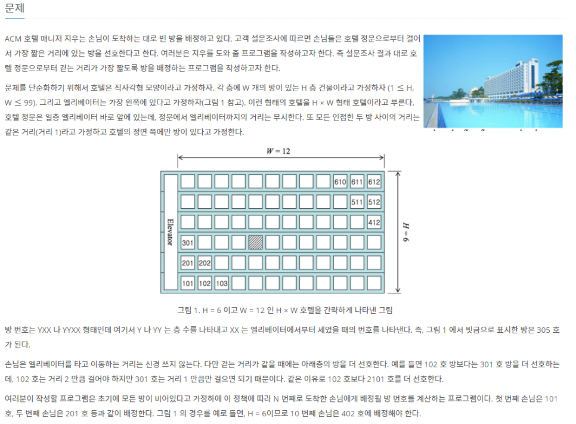
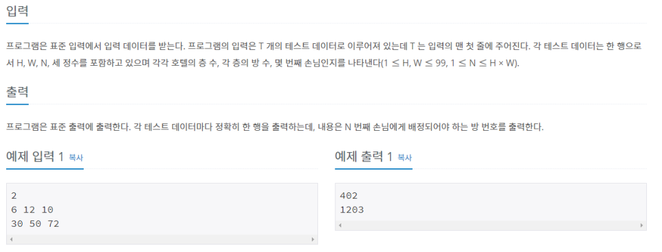

> \#10250 ACM 호텔

백준 알고리즘 [10250#](https://www.acmicpc.net/problem/10250)

문제를 단순화 해서 해석해보자면, 이동거리는  엘리베이터로 이동하는 거리는 따지지 않고 이동하는 거리로 생각하므로

W는 이동거리가 되고 남아있는 방중 이 거리가 가장 짧은 방을 배정해주면 된다. 다만, W가 같을때는 H에 따라 호감도가 달라지는 구조이다.

그러므로 방배정은 H층이라 하면 [1][01]부터 [h][01]까지 방배정하고,

다시 [1][02]부터 [h][02]까지 .... [1][W]부터 [h][w]까지 순서로 방배정을 하게 되어있다.

반복문을 이용해 푼다면 매우 간단할 것 같다.

> \#2775 부녀회장이 될테야

백준 알고리즘 [2775#](https://www.acmicpc.net/problem/2775)

k층의 n호에 몇 명이 살고 있는지 알아내는 함수

k층의 n호에 살기 위해서는 (k-1)층의 1호~n호까지의 사람의 수만큼을 데려와야 한다.

0층 1호부터 i호까지 순서대로 0~i명이 산다.

K0,i = {1,2,3,4, ... ,i}

K1,i = {1,3,6,10, ... ,i(i-1)/2}

K2,i = {1,4,10,20, .... , Sum(1,i)}

K3,i = {1,5,15,35, .... , Sum(2,i)}

※ Sum(n,i)는 n층의 1호부터 i호까지의 사람들의 합

결과는 정상적으로 잘 나오지만 런타임 에러가 나온다.

계산시간이 문제에서 요구하는 것보다 오래걸린다는 점이다.

이를 개선할 방법을 찾는 것이 시급하다.