잠시 쉬어가는 의미로

파이썬에서의 랜덤함수 그리고 엑셀파일 접근하는 방법을 익혀서

이를 활용하여 로또 알고리즘을 만들어보자

계획은 이러하다

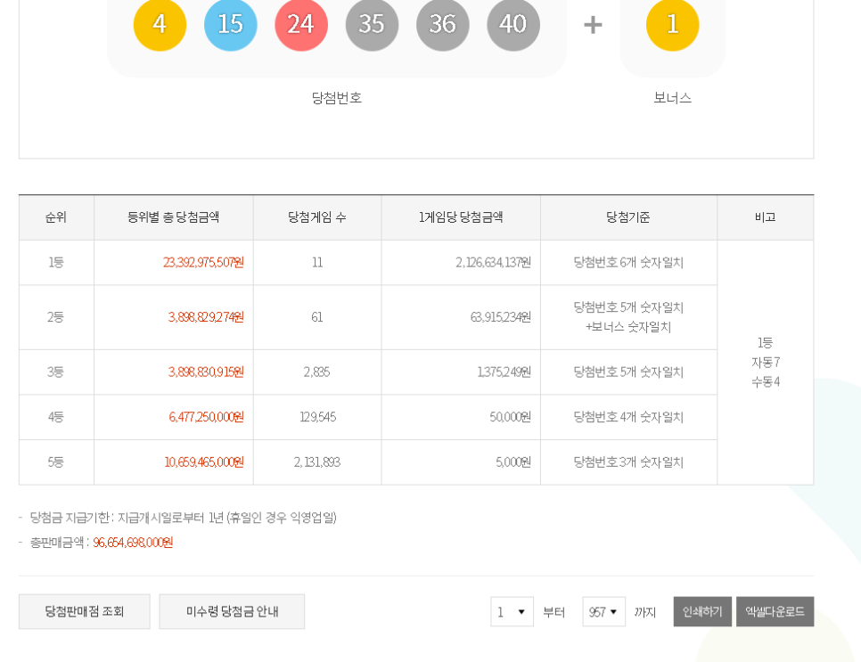

동행로또 홈페이지에서 회차별 정보를 엑셀로 제공해준다.

이를 다운받으면 역대 당첨번호를 쉽게 엑셀로 만들 수 있다.

엑셀로 만든 이유는 이 엑셀에서 파이썬으로 데이터를 가져오기 편하기 때문

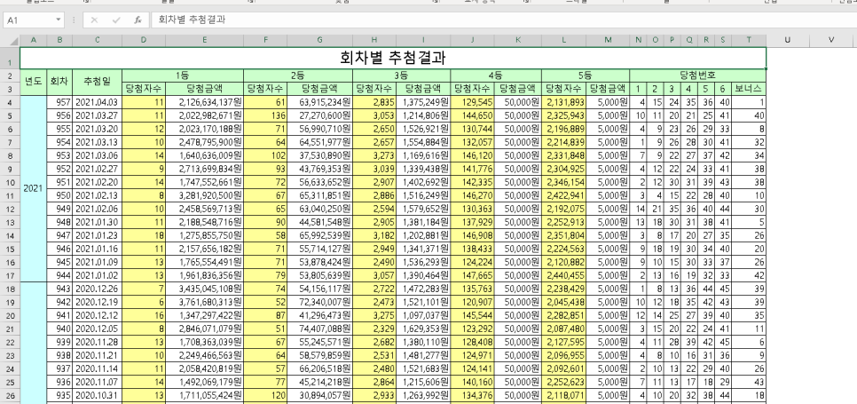

엑셀파일을 열어보면 역대 회차별 당첨금액, 당첨번호가 다 나온다.

여기에서 내가 활용할 데이터는 당첨번호다.

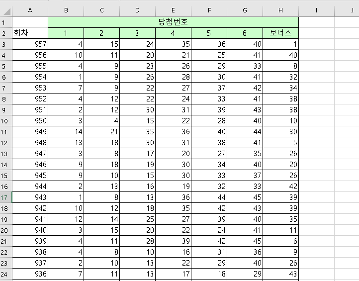

이렇게 당첨번호만 가져오고

이는 각각 배열로서 담기게 될 것이다.

이 데이터들은 각 로또 번호와 대차비교하여

1등은 3000점 2등은 600점 3등은 30점 4등은 10점 5등은 1점

이렇게 점수를 매겨준다.

정확한 계산을 위해서는 각 회차별 당첨금액으로 점수를 매기는 것이 좋았겠지만

사실 로또가 매번 독립시행인데 이런 점수가 무슨 의미가 있을까?

그냥 재미를 위해 이정도 스케일로만 계산해봤다.

이제 로또 번호를 랜덤함수를 이용해서 생성해볼 것이다.

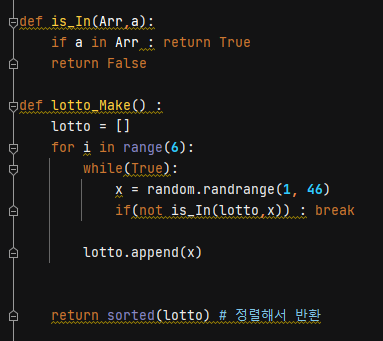

위는 간단히 로또 번호를 랜덤으로 생성하는 코드다.

배열에 6개의 번호를 1~45까지 생성해서 넣어준다.

만약 중복된 번호면 중복되지 않은 숫자를 뽑을때까지 반복해주는 방식

그리고 마지막에 숫자를 이쁘게 정렬해서 반환해준다.

다음으로 몇등 당첨됬는지 확인하는 코드

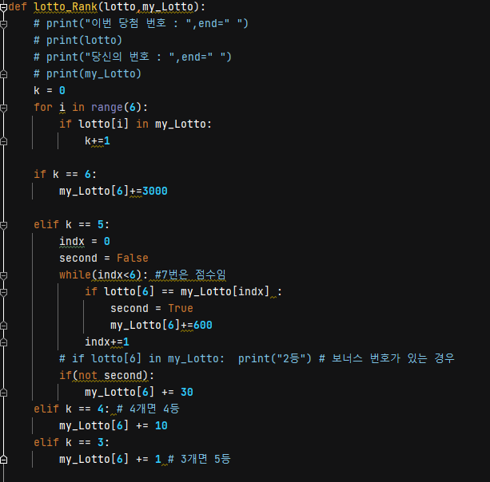

첫번째 인자는 로또 당첨번호고 두번째 인자는 내 로또번호다.

당첨번호는 보너스포함 총 7개의 숫자가 들어있고

내 로또번호도 6개의 로또번호와 점수(당첨금)를 담는 곳을 포함 7개의 숫자가 들어있다.

6개 다 맞으면 1등

5개 맞았을 때, 보너스 번호까지 포함하여 체크해봐서 2등과 3등을 가려주고

4개 4등 3개 5등

이렇게 계산해준다.

이제 로또 회차별 당첨번호를 저장한 엑셀을 불러와준다.

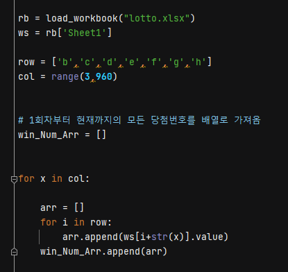

win_Num_Arr라는 곳에 배열로 각 회차별 당첨번호를 넣어준다.

다음으로 10만개의 로또번호를 생성해준다.

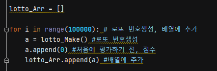

마음같아서는 로또에 나올 수 있는 모든 가짓수인 45C6 의 수열을 생성해서(약 810만)

각 번호마다의 점수를 계산해보고 싶었지만, 내 컴퓨터 메모리의 한계로... 10만개정도만 해봤다.ㅠㅠ

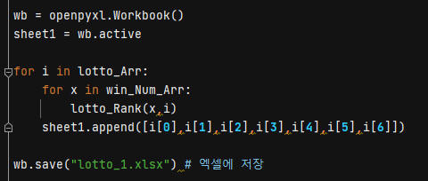

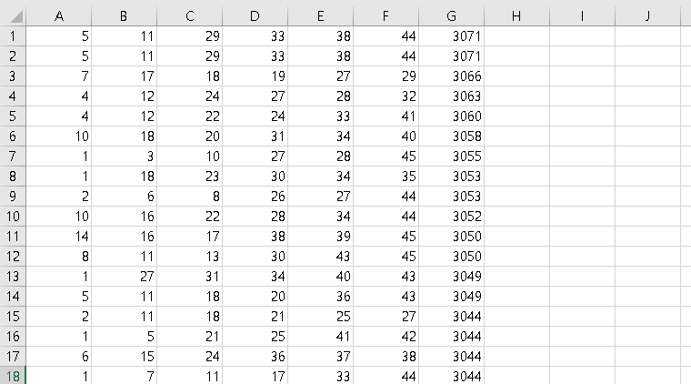

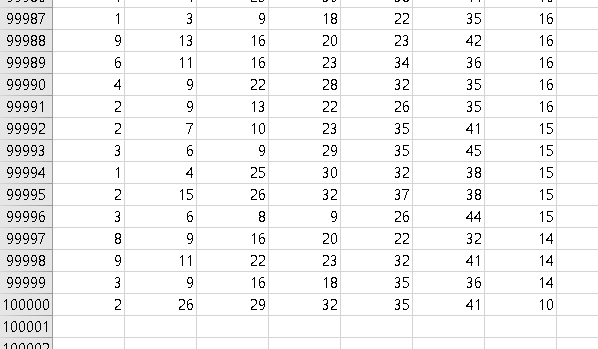

그런데 신기했다.

위 결과로 보았을 때 만약 1회차부터 지금까지(2021년 4월3일 기준 957회)

꾸준히 한 번호로 샀다고 가정했을때의 각 번호들의 기대값들이 천차만별이었다.

물론, 로또가 대략 810만회차까지 진행됬다면 각 번호들의 점수들이 비슷해지겠지..

957회는 약 1/8000 정도의 규모이기 때문에 이러한 결과가 나왔으리라

한 회차별로 1주일 걸리므로 지금까지 약 18년이 걸렸다.

15만년동안 한 번호로 사면 한번은 당첨될 것이다...

상위 점수의 값들은 best-fit으로

만약 로또 당첨번호에 패턴이 있다면 이와 최대한 유사한 값이라 기대할 수 있다.

하위 점수의 값들은 worst-fit으로

지금까지 당첨됬던 번호들은 다음 회차에서 나오지 않을거라 생각한다면

다음 회차의 당첨번호는 worst-fit의 번호로 기대할 수 있다.

물론 모든 회차가 독립시행이지만, 대수의 법칙으로 회차가 무수히 많아지면 평균에 수렴하게 되어있으므로  

다음 회차의 주인공은 바로 worst-fit이리라 간절히 외쳐본다.

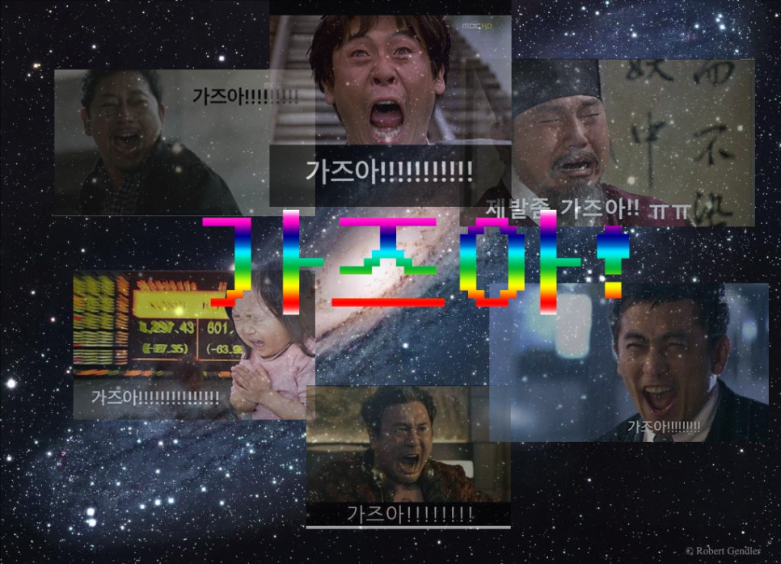

로또 당첨될 확률이 엄청 낮다고만 들었지만 실제 데이터를 통해 마주하니 더 실감이 났고

실질적으로 매번 도전했을 때 한번은 1등이 당첨된다고 가정하고 이를 시간으로 환산해보니

15만년이 걸리므로 이따위 종이쪼가리에 걸기에는 어쩌면 미련한 일이구나 라는 생각이 들기도 했다.