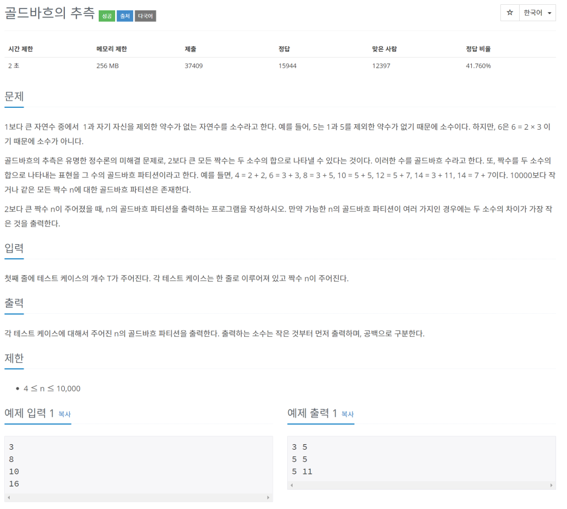
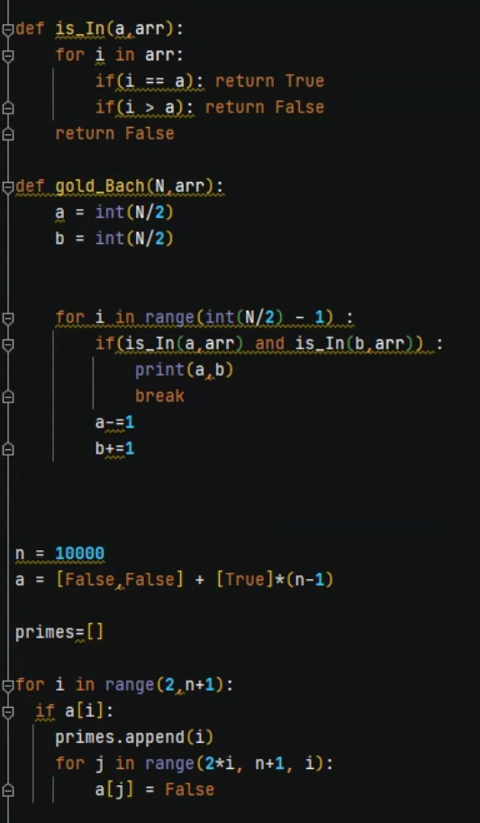
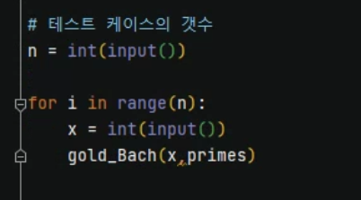
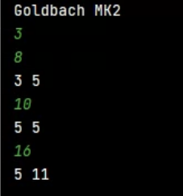
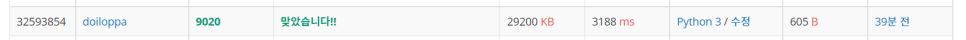

> 
> \#9020 골드바흐의 추측

백준 알고리즘 [9020#](https://www.acmicpc.net/problem/9020)

구조를 다음과 같이 하여 문제를 해결할 예정

\1) 골드바흐 파티션을 구할 수 n 

  n은 두 수의 합으로 나타낼 수 있으므로 n = p + q로 표현

 4부터 10000사이의 짝수만 골드바흐 파티션을 구할 예정이므로 2로 나누어 생각할 수 있다.

  n = p+q에서 

 p = n/2 , q = n/2로 시작한다. (n = (n/2) + (n/2) 이므로 )

 그리고 p는 1씩 감소, q는 1씩 증가하는 방식으로 n을 표현할 수 있다.

 p가 1이면 소수가 아니므로 이를 제외하면 이 때 나올 수 있는 합의 조합은 (n/2 - 1) 가지

 이 중 소수의 합으로 이루어진 경우에만 골드바흐 파티션 이므로

 각각의 p와 q가 소수인지 확인을한다.

 모든 골드바흐 파티션을 구하는 것이 아니라 두 수의 차가 최소인 값을 출력해주는 것이 문제의 요구사항

16을 예로 들어보면,

| p    | q    | 두 수의 차 | 골드바흐 파티션 |
| ---- | ---- | ---------- | --------------- |
| 8    | 8    | 0          | x               |
| 7    | 9    | 2          | x               |
| 6    | 10   | 4          | x               |
| 5    | 11   | 6          | o               |
| 4    | 12   | 8          | x               |
| 3    | 13   | 10         | o               |
| 2    | 14   | 12         | x               |

위의 표에서 알 수 있다시피, [5,11]과 [3,13]의 조합이 골드바흐 파티션이다.

p와 q가 모두 소수인 경우만 골드바흐 파티션으로 본다.

아래로 내려갈 수록 두 수의 차가 커지므로

처음으로 골드바흐 파티션을 만났을 때 그 때의 p와 q를 출력해주면 문제에서 요구하는 값이라 할 수 있다.

\2) 소수 배열을 구함 (해당수가 소수인지 알기위함)

 2-1) 속도를 빠르게 하기 위해 소수배열은 에라토스테네스의 체를 활용하여 구함 

p와 q가 소수인지 확인하기 위해서

 우선 소수배열을 만들어 주고, p와 q가 해당 배열에 들어있는지 각각 따져보면 된다.

 is_In이라는 메소드를 선언하여 에라토스테네스의 체를 이용하여 구한 소수배열에 해당 값이 존재하는지 본다.

 모든 값은 오름차 순으로 정렬되어져 있으므로 처음부터 끝까지 모든 값을 확인할 필요는 없다.

 배열에 들어있는 값이 확인하는 값보다 커지면 뒤에 값은 확인해보지 않아도 된다.

