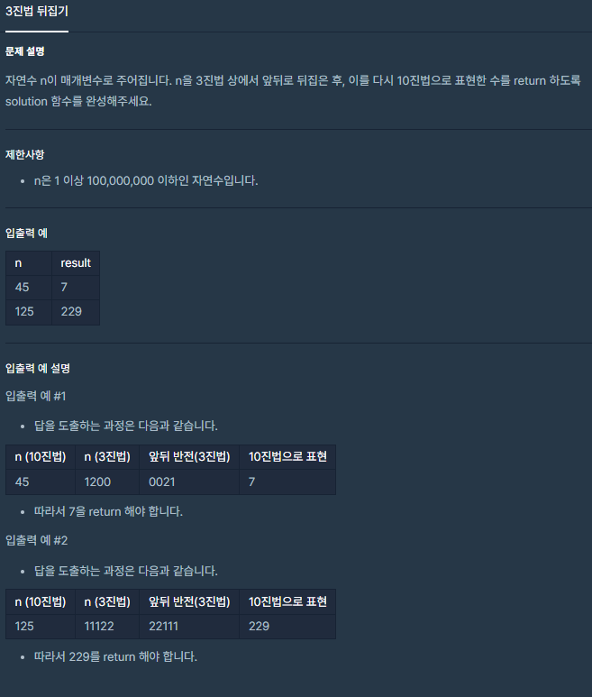

```java
class Solution {
    public int solution(int n) {
        String answer = "";

        while(n > 0){
            answer += (n % 3);
            n /= 3;
        }
        
        // 3진법(String) -> 10진법(int) 바로 변환
        return Integer.parseInt(answer,3); 
}
```

존재하는 함수들을 사용한다면 위처럼 간단하게 코딩할 수도 있다.

하지만, 간단한 문제이므로 직접 함수들을 구성하면
논리력을 강화시킬 수 있는 좋은 공부가 될 것이다.


간단하게 수행해야 할 단계들을 구상하고,

각 단계들을 디테일하게 구현하는 탑다운 방식으로 짜볼 것이다.


```java
class Solution {
    public int solution(int n) {
        int answer = 0;
        
        // 1. n을 3진법으로 표기 후 뒤집는다.
        String reverse = getTernaryReverse(n);
        // 2. 새로운 3진법 수를 10진법으로 다시 변환
        answer = getTenary2Dec(reverse);

        return answer;
    }
    
    private static String getTernaryReverse(int n){

        String result = "";

        int next = n;
        for(;n > 0;){
            result += n % 3;
            n /= 3;
        }
        return result;

    }
    private static int getTenary2Dec(String tenary) {
        int decimal = 0;

        for(int i=0;i<tenary.length();i++){
            //제곱수 구하는 함수는 Math.pow()를 이용하면 간단.
          //int digit_Number = (int) Math.pow(3,tenary.length()-1-i);            
            int digit_Number = pow(3 , tenary.length()-1-i);
            
            
            // charAt을 하면 해당 숫자를 ASCII코드로 보기 때문에
            // "0"은 48이다.
            // 따라서, 48을 빼주면 실제 int값과 일치해진다.
            
            int x = reverse.charAt(i) - 48 ;
            decimal += (x * digit_Number);
        }

        return decimal;
    }
    
    private static int pow(int a, int b){
        int result = 1;
        for(int i=0;i<b;i++) result *= a;
        return result;
    }
    
}
```

