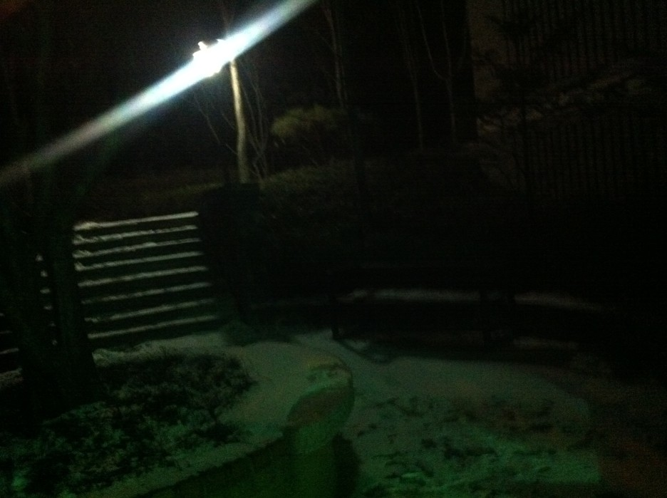

 

눈이 왔다.

 

눈이 오면 나는 그렇게 기분좋고 신났는대

 

오늘은 기분이 업! 되지 않았다.

 

왜냐하면 요즘 자꾸 보고싶지 않은 것만 보였기 때문이다.

 

안보고 싶다고 안보이는 것은 아닌가보다

 

자꾸 맘에 걸린다.

 

아니길 아니길 바랄수록

 

더 가까워지는 것 같다.

 

마음을 잘 다스려야겠다.

 

 

 

착잡하고 답답하고

 

이 내 마음이 무슨 마음인지 모르겠다.

 

또 앞으로 어찌해야할지 모르겠다.

 

알면서도 그렇게 행동하기 힘든 것인지

 

내가 다르게 생각하는 것인지..

 

설명할수 없는 응어리들을 계속 품고사는 것 같다.

 

 

 

아직도 나는 사춘기일까?

 

아직 덜 자란 나의 생각들이

 

나를 불안하고 초조하게 만드는 것 같다.

 

인생에 중요한 것들이 더 많은데

 

나의 마음이 계속 이 감정들을

 

붙잡고 있는 것 같다.

 

 

 

이런 속마음 엄마한태는 당장 말했을텐데...

 

이런 날일 수록 너무 보고싶다

 

혼자있는날 더 사무치고 그리워진다.

 

가슴에 못만 박은 못난 나를

 

평생 사랑으로 나를 키워주신

 

그 엄마의 품이 그립다.

 

엄마 품에 안겨서 펑펑 울고싶다.

 

내가 인생을 앞으로 얼마나 더 살지 장담할 수 없지만

 

그만한 포근한 사랑을 다시 느낄 수 없을거 같다.

 

이 못난놈...

 

시간이 지나갈수록 

 

그리움들, 후회들이 잊혀지기보다는

 

더욱 가슴에 선명해진다.

 

 

 

엄마의 그 사랑이

 

때로는 너무 죄책감에 아프다가도

 

너무나도 갈급해져서

 

자꾸 부르짖게 된다.