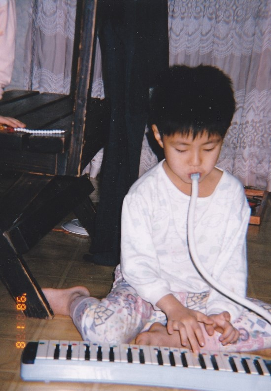

우리 엄마

 

나의 머리숱이 많은 비결,

그것은 바로바로

어릴 때 동자승처럼 머리를 빡빡 밀었던 것이었다.

다리털이나 수염 한번 밀고 나면

더 거칠어지고 많이 자라지 않나?

그 원리와 비슷할 것이다.

 

아마...

이때부터 였을 것이다.

독서에 대한 열정

 

음악에 대한 열정,

그것도 이때부터였다

 

 

 

이후 난 초등학생이 되었다.

당시 헤어 트렌드였던 스포츠머리를 소화하는

초등학생이 되었다.