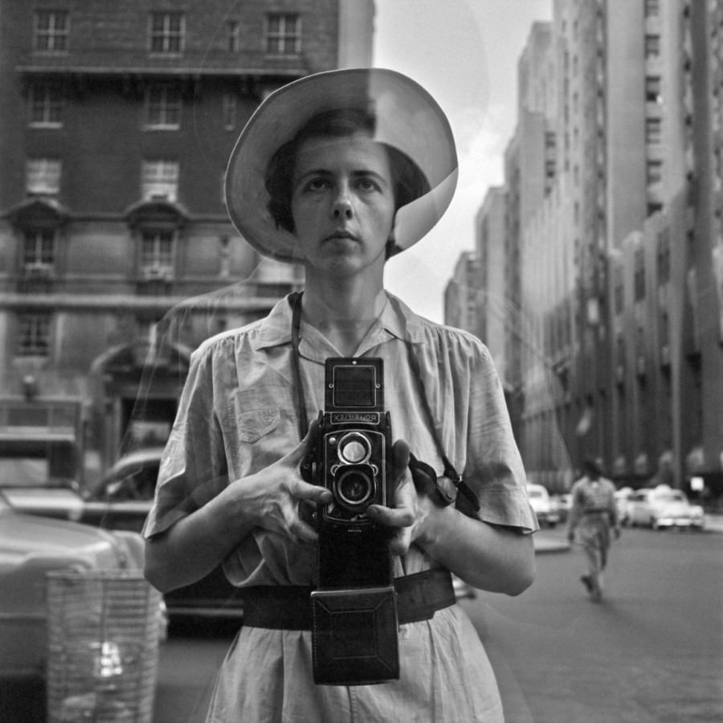

많은 이들이 여행을 다녀오면 항상 사진을 남긴다
각자의 추억, 사진은 추억을 담기에
그것이 소중하기 때문이겠지
나도 그렇다.
그래서 항상 사진을 남긴다.

하지만 불행히도 나는
여행을 남기기 위해 사진을 찍는 게 아니라
사진을 찍기 위해 여행을 가나 보다.
모든 순간순간, 그 순간을 누리기 보다
그저 추억이라는 이름의 그 시간의 파편들을
주린듯 증거로 남기려 한다.

나를 기억하기 위해 기록하는 삶,
남은 것은 그저 사진 한 장
혹은 몇 자의 문자
누가 보지도 않을 일기장 따위에

나는 시간을 던진다

시간속에서 하루하루 나를 잃는데도 말이다.

하지만 역시 멈출 수는 없다.

내 사진은 밥 먹여주는 것도 아니라는데
흔적들을 남겨야만 한다.

그것으로 나를 채울 수 있을 것만 같기에..
그래서 그런 점에서 나는 불쌍하다

 