이사 가기 전에 살던 집 바로 앞에 있던 한옥마을,

 

마음먹고 돌아다니는 것과 

집 앞이라 그냥 지나가는 것과는

사뭇 느낌이 달랐다.

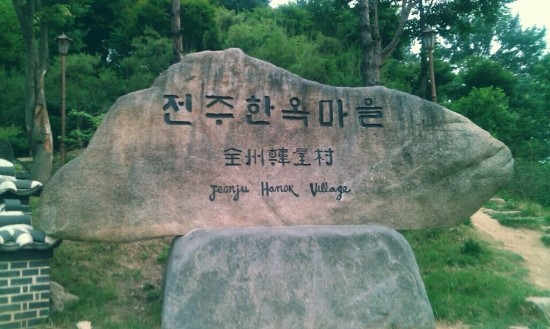

여기가 한옥마을 입구다. 

 

 

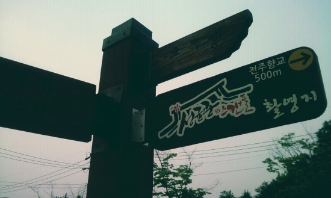

 

향교에서 성균관 스캔들을 찍었다고 한다.

사실 나는 안 봐서 향교가 드라마에 나왔는지는 모르겠다.

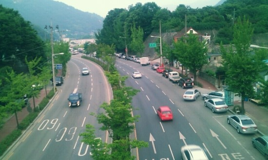

오목대 육교 다리를 지나면서 사진을 찍었나 보다

왜 찍은 지는 모르겠다.

 

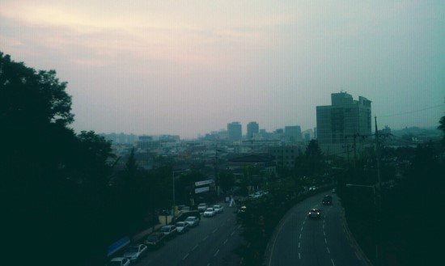

이것도 왜 찍은 지 모르겠다. 

저 멀리 리베라 호텔이 보이는데,

그 근처에 아이넷 피시방이라고 지금은 망한 피시방이 있었다.

그곳에서 내가 초등학교 5학년인가 6학년 때

한창 아시아의 베컴으로 주가를 올리고 있던

이천수 씨를 만났었다.

(여담이지만, 당시 이천수 씨는 세이클럽을 하고 계셨다.)

지금은 어디 계시는지 모르겠지만,

이천수 씨 행복하세요.

 

 

 

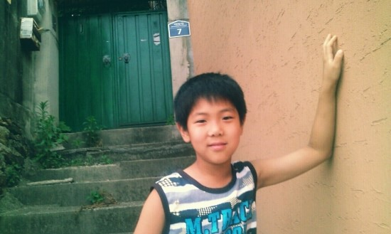

사연 있어 보이는 인물 사진이 멋지다고 생각한다.

그래서 뭔가 이야기가 있는 화보처럼 찍으려고 시도해 봤지만

작가며, 모델이며 완벽하지 못해

사진이 망했다.

개인적으로 내가 모델에게 요구한 것은 참 많았지만

그걸 표현하는 데에 있어서 다 소화하지 못해서 아쉬웠다.

하지만 어쩔 수 없다.

왜냐하면 민재는 전문 모델이 아니고

또 나는 아무리 모델이 개떡같아도 

무지개떡처럼 찍어주는 프로사진작가가 아니기 때문이다.

(민재가 개떡같다고 표현된 것 같지만 그런 뜻은 아니다.)

 

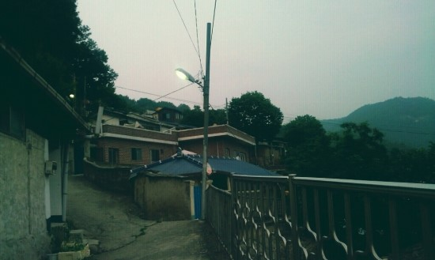

골목골목 길들이 운치가 있다.

초저녁의 뭔가 아쉬운 답답함이

서민들의 한을 표현해낸 것 같다.

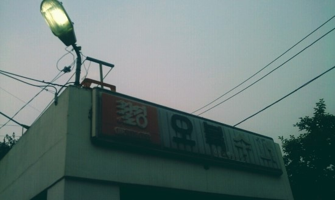

내가 옛날을 살아보지 않았지만

옛 수퍼의 감성이 있어서 찍어보았다.

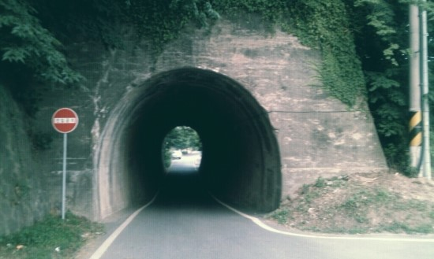

굴다리~ 

운치가 제법 좋다.

중학교 수학시간에 선생님 몰래 본

소년탐정 김전일에서 비슷한 장면이 나온 것 같은데

거기서는 이러한 굴다리를 지나가면 

신세계가 나오던 장면이었다.

그래서 이곳을 지나가면 

뭔가 특별한 일이 일어날 것 같아서 바로 들어가 보았다.

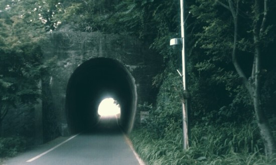

굴다리를 지나서

 

 

 

 

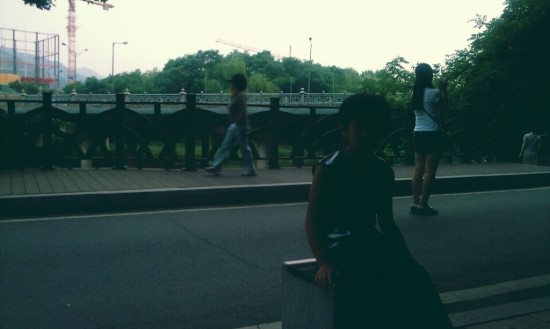 

굴다리를 지나오니

몇몇 관광객들이 사진을 찍고 있었고

동네 아주머니께서 산보를 즐기시고 계셨다.

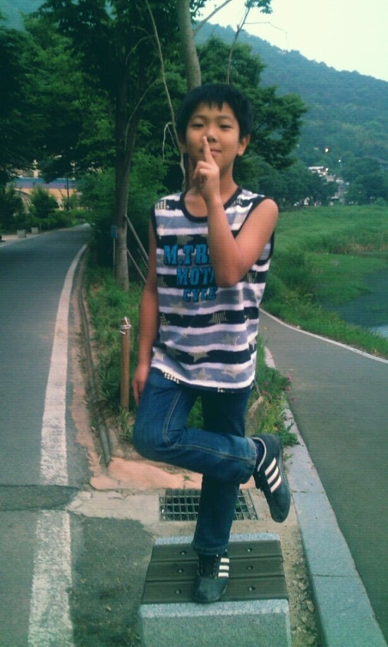 

이번에는 자연스러운 생동감을 담아보고 싶어서

내가 생각하는 요구 사항들을 주문했다.

나루토 자세를 취하라고 한 이유는

동네 놀이터에서 자신이 만화 속 주인공이 되어 

뛰어노는 아이들을 생각하며

그러한 아이들의 순수한 즐거움에 대해 표현하고자 해서이다.

민재의 표정이 살짝 웃고 있는 것 같은데

사실은 민재도 아주 어린아이가 아니었기에

이런 사진 찍는다는 것이 민망해서

표정이 좋지 않았기에 내가 웃으라고 주문한 것이다.

 

 

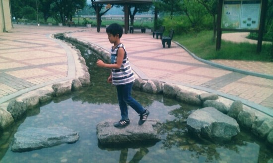

비틀즈의 "Abbey Road" 앨범 커버를 오마쥬 하여

징검다리를 건너는 소년을 표현하려 했는데

자연스러운 연출이라기보다는

너무 작위적인 티가 팍팍 난다.

실제로 지나갈 때 찍었어야 했는데

지나가는 '척' 하는 것을 찍었더니

전혀 자연스러운 생동감을 느낄 수 없다.

 

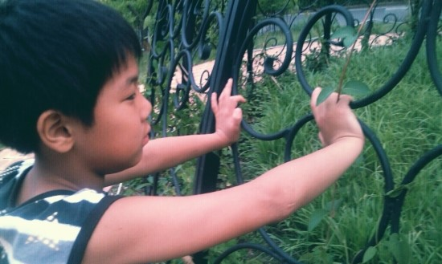

벌써 몇 개월 전 사진이라

이것이 무엇이었는지 기억이 잘 안 난다.

그때 나름 멋있다고 생각하고 찍었나 보다.

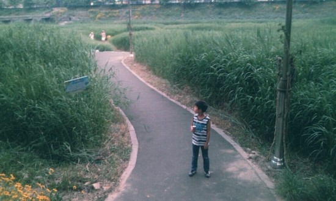

사진에 어떤 의미를 부여하지 않고,

길 위에 서게 한 다음 찍었다..

내 생각으론 이 날 찍은 베스트 포토라고 생각된다.

굳이 제목을 달자면

< 나는 왜 이 길에 서있나, 이게 정말 나의 길인가? >

god의 노래 길 가사가 떠올라서 제목으로 해보았다 ㅎㅎ

 

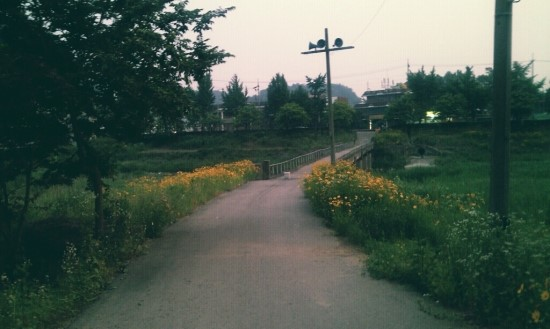 

굴다리를 지나온 곳에서 교대 쪽으로 갈 수 있게 해주는 다리다

 

 

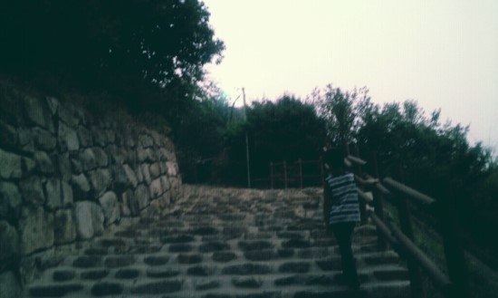

이것도 아무 생각 없이

그저 화보처럼 멋있게 찍으려고 했지만

내가 사진 구도도 잘못 잡았고

어두워서 무슨 사진인 지도 모르게 되었다.

지우려다가 추억이라 그냥 올렸다.ㅎㅎㅎ

 

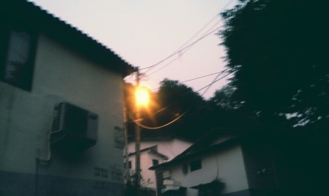

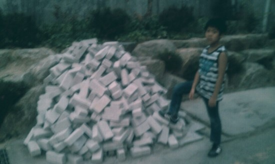

근처에 돌무더기가 있길래

인터넷 쇼핑몰 모델들이

주변 사물들을 활용하여

멋지게 찍은 것을 보고

이런 포즈도 요구해보았다

 

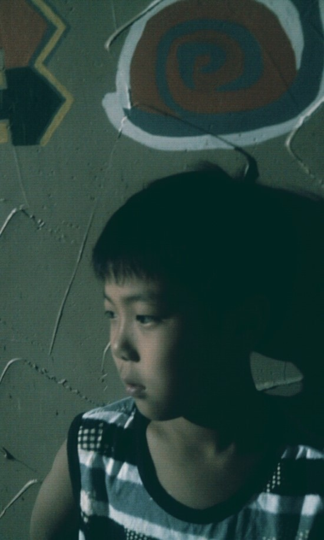

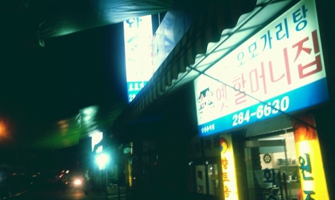

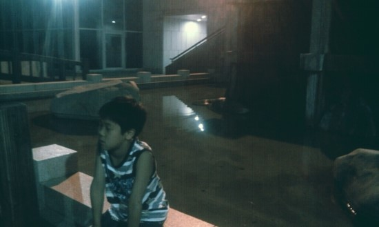

민재는 돌아다니는 것을 별로 좋아하지 않았다.

내가 형이라 시켜서 따라다녔지

정말 지루해했다.

미안하니깐 다음에 만나면 빠삐코 하나 사줘야겠다.

 

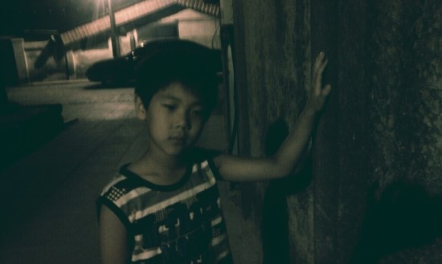

이 차는 여행을 떠나고 싶게 만드는

묘한 매력을 가지고 있었다.

 

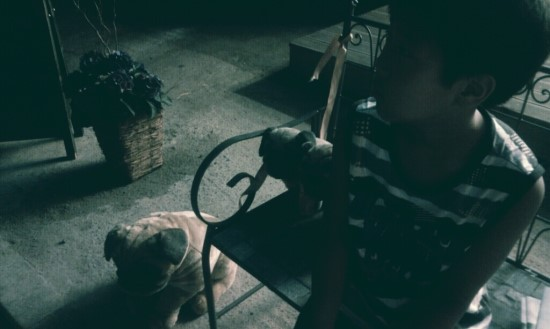

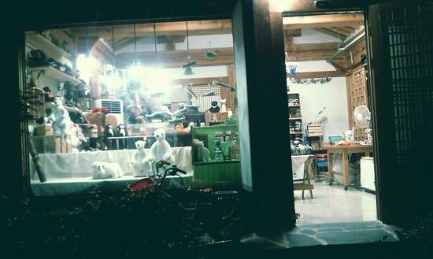

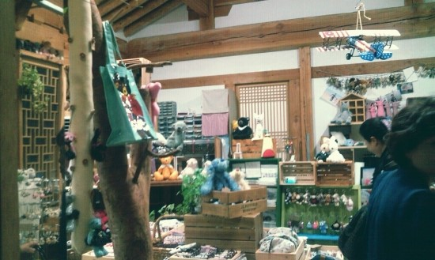

한옥마을에서 지나가다가 찍은 사진