 

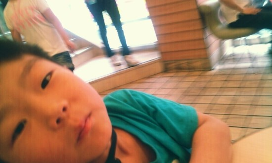

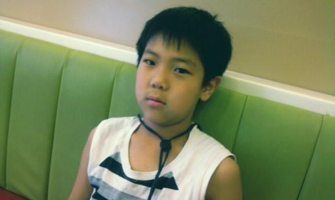

놀러 가기 전 롯데리아에서

(사실 말이 나들이지 하루 종일 걸었다. 그래서 애들 배고플까 봐 롯데리아에서 세트메뉴 사줬다.)

 

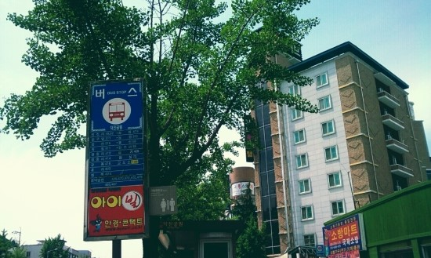

몇번 버스 탔는지 기억은 안 나지만 덕진공원 정류장에서 내렸다.

푸른 나무를 보면 지금같이 추운 겨울(이 글을 쓴 지금은 2012년 2월 겨울이다.)에는

매미소리 울리는 여름이 그립다.

그런데 난 항상

여름엔 겨울을 그리워하고

겨울엔 여름을 그리워한다. 

뭐, 난 항상 그런 식이다.

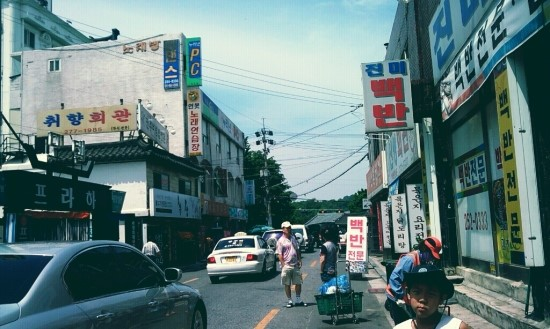

무슨 사진일까 한참 생각했는데

앞에 민재가 있는 것을 보니 나름 화보 촬영이었나 보다.

나는 이때 무슨 생각으로 살았을까?

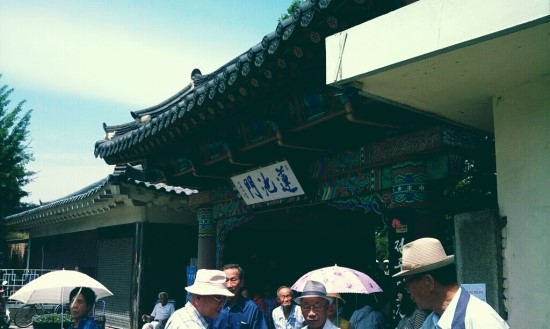

덕진공원 입구를 지나서

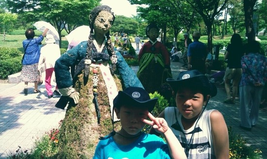

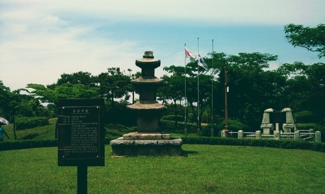

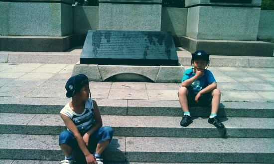

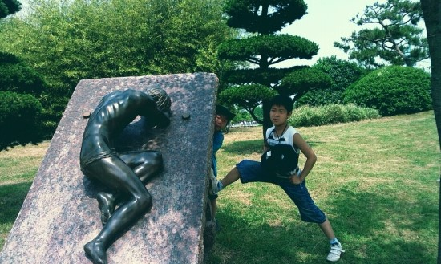

 

다리를 내가 왜 저렇게 올리라고 했을까?

난 맨날 이상한 포즈만 요청한다.

덕진공원은 그렇게 넓지 않아서

돌아다니기에 힘들지 않고 충분하다.

그냥 걷기엔 심심할 테지만

구경할 예술작품, 조형물들도 많다.

역시 문화의 도시 전주!

 

 

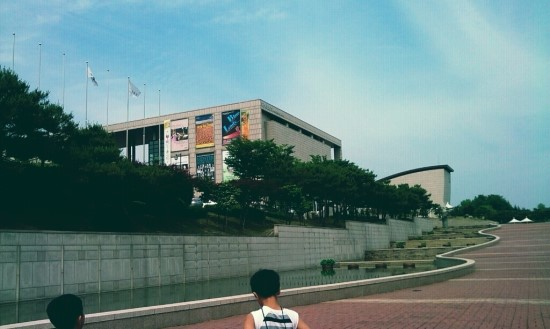 

다음으로 이곳은 소리문화의 전당이다.

덕진공원에서 동물원 가는 길에 위치해 있다.

동물원 가기 전에 한번 들려서 구경하고 싶었다.

혼자 가기는 부끄러워서 사촌동생들이랑 노는 김에 데리고 왔다.

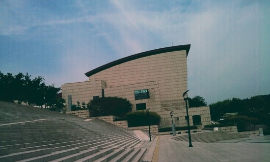

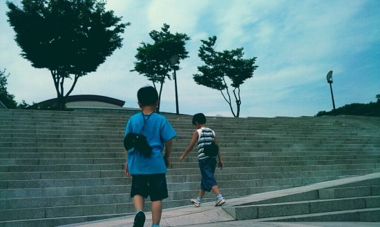

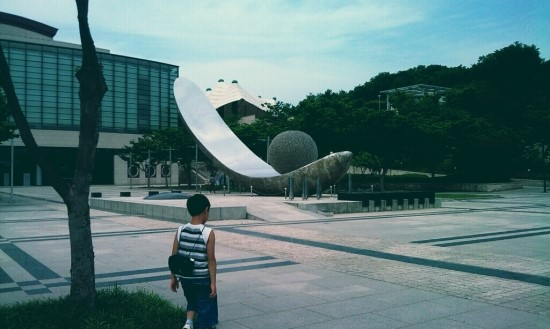

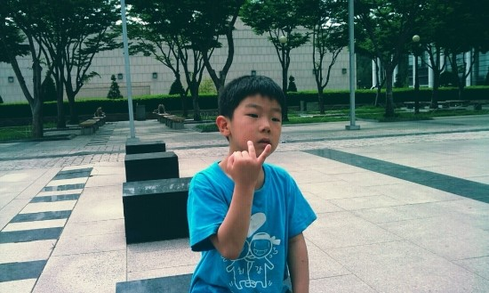

뭔가 내기를 했던 거라고 기억이 나는데

무슨 내기였는지는 기억이 안 난다.

 

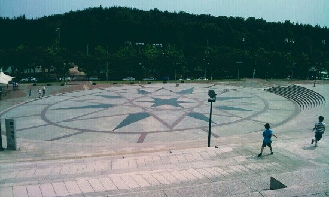

전주에도 이러한 광장이 있다는 사실에 기분이 좋았다.

이탈리아의 깜빠똘리오 광장에서

자유롭게 뛰어노는 아이들을 표현하고 싶었지만

아쉽게도 그런 느낌은 전혀 안 났다.

역시 형이 체력은 더 좋은 것일까,

민재랑 경재가 술래잡기를 하는데

경재는 지친 듯한 자세이다.

물론 이것도 즐겁고 활기찬 컨셉이지만 

하나도 즐거운 것은 없었다.

다 내가 시킨 것이기 때문이다

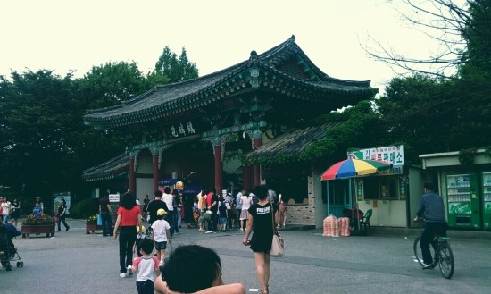

동물원 입구

걸어서 도착했다.

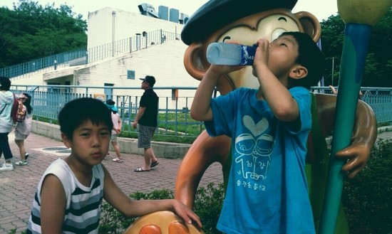

비싼 돈 천 원 주고 얼음 물을 샀다.

날이 더워서 금방 녹았었다.

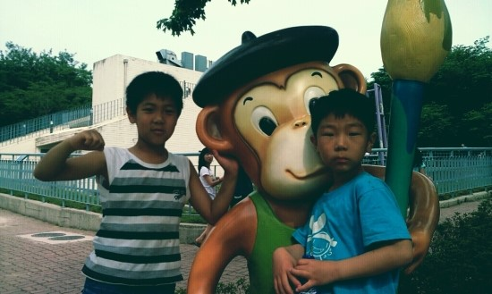

이자르폰 500만 화소였는데 찍고 보면 참 화질이 안 좋다.

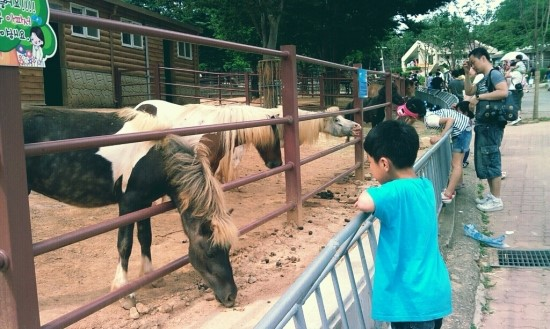

조랑말들과 교감을 하는 경재

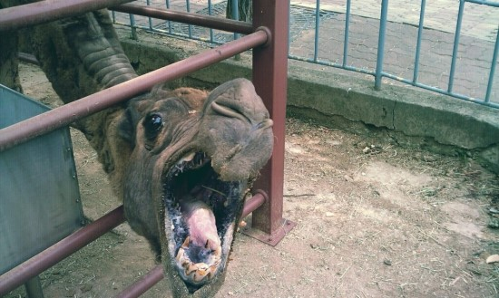

ㅋ

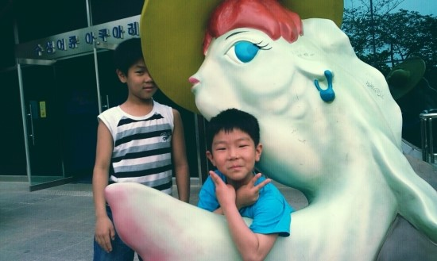

이 사진은 잘 찍었다.

뿌듯하다.

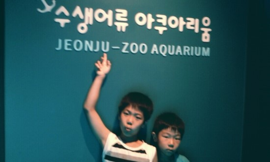

"나 지금 수생어류 아쿠아리움에 있다!"

라고 자신감 있게 말하는 것처럼 표현하고 싶었는데

찍기 싫은 표정이 팍팍 풍긴다.

드라마에서 아역배우들의 풍성한 표현들을 보면

아무나 다 배우하는 것은 아니라는 것을 알 수 있다.

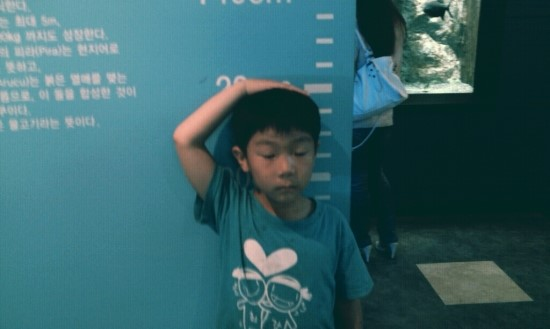

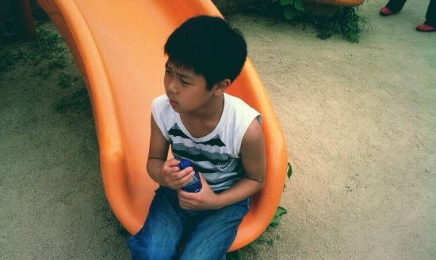

컨셉 사진보다는 그냥 막 찍은 사진이 더 괜찮은 것 같다.

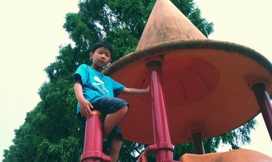

**1. 다음 사진에서 화자가 말하고자 하는 바는? [2점]**

① 동물원 안에 놀이터도 있네, 역시 전주 최고다.

② 내가 세상을 정복하겠다.

③ 매우 덥다. 더운 날에는 역시 높은 곳이지!

④ ****1.5층 높이의 미끄럼틀이지만, 떨어지면 어떻게 다칠지 모르기 때문인지 개구장이 아이들에게는 공포심이 없다. 그래서 어른들이 무서워한다.

⑤ 내가 왜 애들 사진이나 찍고 있을까? 이게 뭐 하는 짓인가?

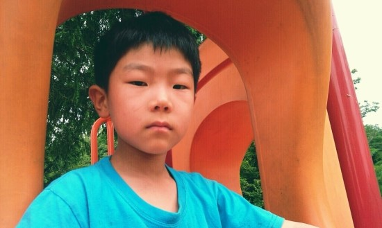

앞에서 사진 찍으려고 하면 부끄러워서

표정이 굳는다.

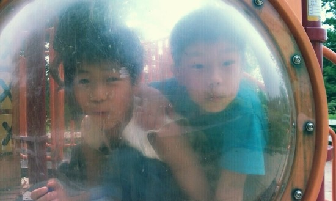

오, 이사진은 괜찮다

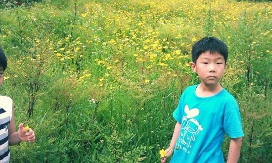

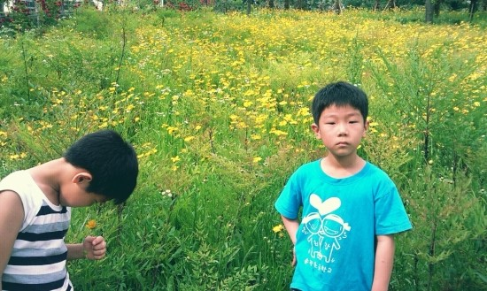

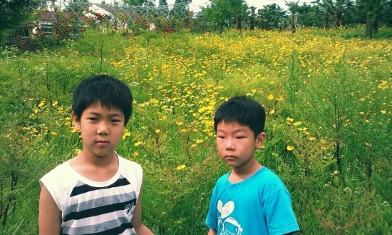

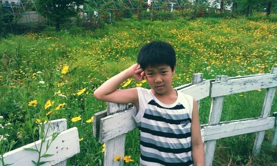

제주도에 온 느낌

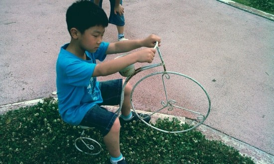

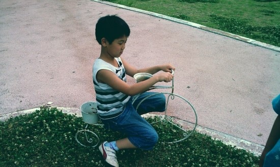

이거 만지면 안 되는 화분인데

장난꾸러기 아이들은

그런 거 신경 안 쓴다는 컨셉으로

내가 시켰다.

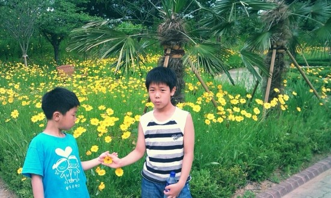

야자수 나무 덕분에

진짜 제주도에 온 것 같은 느낌을

살짝 풍겼다.

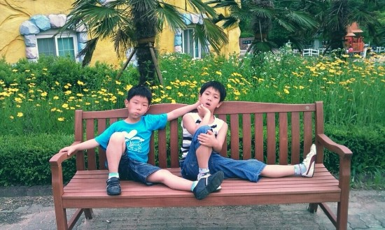

나는 거만하고 당당한 것을 참 좋아한다.

그래서 이 사진도 그렇게 시킨 것이다.

잘 소화한듯싶어 뿌듯하다.

거만함에는 어떠한 부끄러움도 없어야 하기 때문이다.

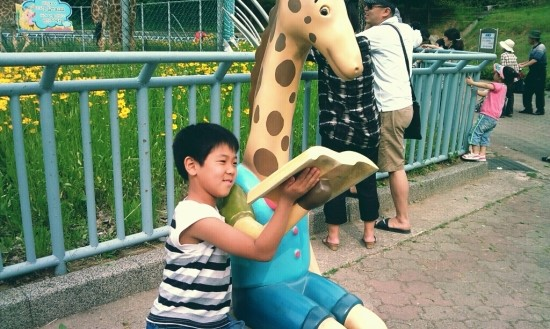

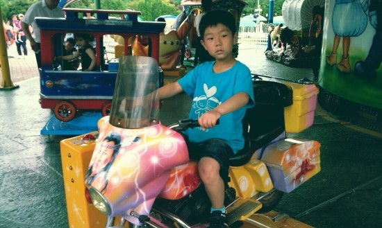

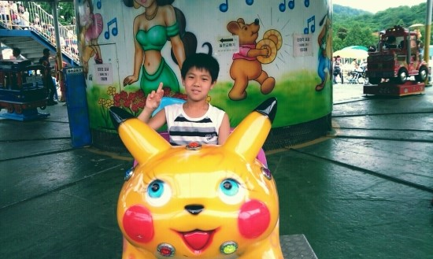

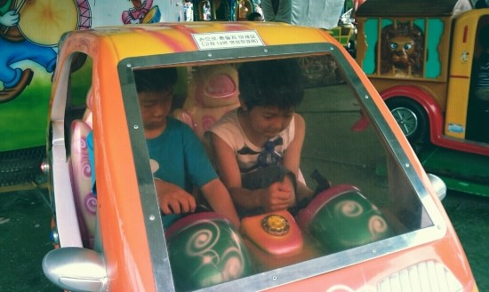

참 나는 글재주가 없나 보다

쓸 말이 참 없다.

여자들 싸이나 블로그 가면

사진 하나 마다

별말들을 다 달던데

글쓰기가 참 고역이다.

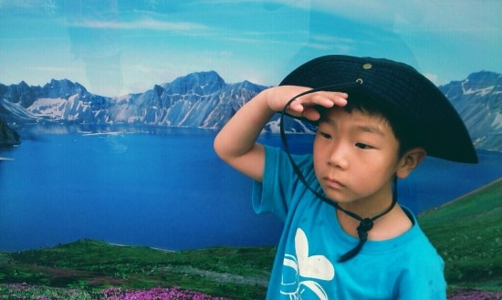

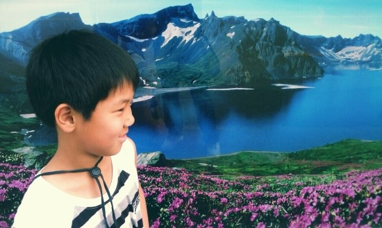

길가에 있는 사진관에 걸려있는 사진 앞에서 찍은 사진이다.

오브제 활용 센스가 나는 남달랐다.

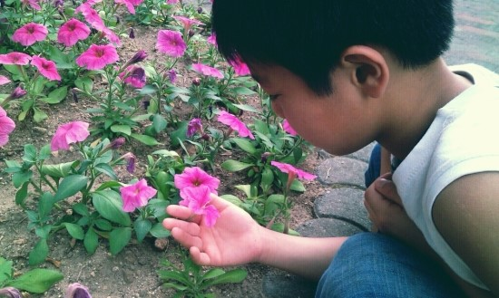

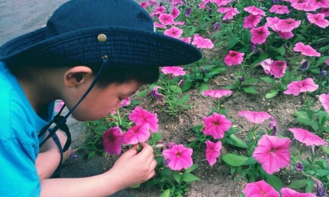

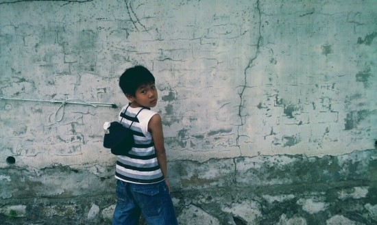

이 사진은 노상방뇨하는 것 같은데

절대로 노상방뇨하는 것이 아니다.

관찰력 있는 사람들은 이미 눈치챘겠지만

노상방뇨했다면 벽에 물줄기가 있어야 하는데

없는 것을 확인할 수 있다.

내 머릿속에 그때 뭐가 들어있었는지

인터넷 쇼핑몰 화보에서 벽에서 멋있게 뒤돌아보는 사진을 생각하고

이런 포즈를 주문했는데

실패해서 이러한 사진이 나왔다.

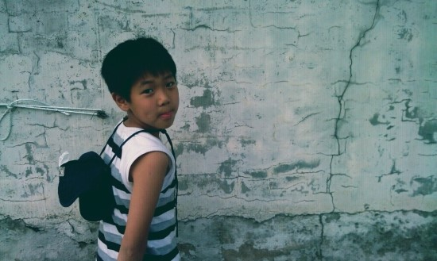

처음에 이런 느낌을 바랐던 거였다.

그러니 오해 NO, NO

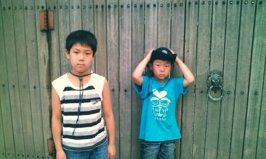

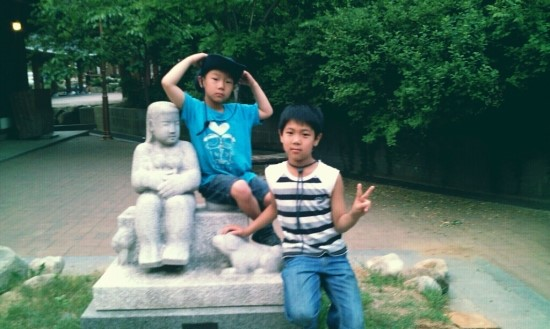

이곳은 한옥마을 오목대 내려와서

공중화장실 뒤에 있는 조각상이다.

이 사진을 마지막으로 그만.... 집에 들어갔다. 