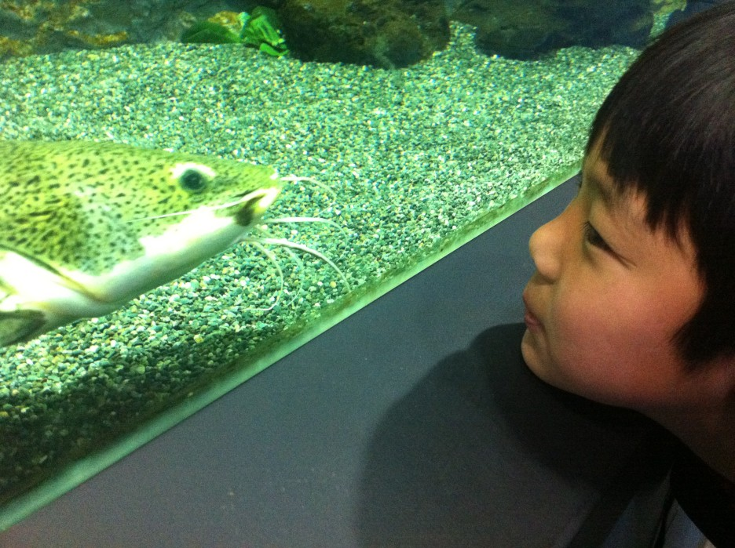

 사촌동생 민재가 봄방학을 해서

우리 집에 놀러 왔다

우리 집엔 할게 별로 없어서

동물원으로 갔다

 

 

제주 조랑말

 

 

 

수컷 공작새가 암컷 공작새를 유혹하고 있다.

아주 커다란 꼬리를 펴서 유혹하지만

암컷은 쳐다도 안 보고 있었다.

끊임없는 구애를 했지만

결국 외면당했다.

불쌍한 수컷 공작새

 

 

매기 같은 물고기와 교감 중

 

우파루파

사촌동생이 희귀종이라고 해서 찍었다.

메마른 가지들과 더러운 나무 울타리의 조화

그리고 파란 하늘로 인해 쓸쓸할 것 같지만,

한편으로는 그 고독을 즐기는 것만 같다.

사진에는 못 담았지만

기린이 들고 있는 책에는 낙서가 되어있었다.

책이란 무엇인가?

작가가 하고 싶은 말들을 적어놓은 것이다.

조형물에 낙서를 통해

각자들의 생각을 투영함으로 인해

웃기지만, '책'의 순기능을 했다고 볼 수도 있다.

(조형물에 낙서하지 마세요 제발...^^;;; )

 

사진을 보면 알겠지만

날이 추워서 그런지 볼 것이 별로 없었다.

모처럼 왔는데, 정말 할 것도 없고 심심해서

한 삼십 분 만에 모든 동물을 관람하고 나왔다.

 

 

 

허무하게 나왔는데

그냥가기 섭섭해서 솜사탕하나를 사줬다.

비싼돈 이천원 주고 사먹었다.