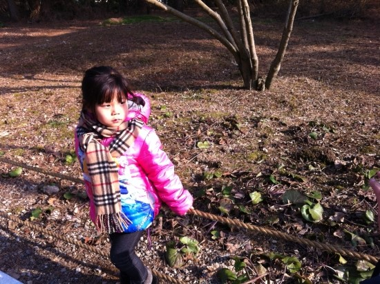
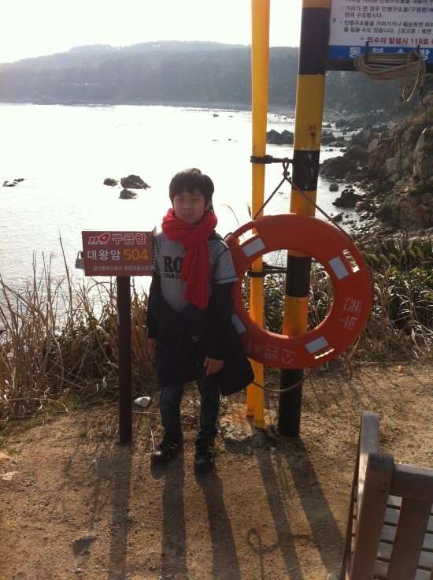
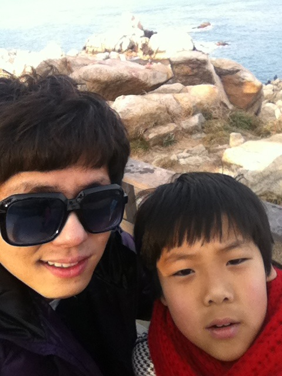
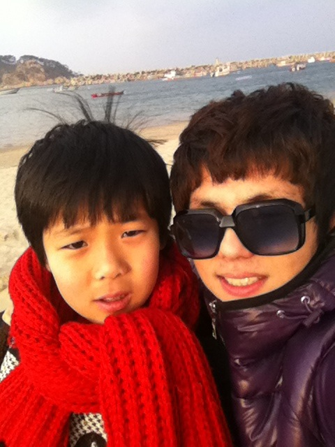
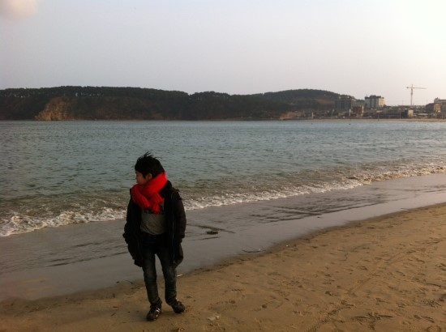

 
전주에서 울산까지

약 4시간 30분 정도 걸려서 갔다.

울산으로 이크죠!

가는 길에 심심해서 닮은꼴 인식을 해봤다.

나는 유노윤호 98퍼 나왔었는데, 내 사진은 차마 못 올리겠다.

그래도 미남자가 된 것 같아 기분이 좋았다.

 

울산 도착했을 때,

기름이 거의 떨어져서 주유소에 들렸다.

1L에 2000원이 넘는 고유가 시대에

1L에 1954원이었다.

고맙다 울산아.

세차하는 동안

기름을 넣고 울산 현대호텔에 도착했다.

이곳에 짐을 풀고 대왕암에 갔다.

대왕암은 신라시대 문무왕의 수중릉이라고 안내판에 쓰여있다.

찍고 나서 보니 가운데에 여자들이 있어서

사진 구도상 여자들을 중심으로 찍은 것 같아서

여성편력 자라는 오해가 생길 것 같지만

사실은 정말 울산의 아름다운 풍경을 담았는데

마침 우연찮게 여자들이 지나갔다.

이곳에서 키우는 고양이인가보다.
 

대왕암에는 코스가 ABC 세 가지가 있는데

가장 긴 A코스로 가려고 했다가

너무 다리가 아파서 그냥 중간에 돌아왔다.

그리고 일산해수욕장으로 갔다.

 

겨울바다는 역시 동해인가 보다 

모래사장과 파란 하늘

한 폭의 수채화 같은 풍경이었다.

바람은 많이 불었다.

칼바람이라 춥고 아팠다.

바다에 오면 회를 먹어야 한다.

그래서 회를 먹었다.

(점심에는 짜장면이랑 탕수육을 먹었다.)

굴도 먹었다.

먹고 나오는데 저녁에는 바람이 더 세차게 불어서

바로 차 속으로 들어가려 했지만

현진이(사촌동생 여자아이)가 짱구 과자 먹고 싶다고

울면서 떼쓰는데 정말 장난 아니다.

정신적 육체적으로 고통스럽다.

그래서 춥지만 바람을 해치고

패밀리마트에 가서 짱구를 사 왔다.

