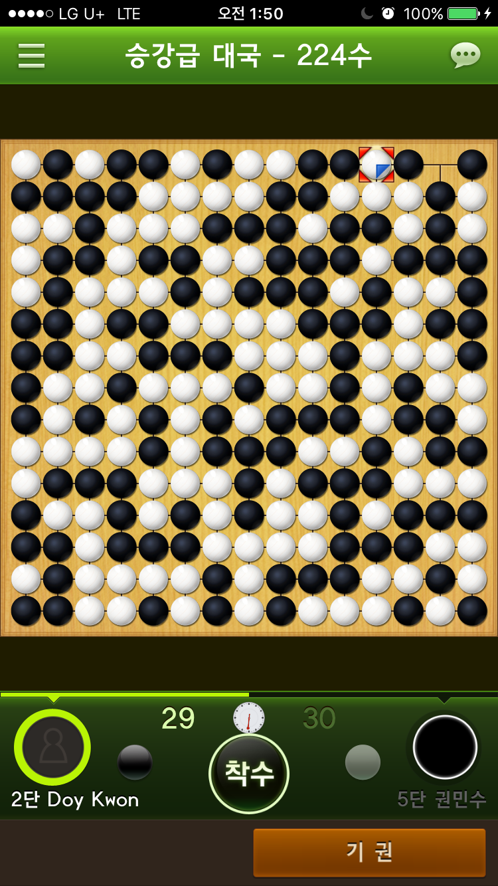
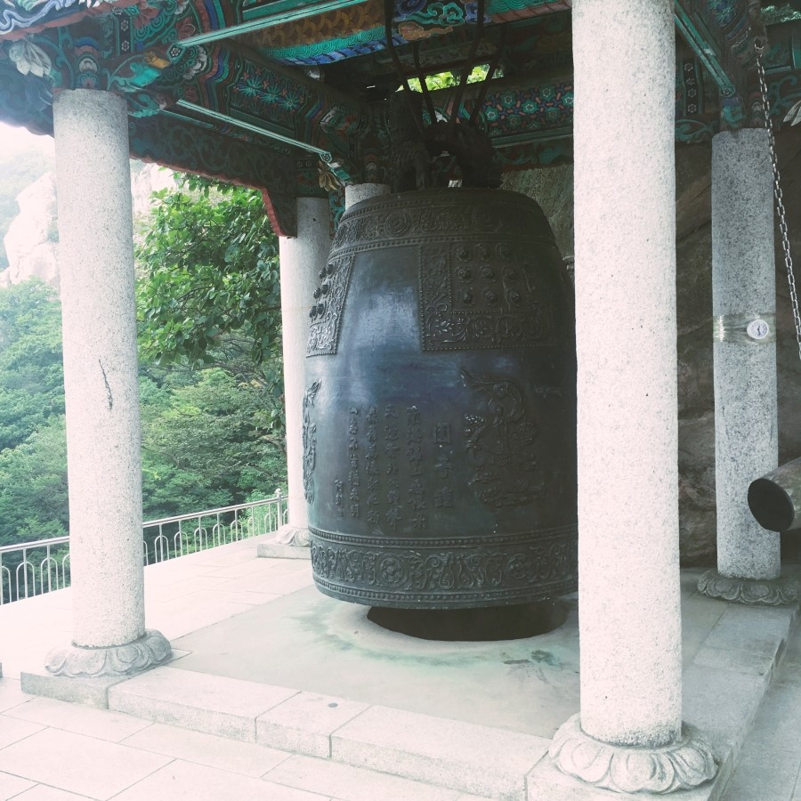

남해 가기 전날 밤, 그동안 기사 공부하느라

게임도 못하고 바빴는데

오랜만에 휴식 겸 오목을 두었다.

난 오목을 정말 잘 둔다. 

특히 내가 흑돌을 잡았을 때, 진 적이 거의 없었다.

그런데 이게 웬일, 모든 공간을 다 채울때 까지 승부가 나지 않았다.

거의 한 시간 가까이 오목 한게임을 두었다.

흑이 유리한 게 당연한데 여까지 끌고 오다니...

역시 5단의 클라스 

끝장도 못 보고 돌을 던져버렸다.

그렇게 허무하게 긴 밤을 보내고 나서야

잘 수 있었다.

누군가가 늦게 자는 이유 중 하나는

"그날 하루가 만족스럽지 않았기 때문"이라고 하던데

"충실하지 못했음"을 만회하려고 어쩔 수 없이 잠에 들 수 없는 거라고 그런다.

나는 이 밤의 끝까지,

이 오목판 위에서마저도 결판을 짓지 못했는데도

잠을 잔다.

왜냐하면 졸리기 때문이겠지ㅎ

매슬로의 욕구 5단계 중 나에겐 가장 아랫 단계가 가장 강력하다

어쨌든 해가 떴고 날이 밝았으니, 이제 남해로 출발!

 

남해에 도착하기 전, 섬진강 휴게소에 잠시 들렸는데

구름이 신기하고, 하늘이 푸르렀다.

특히, 옆 계단에는 정말 아름다운 전망대가 있었는데...

 

마치 광고 속 한 장면과 같이 아름답게 꾸며져 있었다.

하늘이 푸르러서 우산의 색감이 더 영롱하게 빛났다.

 

남해 대교를 지나, 상주은모래비치로 향했다. 저 건너편에는 다리를 건설하고 있었다.

놀러 온 것도 좋지만 항상 남는 건 사진과 추억들이 아닌가

휴양지 느낌을 사진 몇 장 담고 싶어서 물속으로 들어가기 전, 주변을 둘러보았다.

 

모래가 얇아서 맨발로 걸을 때 느낌이 너무 좋았다.

상인들이 돈 받고 대여해주는 튜브들이 널려있었는데

전부 노란색이라서 여름의 색감을 주는 듯 싶었다.

하늘이 굉장히 파란색이다.

사실 완전 화창한 날씨는 아니었고 비가 올 듯 먹구름이 조금 끼었었다.

아날로그 시리즈의 필터를 사용하니 막 찍은 사진들도 정말 예쁜 색감이 나온다.

 

빨간 파라솔도 있고 푸른 바다와 고운 모래, 내가 생각하는 아름다운 여름 휴양지의 3요소를 갖추고 있다.

여기가 어디라고? 이곳은 바로 상주은모래비치다.ㅎ

<iframe src="https://mashup.map.naver.com/view.nhn?mid=bl0142552948%40s12881082&amp;type=total" width="402" height="352" frameborder="0" scrolling="no" onerror="return true;" onabort="return true;" title="포스트에 첨부된 지도" style="margin: 18px 0px; padding: 8px; background-color: white;"></iframe>

 

파도가 아름다워서 한 컷 찍어보았다.

 

무인도나 야생에서 살아남기 위해서는

식량을 조달하는 낚시 기술이 필수다.

물놀이를 즐긴 후 게 낚시를 하러 출발

방파제로 쌓아둔 바위들이다. 인공으로 배치해놓은 바위들이 게들이 살기 좋은 생태계로 형성되었다.

 

바닷가에서 흔히 볼 수 있는 작은 게들이다.

꽃게가 아니라 뭐라고 부르지?

점심에 먹은 짬뽕에 들어있는 오징어 몇 개를 줄로 묶어 미끼를 만들었다.

바위 사이에 줄을 넣으면, 게들이 오징어를 집게로 꽉 잡는다.

그때 낚시줄을 당기면

그 게는 나의 것이다.

약 페트병 두 병정도 채울 정도로 잡았다.

바닷가에서 놀고 저녁으로는 횟집을 왔다.

참고로 점심은 중화요리를 먹었다.

먼 길 달려와 먹는 거라

사진 찍을 생각도 못하고 허겁지겁 먹어버렸다.

비록 사진은 없지만..

바닷바람 맞으며 먹는 짜장면, 그리고 탕수육

그냥 최고다.

 

정확한 음식 명칭은 모르지만 아마 멸치 회 무침 이였을 것이다.

남해 주변을 돌아다니며 느낀 건데 어딜 가나 멸치 회를 간판에 내놓는다.

이곳은 멸치 회가 지역을 상징하는 음식인가 보다.

마치 전주하면 비빔밥, 춘천 하면 닭갈비 하듯이

아주 싱싱한 광어회~

저녁을 먹고 노래방에 갔다.

오랜만에 가는 노래방, 막상 가니 부를 최신곡이 없었다.

예전 노래를 많이 불렀다.

항상 최신곡만 챙겨 부르던 나도 이렇게 늙어가는 가 보다.

다음날, 남해 보리암으로 향했다.

아, 보리암 가기 전 길가에 있는 식당에 들러 

아침식사를 하였다.

여행지에 오면 음식도 중요하긴 한데

비싸고 맛없었다.

매우 무난한 제육볶음을 시켰는데

전주에서 쉽게 먹을 수 있는 

아주 맛난 제육볶음의 가격에 두 배였고,

맛은 군대 훈련소에서 먹었던 그 제육과

정확히 일치했다.

그나마 해물 된장찌개가 매콤하니 먹을만했다.

양이 적은 게 문제지만...

결론, 음식은 전주다.

오르는 길에 담은 사진이다.

이 사진을 카톡 프사로 설정하고 상태 메시지로 "보리암 가는 길목에서~"와 같은 문구로 설정하면

누구라도 어른이 될 수 있다.

'진짜 어른'이 되고 싶다면 한번 시도해보세요~

 

보리암은 차로 바로 갈 수 있는 곳이 아니라

약간의 등산을 해야 도착할 수 있는 곳이다.

대략 10분 정도 무거운 몸을 이끌고 도착하니

흐린 날씨에도 불구하고 땀이 송골송골 맺혔다.

(겨터파크 개장)

 

 

보리암은 태조 이성계가 기도를 드렸던 곳으로도 유명하다.

 

영화 '셔틀콕'에서 나왔던 보리암이 기억에 남아서

언젠간 꼭 가보고 싶다고 생각하고 있었다.

사실 보리암을 가기 위해 남해를 온 것은 아닌데,

남해에 와보니 보리암이 있어서 당장 갔다.

 

흐린 날씨 덕에 마치 안개 낀 새벽녘의 산산한 공기 냄새가 느껴지는 것 같았다.

그 느낌을 나는 좋아하는데, 이 사진에도 함께해서 좋다.

 

여기가 바로 해수관음보살상

사찰을 지나 계단으로 내려오면 마주할 수 있다.

다음 행선지는 독일마을 되시겠다.

 

독일 마을을 돌아다니다 카페에 들어왔다.

점심으로는

유럽 느낌 물씬 나는 레스토랑에 가서

돈까스를 먹고 싶었지만

사람들이 너무 많아

주차할 수 있는 곳이 없어서

아쉽게도.... 이곳으로 왔다.

\~~~~ 

바닷가에서 느낄 수 있는 바람과 냄새

그리고 주변 독일식 펜션 건물들의 조화가

충분히 아름다웠지만

그 느낌들은 사진에는 하나도 담겨지지가 않았었다.

아마 느낌 때문에 나만 착각한 거였을지도

 

점심으로 독일식 소세지와 함께 독일 생맥주를 마셨다.

소세지가 참 맛있었다. (사실 스팸이 더 밥 도둑이긴 하다.)

그리고 넘나 맛있는 감튀....

(8000원 정도 했는데 사실 맘스터치가 더 맛있긴 하다ㅎ)

독일마을에서 맛보는, 점심에 먹는 독일식 브런치

(설마 독일인들 점심을 이만큼 먹지는 않겠지?)

다음엔 꼭 독일에서 직접 먹고말겠다.

