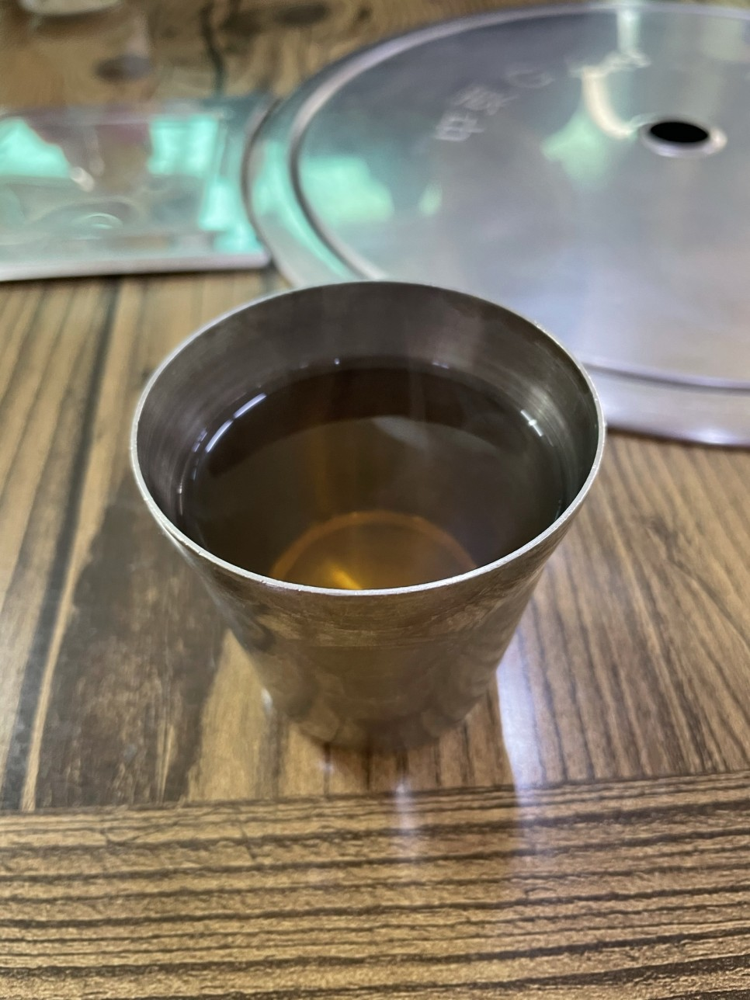
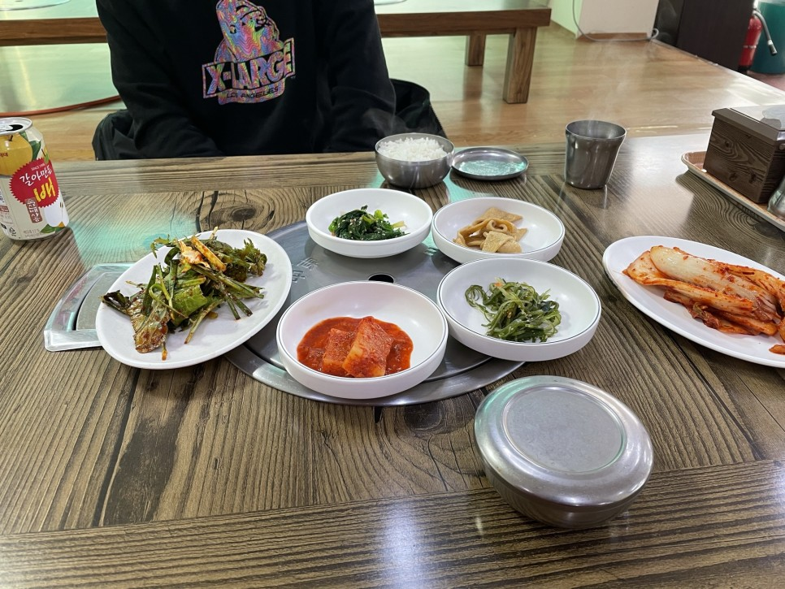

처음 모악산 버스정류장에서 내리고 올라가는 길이다.

날씨가 매우 흐릿하여 비가 올듯말듯 한 침울한 날씨였다.

모악산 근처 맛집을 찾아보고 갔어야 하는데

그냥 눈에 보이는 아무 식당이나 들어갔다.

손두부라는 글씨가 인상적이어서

뭐에 홀린듯 들어갔다.

물을 정수기에서 떠서 주는 것이 아니라

어떤차인지는 모르겠는데 보리차처럼 엽차로 따듯하게 물이 나온다.

날씨가 추워서 그런지 이 점은 좋았다.

매우 단촐한 반찬구성

1인 7000원의 순두부찌개의 구성이다.

비주얼은 순한느낌이었다.

확 맛있어 보인다기 보다는 그냥 순두부찌개네 이런 느낌

맛을 평가하자면 착한맛이었다.

맛있다는 뜻은 아니고, 순박한 시골청년마냥 그냥 순진무구한 밍밍한 맛이었다.

그렇다고 썩 맛없다는 뜻도 아니라 그냥 착한(사람좋은?)맛이라고 표현하고 싶다.

산 입구에는 프로포즈 존이 있었다.

모악산까지 와서 프로포즈를 하는 사람이 있나? 싶은 마음이 들었지만

또 모르는 일이니까.. 고백하실분들 참고하세요

산 입구에 있는 식당이

오히려 아까 먹은 순두부찌개보다 맛있어 보였다.

올라가면서 계속 아쉬움이 남았던 부분

산 초입 부분들은 날씨도 흐리고

바닥은 녹은 눈들과 흙들이 뒤섞여 질척거렸다.

산에 오면 기분이 좋아진다던데, 뭔가 쓸쓸해져버렸다.

날씨도 꽤 추웠다.

사촌동생의 땀이 얼어버렸다.

1차 휴식지점인 대원사

참고로 여기서 매년 신년행사로

떡국을 조금씩 담아서 나눠줬었다.

신년등반할때마다 먹었었는데

여기 진짜 떡국 맛집이다.

하지만 올해에는 행사를 진행하지 않았다.

코로나가 앗아간 나의 작은 행복... ㅠ

귀여운 진돌이도 쓸쓸하게 있었다.

대원사에 오니 물이 쪼르르 나오고 있었다.

마스크를 쓰고 등산해서 그런가

매우 힘든 산행이었는데

그래서 그런가 매우 달콤한 물이었다.

산 중턱까지 가는 길은 전반적으로

흐린 날씨와 얼다만 땅이 어우러져

매우 쓸쓸함이 맴도는 길이라는 생각밖에 안들었다.

중간 휴식지점.

여기에서 하산할까? 이생각 백만번 들었다.

마스크끼고 등산하는 거는 진짜 할 일이 아니다.

너무 고강도..

고약한 길을 지나고 나니

계단이 있어서 조금은 편하게 올라갈 수 있었다.

저 멀리 정상이 보인다.

이 길이 분기점이 되어

여기서부터 뭔가 설산이 되어졌다.

눈도 조금씩 내리기 시작하더라

정상에 가까워져 갈수록

겨울왕국이 되어져갔다.

<iframe width="544" height="306" src="https://serviceapi.nmv.naver.com/flash/convertIframeTag.nhn?vid=151754ED08C94F9D76D2FC00F15DF45674A3&outKey=V121056460b75d6fb651308a09219921f98d64cdd99baf16fa8a508a09219921f98d6" frameborder="no" scrolling="no" title="NaverVideo" allow="autoplay; gyroscope; accelerometer; encrypted-media" allowfullscreen></iframe>

아이젠도 없이 호기롭게 올랐는데

정상에 가까워지니 

눈이 녹고 매우 위험한 길이 되었다.

정상을 0.5km남겨두고 왼쪽 10m옆에 짭 정상 무제봉이 있었다.

잠깐 정상의 기분을 느껴보고자 갔는데

무제봉에서 바라본 풍경

황량하고 아쉬웠다.

0.5km밖에 안남았으니

그래 정상으로 가자

나무들엔 눈꽃이 피어났었다.

다들 사진찍고 난리났었다. 등산객들 모두 신났다.

대나무 죽순인 줄 알았는데

쇠파이프가 쏟아오른 것이었다.

드디어 오른 전주의 에베레스트인 모악산 정상

전망대도 있었는데

뭐가 보이진 않았다.

정상에는 kbs 기지가 있었는데

직원들은 케이블카 타고 출퇴근 하나보다.

부럽다 ㅠ

정상에서는 풍경이 너무 아름다웠다.

아래에서의 흐린날씨와 같은날이라고는 생각이 들지 않게

매우 푸르르고 예쁜 하늘이었다.

하산하는 길에 아주 귀여운 짹짹이를 만났다.

사람을 두려워하지 않는 것 같아 보였다.

다가가서 동영상찍는데도 무관심했다.

이런 강인함은 배우고싶다.

올라갈때는 어떻게 올라갔는데

하산하는 길은 엄청나게 어려웠다.

빙판 내리막길이라서

아이젠도 없이 올랐던 우리들은 죽을뻔 했다.

처음으로 베어그릴스보다

베어그릴스 카메라맨이 더 대단하다는 생각이 들었다.

그래서 하산하는 길의 풍경은 하나도 담지 못했다 ㅠ

그냥 가기 아쉬워서

바로앞에 있는 도립미술관에 들렀다.
