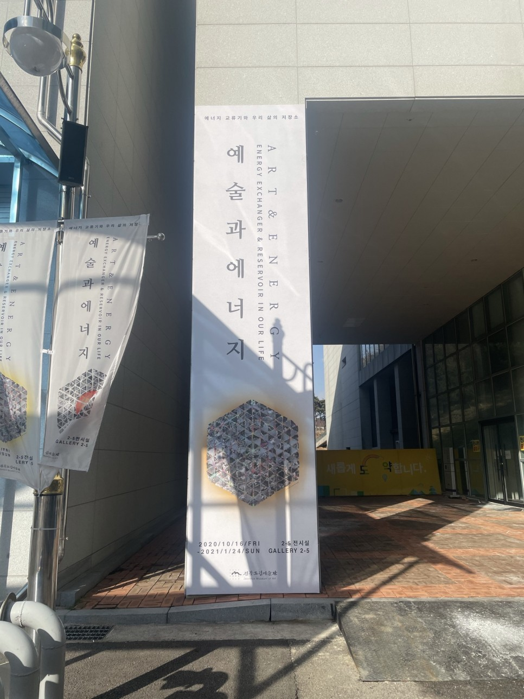
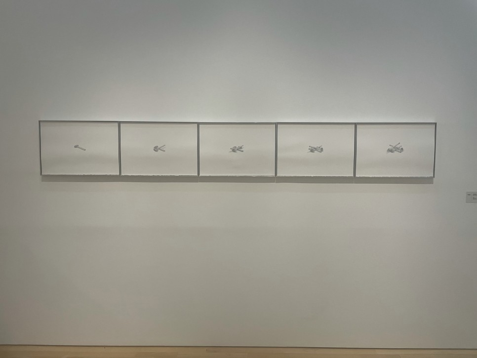
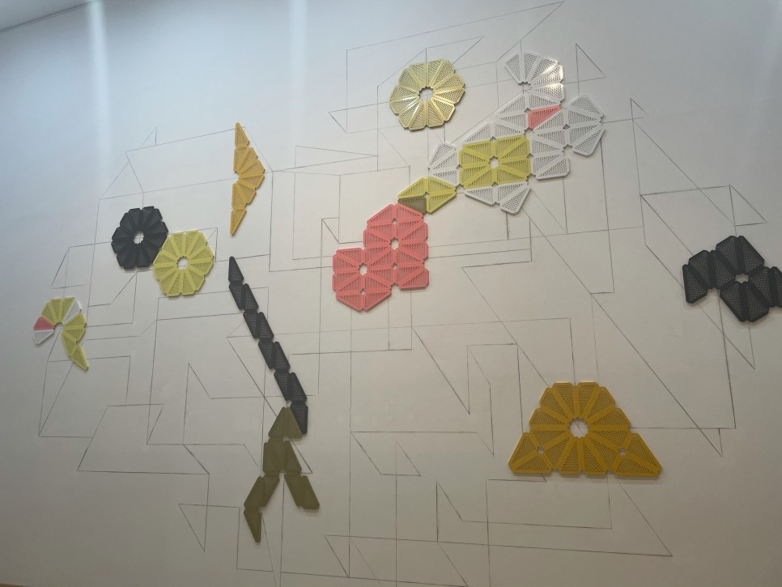
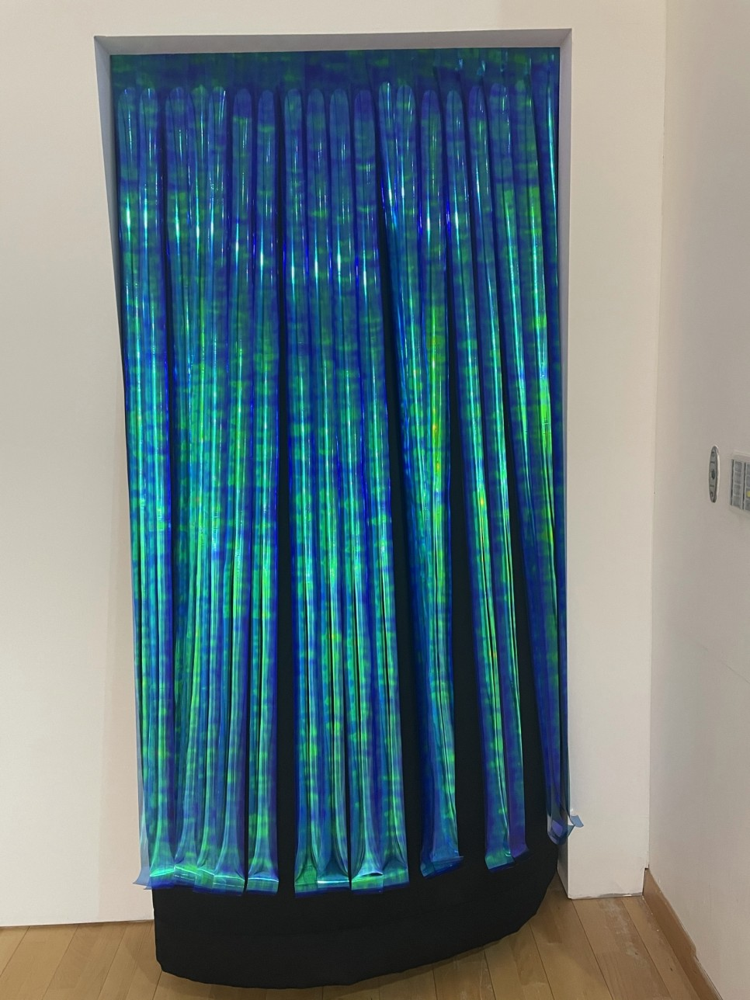
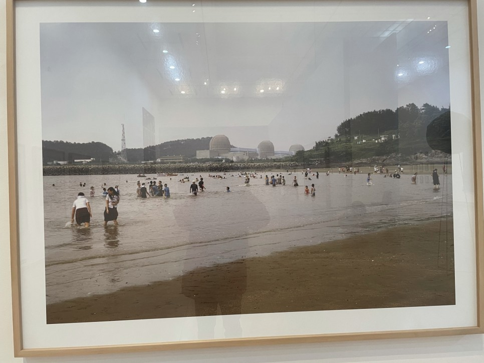

모악산에서 내려오고

시간이 좀 남아서 도립미술관에 들렀다.

도립미술관 가는길~♬

산에 올라갈 때와는 반대로

날씨가 참 좋아졌다.

햇살이 바삭바삭하니 기분이 상쾌해졌다.

이것이 비타민D의 생성인가?

앙상한 나뭇가지와 푸르른 하늘, 차가운 공기의 조화로

도립미술관의 갬성이라는 것이 폭발하였다.

"**예술과 에너지**"라는 주제의 특별전이었다.

크리스마스가 지났지만 아직 트리가 있었다.

개인적으로 크리스마스에 대한 감상은

딱 당일 기준으로 따뜻한 연휴느낌이 확 전환되는 듯하다.

<iframe width="544" height="306" src="https://serviceapi.nmv.naver.com/flash/convertIframeTag.nhn?vid=CE4F058B6553B3D0D06018D00D22679809A4&outKey=V12105c3252881529c3e8062d6b99dbbb36550ecc28850ad60358062d6b99dbbb3655" frameborder="no" scrolling="no" title="NaverVideo" allow="autoplay; gyroscope; accelerometer; encrypted-media" allowfullscreen></iframe>

**이름없는 병**

인상적인 작품이었다.

난 동영상이 더 좋은가보다.

그림들 보고는 특별한 감상은 없었는데

이 작품은 보자마자

"오, 이런것이 미술관인가?" 하는 생각이 들었다.

<iframe width="544" height="306" src="https://serviceapi.nmv.naver.com/flash/convertIframeTag.nhn?vid=30F68B4BEFC1C595A305441A610AA382BB15&outKey=V12923cbb81d0925c435cf522555e87d7a31bda137374d867eafef522555e87d7a31b" frameborder="no" scrolling="no" title="NaverVideo" allow="autoplay; gyroscope; accelerometer; encrypted-media" allowfullscreen></iframe>

<iframe width="544" height="306" src="https://serviceapi.nmv.naver.com/flash/convertIframeTag.nhn?vid=FAE6018901F0881BA28A343B1734C0A7D68A&outKey=V1272f06010a7d18119fe4942abb4ce7e0336cf0b0f4eec664fdc4942abb4ce7e0336" frameborder="no" scrolling="no" title="NaverVideo" allow="autoplay; gyroscope; accelerometer; encrypted-media" allowfullscreen></iframe>

<iframe width="544" height="306" src="https://serviceapi.nmv.naver.com/flash/convertIframeTag.nhn?vid=75D3D43DEBA057AFA071A1F9C4B3F1CB3996&outKey=V128b83b2460784cdf7e1eaeefb71a5bd30bf6377924dbd0bba6aeaeefb71a5bd30bf" frameborder="no" scrolling="no" title="NaverVideo" allow="autoplay; gyroscope; accelerometer; encrypted-media" allowfullscreen></iframe>

단순 조형물인줄 알았는데 이렇게 움직인다. (매우 천천히)

마치 꽃이 폈다가 지는 일련의 과정처럼 "탄생과 죽음이라는 일련의 생의 과정을 기계의 역학, 즉 생성과 소멸이 순환하는 그 메커니즘이라는 거대담론에 빗대어 표현한 것인가?" 라고 감히 추론 해봤는데

그런 뜻은 아니었다.

<iframe width="544" height="306" src="https://serviceapi.nmv.naver.com/flash/convertIframeTag.nhn?vid=CC3C5B3EEDD1F6A87A996AC265F0176E6ECC&outKey=V127c76db0009a665d158d3b32d2f617ec61b0049938179ac8870d3b32d2f617ec61b" frameborder="no" scrolling="no" title="NaverVideo" allow="autoplay; gyroscope; accelerometer; encrypted-media" allowfullscreen></iframe>

**기억의 잡초, 흘러내리는 상념**

신기한 작품이네 생각하고 있었는데

단순한 작품이 아니었다.

이것은 백남준 작가의 작품을 감상하러 가기 위한 입구작품이었다.

작품과 작품의 만남... 가슴이 웅장해진다.

<iframe width="544" height="306" src="https://serviceapi.nmv.naver.com/flash/convertIframeTag.nhn?vid=2A764F894E9071E811EDF5539B8B89152CC2&outKey=V1299d8494530fbfc1f5080836cad0029a6fb0419890e19f0039a80836cad0029a6fb" frameborder="no" scrolling="no" title="NaverVideo" allow="autoplay; gyroscope; accelerometer; encrypted-media" allowfullscreen></iframe>
**백남준 원자 그 너머**

왜 거장인지 조금은 알겠다.

다른 작품들은 특별한 감상 없이

"오, 잘 만들었는 걸?" 딱 이정도 느낌이었는데

백남준 작가의 작품은 달랐다.

나같은 예술 무지랭이도 감탄사가 나오더라

자세히 보니 조커였다.

특별한 장소도 아니고 특별한 인물도 아니고 특별한 상황도 아닌데

뭔가를 불러일으키는 작품이었다.

이게 그 유명한 느낌적인 느낌인가?

사진작가의 시선에는 세상이 이렇게 보이나 보다.

참 신기했고 대단해보였다.

역시 예술가들은 천재야

