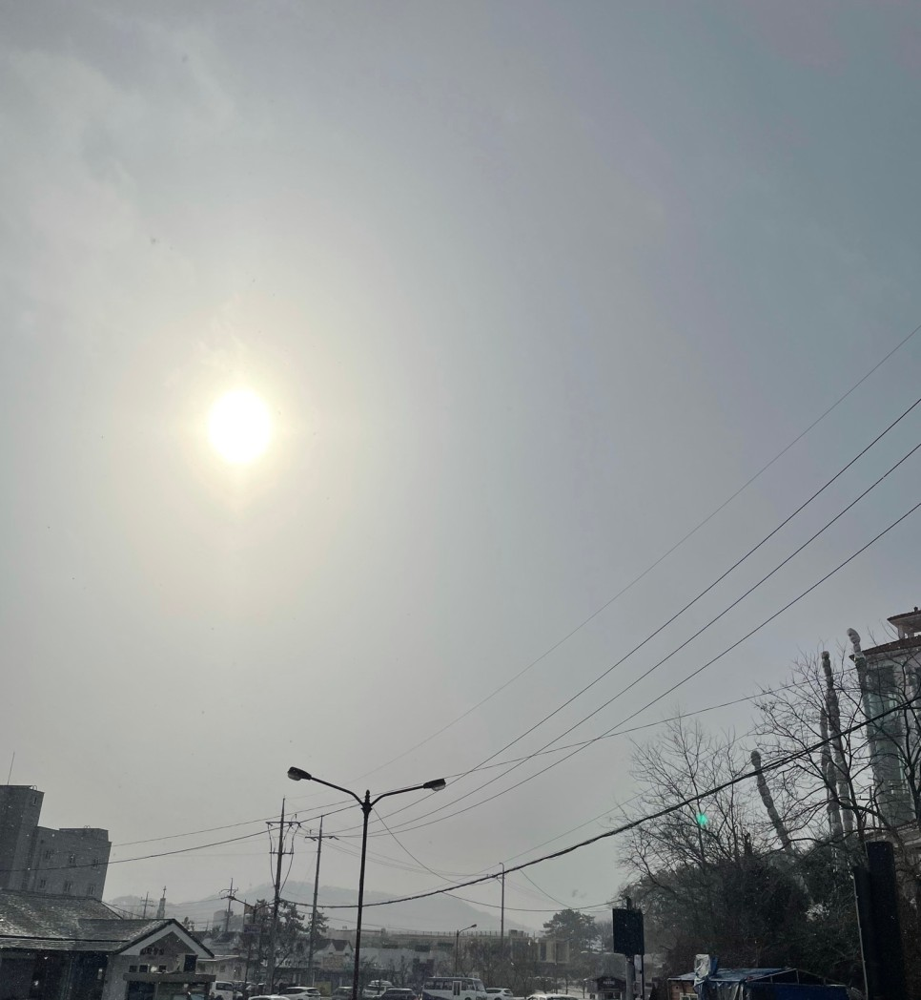
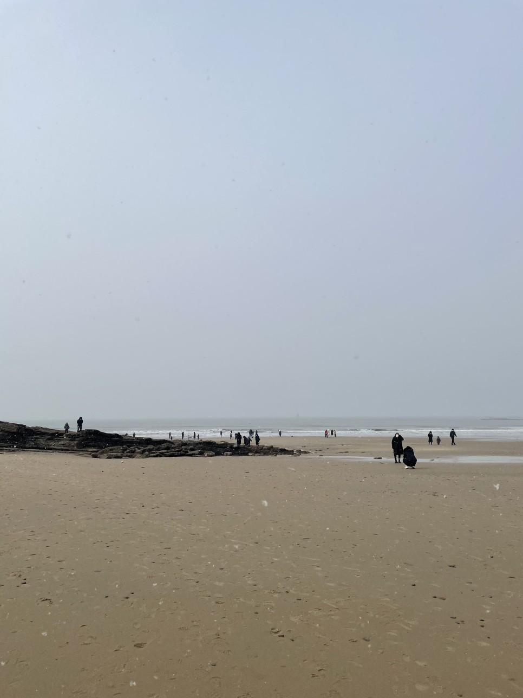
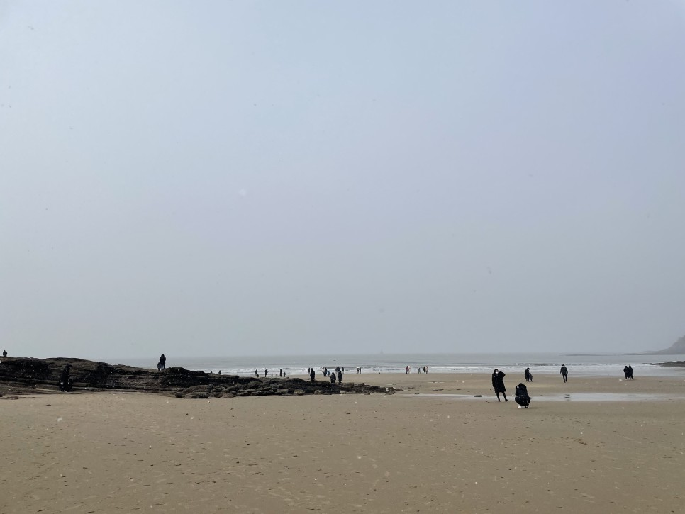
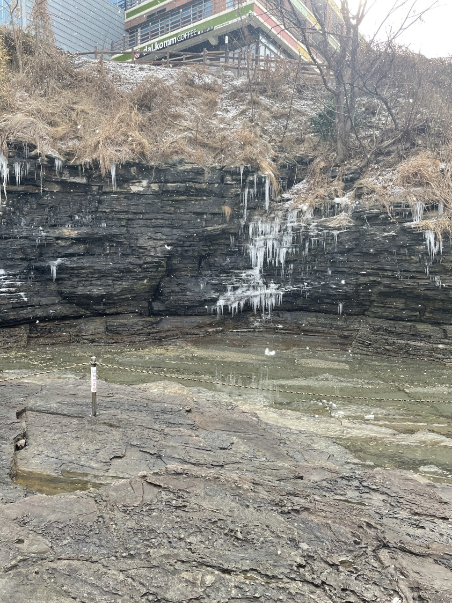
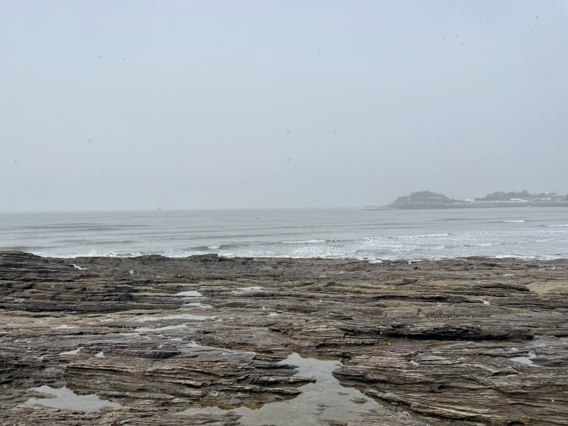
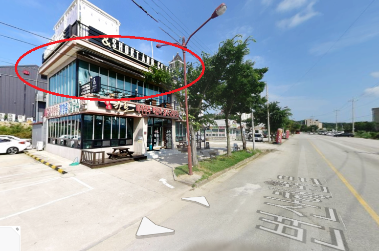
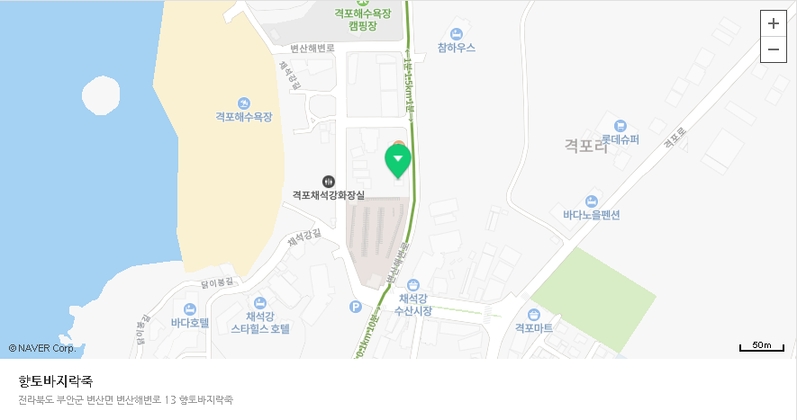

눈 내리는 주말 

변산에 방문하였다.

사람들이 꽤 많이 방문하였다.

눈이 와서 찾아들 온건지

원래 주말이면 사람이 붐비는지 알 수 없었다.

<iframe width="544" height="306" src="https://serviceapi.nmv.naver.com/flash/convertIframeTag.nhn?vid=2B1A57A967AEC1B6E18D5508428F425CE66C&outKey=V129b932b5e201f26c3175d241b37b14007b55502df53a229c7d85d241b37b14007b5" frameborder="no" scrolling="no" title="NaverVideo" allow="autoplay; gyroscope; accelerometer; encrypted-media" allowfullscreen></iframe>

작년에는 눈 구경도 못한 것 같은데 올해는 겨울왕국이었다.

.JPG)

.JPG)

바다하면 여름이 떠오르기 마련인데

겨울바다도 충분히 매력적이었다.

왜냐면 이 차갑고 촉촉한 날씨가 "칼국수"마렵게 하거든

<iframe width="544" height="306" src="https://serviceapi.nmv.naver.com/flash/convertIframeTag.nhn?vid=FD6EA78BAEE481B43E7FC38593CD343FE19B&outKey=V1267aaeb01985af9e6cae02f448c29271f60ec096d60cbf6e58ae02f448c29271f60" frameborder="no" scrolling="no" title="NaverVideo" allow="autoplay; gyroscope; accelerometer; encrypted-media" allowfullscreen></iframe>

**겨울바다 채석강**

눈내리는 풍경을 슬로모션으로 찍었더니

에쁘게 잘 찍혔다.

추운게 아무리 힘들어도

눈만 내리면 기분이 그렇게 좋다.

겨울에 태어나서 그런가?

점심으로는 칼국수를 참을 수 없었다.

주변에 칼국수 집이 여러곳 있었지만 방심할 순 없다.

이런 관광지 근처의 식당들은

맛보다는 접근성으로 승부한다는 편견이 있기 때문이다. (잘못하면 덤탱이는 보너스)

저번 모악산에서 아무생각없이 들어간 식당에서 크게 데었기 때문에

더 강하게 이런 생각이 들었다.

그래서 어디를 가야할지 일단은 감이 잡히지 않았다.

하지만 돼지경력 근 30년..

맛집의 냄새가 나는 곳은 기가막히게 찾아내는 재주가 있다.

(먹느라 바빠서 가게 사진도 못찍었다. 로드뷰를 활용한 현장복원...)

여러 곳을 보던 중, 향토 바지락죽 이라는 집이 눈에 들어왔다.

이곳이 괜스레 맛집으로 느껴진 것이다.

그 이유는 바로

2층에 있는 "카페" 때문이었다.

나의 추리에 의하면

| 만약 이 집이 맛이 없다 =>  사람들의 기분이 나빠진다 => 황급히 자리를 떠난다 => 카페 입장에서는 엄청난 손해 |
| ------------------------------------------------------------ |
| 만약 이 집이 맛이 있다 => 기분이 좋아진다 => 마음의 여유가 생겨서 즐기고 싶어진다 => 어? 주변에 카페가 있네 커피한잔하고 갈까? |

순간적으로 이런 사고회로가 발동했다.

칼국수가 맛없다면 2층에 카페가 있을 이유가 없다.

맛없으면 백종원 선생님이 오셔서 한소리 하셨겠지, 라고 판단을 내렸다.

건너편에는 2층에 민박집을 같이 운영하는 칼국수집도 있더라

혹자는 아마

"아니 칼국수가 얼마나 맛있으면 자고 갈 생각도 할까?" 라고 생각할 수도 있으나

채석강에 1박2일로 놀러오려는 사람중에 민박집을 알아보고 왔을테고

온김에 근처 음식점 말고 귀찮으니 그냥 1층 칼국수집 가자

이렇게 메커니즘이 작동했을거라고 생각한다.

이는 서순이 다른이야기라고 생각한다.

어쨌든 결국 나의 직감을 믿고

칼국수집에 들어갔다. 

이렇게 푸짐하게 바지락이 넘치게 들어있었다.

어쩐지 바다에 조개한마리 없더라

여기 다있었네?

겨울바다 방문의 마침표는

칼국수로 찍고 돌아왔다.

행복해...

